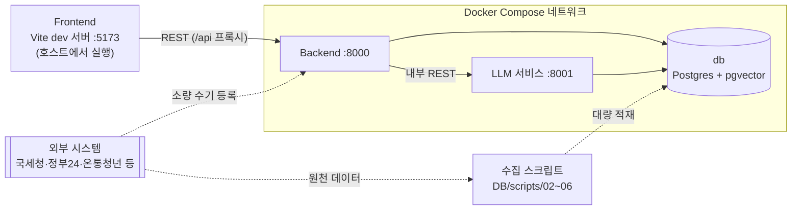
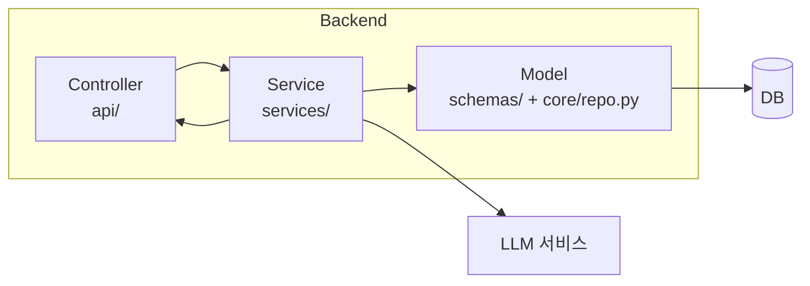

# 시스템 아키텍처

전체 서비스 구성과 Backend 내부 계층(MVC + Service) 구조를 정리한다. 컴포넌트 간 상세 호출 흐름은 `Docs/Design/SEQUENCE.md`를 참고한다.

## 1. 전체 시스템 구성도

- **Frontend → Backend**: 외부에 노출되는 유일한 진입점. `Docs/Design/API_SPEC.md`의 엔드포인트를 Backend가 REST로 제공한다. **로컬 개발에서 Frontend는 Compose 서비스가 아니다.** 화면은 호스트에서 Vite 개발 서버(`:5173`)로 띄우고, `Frontend/vite.config.js`의 프록시가 `/api/*`에서 접두사를 벗겨 `http://localhost:8000`으로 넘긴다. 배포에서는 `frontend` 프로필의 nginx 컨테이너(`:80`)가 같은 프록시 역할을 하며 대상만 `http://backend:8000`으로 바뀐다. 어느 쪽이든 `/api` 접두사 규칙이 같아 Frontend 소스는 동일하다.
- **Backend → LLM**: LLM 서비스는 외부에 직접 노출하지 않고, Backend가 Docker 내부 네트워크에서 서비스명으로 호출한다(예: `http://llm:8001/...`). RAG 질의응답, 세액감면판정 근거 생성, 공고문 요약 등 AI 작업을 담당한다. 영수증 OCR·경비처리 가능성 분석 경로도 있으나 추가 기능(추후 개발)이라 화면에서 부르지 않는다(`Docs/README.md` 8절).
- **DB**: 관계형 데이터(`Docs/Design/ERD.md`)와 벡터 데이터를 Postgres + pgvector로 통합해 컨테이너 하나로 관리한다. Backend와 LLM이 각자 필요한 부분(일반 데이터/벡터 검색)에 직접 접속한다.
- **외부 시스템**: 국세청·정부24·K-Startup·기업마당·온통청년 등의 세법·정책 원문이 들어오는 경로는 둘이다. **실제 대량 적재는 `DB/scripts/02~06` 수집 스크립트가 Backend를 거치지 않고 DB에 직접 쓴다**(`DB/run_all.sh`·`run_all.bat`로 실행). 관리자 기능(FS-26, `POST /admin/policies` 등)은 Backend를 지나는 소량 수기 등록용이며, 이를 부르는 화면은 없다(`Docs/Design/FUNCTIONAL_SPEC.md`의 `화면 연결` 열).

## 2. Backend 내부 계층 구조 (MVC + Service)

`Backend/`에 이미 만들어진 `api/`, `core/`, `schemas/`, `services/` 폴더에 MVC 역할을 매핑한다.

| 계층 | 폴더 | 역할 |
| --- | --- | --- |
| Controller | `Backend/api` | 요청 수신, 라우팅, 입력 검증 후 Service 호출 |
| Service | `Backend/services` | 비즈니스 로직 (RAG 파이프라인 호출, 세액감면 판정 로직 등) |
| Model | `Backend/schemas` + `Backend/core/repo.py` | 요청/응답 데이터 구조(Pydantic)와 데이터 접근. **ORM은 쓰지 않기로 확정했다.** `Backend/core/repo.py`가 엔티티별 조회·저장 함수 64개를 raw SQL로 제공하고, `Backend/core/db.py`가 SQLite/Postgres 양쪽을 같은 인터페이스로 감싼다. `Backend/models` 폴더는 만들지 않았다 |
| View | (별도 폴더 없음) | REST API라 HTML 뷰가 없고, Controller가 반환하는 `schemas`의 응답 모델이 View 역할을 겸한다 |
| 공통 인프라 | `Backend/core` | 설정, DB 세션, 공통 유틸 — 위 계층을 지원 |

고전 MVC와 다른 점: ①화면을 그리는 View가 없고 JSON 응답 스키마가 그 역할을 대신하며, ②비즈니스 로직을 Controller에서 분리한 Service 계층이 추가되어 있다(REST API에서 흔한 "MVC + Service" 변형).

`core/`는 위 세 계층 전반에서 공통으로 쓰는 설정·DB 세션·유틸을 제공하므로 흐름도에는 별도 노드로 표시하지 않았다.

## 3. LLM 서비스 내부 구조

`LLM/src/` 폴더를 역할별로 매핑한다.

| 폴더 | 역할 |
| --- | --- |
| `serving` | Backend가 호출하는 API 진입점. `app.py`(앱 생성·`/health`), `rag_routes.py`(`/rag/*`·`/ocr/*`·`/internal/rag/*`), `schemas.py`, `errors.py` |
| `rag` | LangGraph 기반 질의응답 파이프라인. 라우팅·검색·재정렬·컨텍스트 구성·Guardrail·세무 멀티홉·세금 Semantic Cache(`tax_cache.py`)·최종 답변 생성 |
| `vectorstores` | 검색 백엔드. pgvector(`postgres.py`), 테스트용 in-memory, BM25+RRF를 얹은 hybrid |
| `models` | LLM/임베딩 모델 로딩. 현재 OpenAI만 지원 |
| `features` | 문서 로드·Chunking·색인 및 로컬 인덱스 캐시 |
| `data` | 세법·정책·공고문 원천 데이터 조회와 계약 타입 |
| `evaluation` | 검색·Guardrail 지표 계산과 평가 실행 |
| `core` | 설정(`config.py`), DB 커넥션 풀(`database.py`, `psycopg_pool`), LangSmith tracing 설정 |

## 4. 통신·배포 노트

- Docker Compose 내부 네트워크에서 서비스명 기반 REST 통신 사용
- DB는 Postgres + pgvector로 통합해 별도 벡터DB 컨테이너 없이 운영. LLM은 벡터 검색(`rag_documents`) 외에 세금 Semantic Cache(`tax_rag_cache`)도 같은 DB에 읽고 쓴다
- Backend는 기동 시 `DATABASE_URL`로 Postgres 연결을 8회까지 재시도하고, 끝내 실패하면 `SQLITE_PATH`(기본 `Backend/data/app.db`)로 폴백해 계속 뜬다. 어느 쪽으로 붙었는지는 `GET /health`의 `storage`로 확인한다
- Backend 기동 시 `llm-warmup` 데몬 스레드가 LLM의 RAG 인덱스 준비를 한 번 확인한다. 자세한 흐름은 `Docs/Design/SEQUENCE.md` §4
- 배포 형상은 `frontend` 프로필의 nginx 컨테이너가 `:80`에서 화면과 `/api`를 함께 서빙하고, Backend·LLM·DB는 Compose 내부 네트워크에만 필요하다. 기동 순서는 db → llm → backend → frontend이며 각 단계는 앞 서비스의 헬스체크 통과(`service_healthy`)를 기다린다. 절차는 `Docs/README.md` 12절
- 현재는 동기 REST 호출로 시작하고, RAG 문서 재색인·영수증 OCR(추가 기능)처럼 시간이 걸리는 작업은 향후 큐(Redis/Celery 등) 도입을 검토한다 — MVP 단계에서는 과설계를 지양한다

## 관련 문서

- 컴포넌트 간 상세 호출 흐름: `Docs/Design/SEQUENCE.md`
- 데이터 구조: `Docs/Design/ERD.md`
- API 명세: `Docs/Design/API_SPEC.md`
