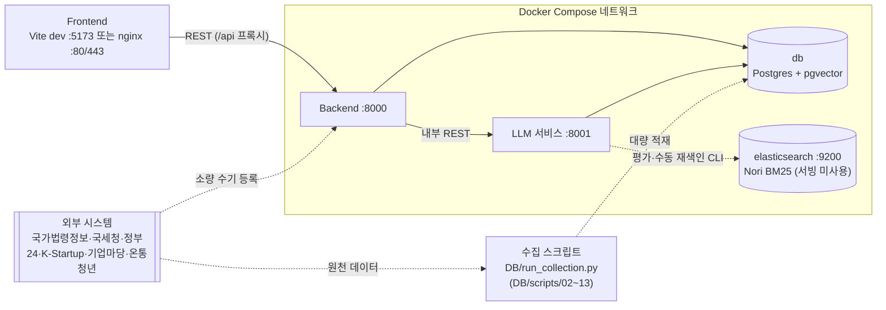
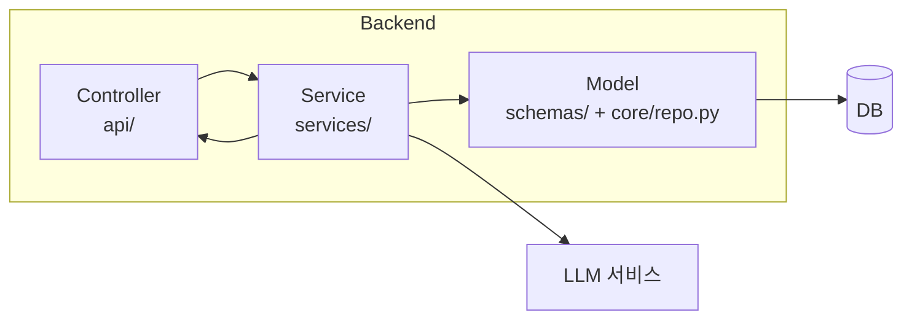

# 시스템 아키텍처

전체 서비스 구성과 Backend 내부 계층(MVC + Service) 구조를 정리한다. 컴포넌트 간 상세 호출 흐름은 `Docs/Design/SEQUENCE.md`를 참고한다.

## 1. 전체 시스템 구성도

```mermaid
flowchart LR
    FE["Frontend<br/>Vite dev :5173 또는 nginx :80/443"]

    subgraph Docker["Docker Compose 네트워크"]
        BE["Backend :8000"]
        LLM["LLM 서비스 :8001"]
        DB[("db<br/>Postgres + pgvector")]
        ES[("elasticsearch :9200<br/>Nori BM25 (서빙 미사용)")]
    end

    Ext[["외부 시스템<br/>국가법령정보·국세청·정부24·K-Startup·기업마당·온통청년"]]
    Scripts["수집 스크립트<br/>DB/run_collection.py<br/>(DB/scripts/02~13)"]

    FE -->|"REST (/api 프록시)"| BE
    BE -->|내부 REST| LLM
    BE --> DB
    LLM --> DB
    LLM -.->|평가·수동 재색인 CLI| ES
    Ext -. 원천 데이터 .-> Scripts
    Scripts -. 대량 적재 .-> DB
    Ext -. 소량 수기 등록 .-> BE
```

- **Frontend → Backend**: 외부에 노출되는 유일한 진입점. `Docs/Design/API_SPEC.md`의 엔드포인트를 Backend가 REST로 제공한다. 로컬 개발에서는 Vite 개발 서버(`:5173`)를 호스트에서 띄우거나 `docker-compose.dev.yml`의 `frontend-dev` 컨테이너로 띄운다. `Frontend/vite.config.js`의 프록시가 `/api/*`에서 접두사를 벗겨 `VITE_PROXY_TARGET`(기본 `http://localhost:8000`, `frontend-dev`는 `http://backend:8000`)으로 넘긴다. 배포에서는 nginx 컨테이너(`frontend`)가 같은 프록시 역할을 한다. 어느 쪽이든 `/api` 접두사 규칙이 같아 Frontend 소스는 동일하다. 빌드 결과는 PWA(`vite-plugin-pwa`)로 설치할 수 있다.
- **Backend → LLM**: LLM 서비스는 외부에 직접 노출하지 않고, Backend가 Docker 내부 네트워크에서 서비스명으로 호출한다(예: `http://llm:8001/...`). RAG 질의응답, 세액감면판정 근거 생성, 공고문 요약, 영수증 OCR·경비처리 가능성 분석, 사업계획서 초안·예비진단·어시스턴트 등 AI 작업을 담당한다. 영수증 OCR은 LLM 컨테이너 안에서 PaddleOCR PP-OCRv5 한국어 모델(`LLM/Dockerfile` 빌드 때 모델 다운로드)로 글자를 읽고 LLM이 해석하므로 별도 외부 OCR API 호출이 없다. paddle을 불러오지 못하면 Tesseract(`tesseract-ocr-kor`)로 대신 읽는다(측정: `Docs/OCR_PPOCRV5_BENCHMARK.md`).
- **DB**: 관계형 데이터(`Docs/Design/ERD.md`)와 벡터 데이터를 Postgres + pgvector로 통합해 컨테이너 하나로 관리한다. Backend와 LLM이 각자 필요한 부분(일반 데이터/벡터 검색)에 직접 접속한다.
- **키워드 검색(BM25)**: 운영 하이브리드 검색의 키워드 쪽은 LLM 프로세스 안의 메모리 BM25다(`LLM/src/vectorstores/hybrid.py`의 `BM25Search`, 어절 + 문자 2-gram 토큰). 인덱스 준비·재색인 때 DB 원본 문서를 읽어 다시 만들고, `NoriHybridSearch`(`LLM/src/vectorstores/nori_hybrid.py`)가 pgvector Dense 결과와 RRF로 합친다. 2026-10-02(`1ab40f5`)에 Elasticsearch Nori BM25에서 이 방식으로 바꿨다(`Docs/reports/RAG_TROUBLESHOOTING_FIX_REPORT_20261002.md`).
- **Elasticsearch**: `elasticsearch/Dockerfile`이 `analysis-nori` 플러그인을 설치한 단일 노드다. 컨테이너는 compose에 남아 있고 llm이 healthy를 기다리지만, 서빙 경로는 조회하지 않는다. `LLM/src/features/elasticsearch_indexing.py`(수동 재색인 CLI)와 `LLM/src/evaluation/`의 BM25 비교 스크립트만 쓴다. 원천 데이터가 아니라 pgvector에서 다시 만들 수 있는 파생 인덱스다.
- **외부 시스템**: 국가법령정보·국세청·정부24·K-Startup·기업마당·온통청년 등의 세법·정책 원문이 들어오는 경로는 둘이다. **실제 대량 적재는 `DB/scripts/02~13` 수집 스크립트가 Backend를 거치지 않고 DB에 직접 쓴다.** 배포 환경에서는 `DB/run_collection.py`가 순서대로 실행하고(App EC2의 `collector` 서비스, GitHub Actions `collect.yml` 주간 실행 → `/rag/reindex`, `collect-retry.yml` 3시간마다 실패분 재시도 → `/rag/reindex`), 로컬에서는 `DB/run_all.sh`·`run_all.bat`로도 실행할 수 있다. 관리자 기능(FS-26, `POST /admin/policies` 등)은 Backend를 지나는 소량 수기 등록용이며, 이를 부르는 화면은 없다(`Docs/Design/FUNCTIONAL_SPEC.md`의 `화면 연결` 열).

## 2. Backend 내부 계층 구조 (MVC + Service)

`Backend/`에 이미 만들어진 `api/`, `core/`, `schemas/`, `services/` 폴더에 MVC 역할을 매핑한다.

| 계층 | 폴더 | 역할 |
| --- | --- | --- |
| Controller | `Backend/api` | 요청 수신, 라우팅, 입력 검증 후 Service 호출 |
| Service | `Backend/services` | 비즈니스 로직 (RAG 파이프라인 호출, 세액감면 판정 로직 등) |
| Model | `Backend/schemas` + `Backend/core/repo.py` | 요청/응답 데이터 구조(Pydantic)와 데이터 접근. **ORM은 쓰지 않기로 확정했다.** `Backend/core/repo.py`가 엔티티별 조회·저장 함수(2026-10-01 기준 98개)를 raw SQL로 제공하고, `Backend/core/db.py`가 Postgres 연결과 쿼리 실행을 감싼다. `Backend/models` 폴더는 만들지 않았다 |
| View | (별도 폴더 없음) | REST API라 HTML 뷰가 없고, Controller가 반환하는 `schemas`의 응답 모델이 View 역할을 겸한다 |
| 공통 인프라 | `Backend/core` | 설정, DB 세션, 공통 유틸 — 위 계층을 지원 |

고전 MVC와 다른 점: ①화면을 그리는 View가 없고 JSON 응답 스키마가 그 역할을 대신하며, ②비즈니스 로직을 Controller에서 분리한 Service 계층이 추가되어 있다(REST API에서 흔한 "MVC + Service" 변형).

```mermaid
flowchart LR
    subgraph Backend["Backend"]
        API["Controller<br/>api/"]
        SVC["Service<br/>services/"]
        MODEL["Model<br/>schemas/ + core/repo.py"]
    end
    LLMSVC["LLM 서비스"]
    DB[("DB")]

    API --> SVC
    SVC --> MODEL
    MODEL --> DB
    SVC --> LLMSVC
    SVC --> API
```

`core/`는 위 세 계층 전반에서 공통으로 쓰는 설정·DB 세션·유틸을 제공하므로 흐름도에는 별도 노드로 표시하지 않았다.

## 3. LLM 서비스 내부 구조

`LLM/src/` 폴더를 역할별로 매핑한다.

| 폴더 | 역할 |
| --- | --- |
| `serving` | Backend가 호출하는 API 진입점(Django ASGI). `django_config/`(`settings.py`·`urls.py`·`asgi.py`, 프로세스의 첫 HTTP 요청(헬스체크 포함) 때 인덱스·OCR 모델 워밍업 시작, 인덱스 실패 시 60초부터 2배씩 최대 600초 간격으로 재시도), `django_views.py`(요청 파싱·응답), `rag_routes.py`(`/rag/*`·`/ocr/*`·`/internal/rag/*` 처리 로직), `api_schema.py`(`/docs`·`/openapi.json`), `schemas.py`, `errors.py`, `tax_calculators_docstring.py`(국세청 공개 자료 기반 결정적 세금 계산기, `rag/graph.py`·`rag/tax.py`가 사용) |
| `rag` | LangGraph 기반 질의응답 파이프라인. 라우팅·검색·재정렬·컨텍스트 구성·Guardrail·세무 멀티홉·세금 Semantic Cache(`tax_cache.py`)·최종 답변 생성. 그래프를 거치지 않는 단일 LLM 호출(로드맵 코치 `roadmap.py`, 사업계획서 어시스턴트 `bizplan_coach.py`, 영수증 해석·사업계획서 초안·예비진단 `backend_tasks.py`)도 여기 있다 |
| `vectorstores` | 검색 백엔드. pgvector(`postgres.py`), 메모리 BM25+RRF `hybrid.py`, pgvector Dense와 BM25를 원본 문서 단위 RRF로 합치는 `nori_hybrid.py`(Postgres 모드 기본, 운영 BM25는 `hybrid.BM25Search`), Elasticsearch Nori BM25(`elasticsearch.py`, 평가 스크립트 전용), 테스트용 in-memory |
| `models` | LLM/임베딩 모델 로딩. 현재 OpenAI만 지원 |
| `features` | 문서 로드·Chunking·색인 및 로컬 인덱스 캐시, Elasticsearch 재색인 CLI(`elasticsearch_indexing.py`, 서빙 BM25 원본 문서 로더도 제공), 영수증 OCR(`receipt_ocr.py`, PP-OCRv5 기본·Tesseract 대체·이미지 보정), 사업계획서 양식 검사·PDF/HWPX 출력(`business_plan_documents.py`) |
| `data` | 세법·정책·공고문 원천 데이터 조회와 계약 타입 |
| `evaluation` | 검색·Guardrail 지표 계산과 평가 실행 |
| `core` | 설정(`config.py`), DB 커넥션 풀(`database.py`, `psycopg_pool`), LangSmith tracing 설정 |

## 4. 통신·배포 노트

- Docker Compose 내부 네트워크에서 서비스명 기반 REST 통신 사용
- 벡터는 Postgres + pgvector에 두고, 키워드 검색은 LLM 프로세스의 메모리 BM25로 한다. Elasticsearch는 별도 컨테이너로 남아 있으나 서빙 경로에서 쓰지 않는다. LLM은 벡터 검색(`rag_documents`) 외에 세금 Semantic Cache(`tax_rag_cache`)도 같은 DB에 읽고 쓴다
- Backend는 기동 시 `DATABASE_URL`로 Postgres 연결을 8회까지 재시도하고, 끝내 실패하면 RuntimeError로 기동을 중단한다
- Backend 기동 시 `llm-warmup` 데몬 스레드가 LLM의 `/rag/ready`를 10초 간격으로 최대 `LLM_WARMUP_WAIT`(기본 600초)까지 확인하고, 그때까지 준비되지 않으면 `/rag/reindex`를 요청한다. 자세한 흐름은 `Docs/Design/SEQUENCE.md` §4
- 단일 호스트(`docker-compose.yml`): `frontend` 프로필의 nginx 컨테이너가 `:80`에서 화면과 `/api`를 함께 서빙한다. 기동 순서는 db → db-migrate(완료) → llm → backend → frontend이고, elasticsearch는 db와 함께 먼저 뜬다. llm은 db healthy·db-migrate 완료·elasticsearch healthy를, 그 뒤 단계는 앞 서비스의 헬스체크 통과를 기다린다. `presentation`(발표자료) 프로필도 있다. 절차는 `Docs/README.md` 12절
- 개발(`docker-compose.yml` + `docker-compose.dev.yml`): backend·llm을 `--reload`로 띄우고 `frontend-dev`(Vite HMR)를 추가한다
- AWS(2대 구성): Data EC2는 `docker-compose.data.yml`(db·elasticsearch, private IP에만 바인딩), App EC2는 `docker-compose.app.yml`(backend·llm·frontend nginx `:80/:443`·presentation, `run --rm`으로만 도는 `db-migrate`·`collector`). 배포는 `.github/workflows/deploy.yml`, 절차는 `Docs/AWS_DEPLOY_GUIDE.md`. 운영 상태는 `.github/workflows/health-check.yml`이 6시간마다 서버 밖에서 `/api/health`(`postgres` 연결·`ragReady`)를 확인한다
- 현재는 동기 REST 호출로 시작하고, RAG 문서 재색인·영수증 OCR처럼 시간이 걸리는 작업은 향후 큐(Redis/Celery 등) 도입을 검토한다 — MVP 단계에서는 과설계를 지양한다

## 관련 문서

- 컴포넌트 간 상세 호출 흐름: `Docs/Design/SEQUENCE.md`
- 데이터 구조: `Docs/Design/ERD.md`
- API 명세: `Docs/Design/API_SPEC.md`
