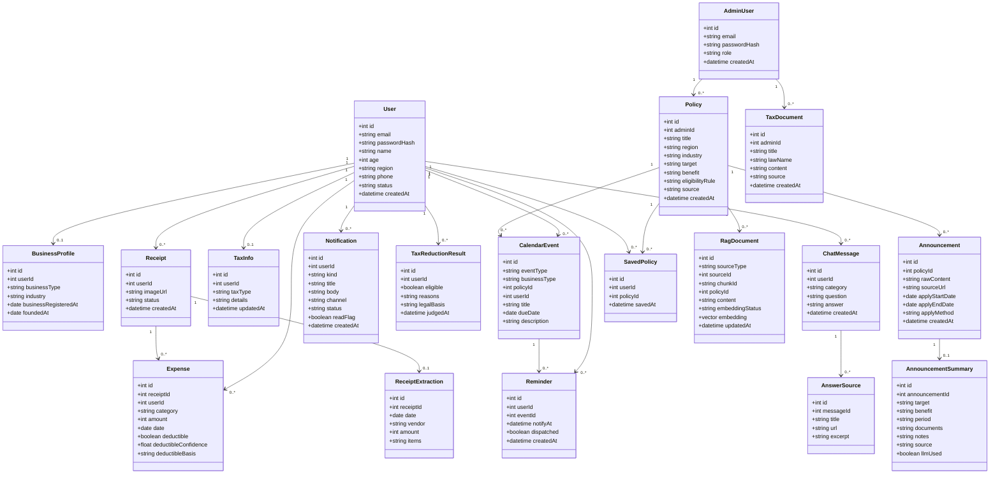

# 클래스 다이어그램

Backend를 구현할 작업자가 참고할 수 있도록 Model(도메인 모델)과 Service(비즈니스 로직) 두 계층의 클래스를 정리한다. `Docs/Design/ARCHITECTURE.md`가 정의한 Controller–Service–Model 구조 중 Controller는 `Docs/Design/API_SPEC.md`의 라우트와 거의 1:1이라 별도 다이어그램 없이 생략한다.

## 1. Model 클래스

`Docs/Design/ERD.md`의 엔티티를 도메인 객체로 재표현한 것이다. 속성만 표기하고 행위(메서드)는 두지 않는다 — `Docs/Design/ARCHITECTURE.md`가 Model 계층을 "요청/응답 데이터 구조(Pydantic)와 DB 엔티티"로 정의한 것과 같은 관점이다.

> 속성 타입, 제약(NOT NULL, UNIQUE, ON DELETE CASCADE 등)의 근거는 `Docs/Design/ERD.md`와 `DB/01_schema.sql`을 참고한다. 이 문서에서는 중복 기술하지 않는다. `RagDocument`는 참조 방식이 두 가지로 나뉜다. `sourceType`/`sourceId`는 여러 테이블을 가리키는 논리 참조라 DB FK가 없고 관계선도 두지 않는다. 반면 `policyId`는 `policies(id)`를 가리키는 실제 FK라 `Policy`와 관계선을 둔다. `Docs/Design/ERD.md`의 `tax_rag_cache`는 여기에 클래스로 두지 않는다. LLM 세금 Semantic Cache(`LLM/src/rag/tax_cache.py`) 전용 파생 테이블이고 Backend가 읽지도 쓰지도 않아 Backend 도메인 모델이 아니다.

## 2. Service 클래스

`Docs/Design/API_SPEC.md`의 라우트 그룹 11개(auth/users/chat/calendar/tax/expenses/policies/stats/system/notifications/admin) 중 비즈니스 로직이 있는 그룹을 `Backend/services/*.py` 모듈 단위로 옮긴 클래스다. 실제 코드는 클래스가 아니라 모듈 함수이며, 메서드명과 인자는 `Backend/services/*.py`의 함수 선언을 camelCase로 그대로 옮긴 것이다(밑줄 없는 공개 함수만 싣고 `_`로 시작하는 내부 헬퍼는 뺐다). 따라서 여기 없는 이름은 코드에도 없다. `stats`·`system`은 라우트가 `core.repo`를 직접 조회해 Service가 없다. `AdminService`도 대응 모듈이 없는 **논리 묶음**이다. 관리자 라우트(`Backend/api/admin.py`)가 `core.repo`와 `llm_client`를 직접 부르고, 관리자 로그인만 `auth_service.admin_login`에 있다. `/tax/calendar`·`/tax/reminders` 라우트는 `CalendarService`를 부른다. `LLMServiceClient`는 `Docs/Design/ARCHITECTURE.md`·`Docs/Design/SEQUENCE.md`에 나온 Backend→LLM 내부 REST 호출을 추상화한 클래스로, LLM 서비스 자체의 내부 구조(`LLM/src/*`)는 다루지 않는다.

```mermaid
classDiagram
    class AuthService {
        +signup(email, password, name) int
        +login(email, password) Token
        +adminLogin(email, password) Token
    }

    class UserService {
        +getMe(userId) User
        +updateMe(userId, payload) User
        +getBusinessProfile(userId) BusinessProfile
        +updateBusinessProfile(userId, payload) BusinessProfile
        +onboardingComplete(userId) bool
    }

    class ChatService {
        +suggestedQuestions(category) string[]
        +sendMessage(userId, category, question, roadmapStep) ChatMessage
        +listMessages(userId, category) ChatMessage[]
        +clearMessages(userId, category) int
        +deleteMessages(userId, messageIds) int
        +getSources(messageId, userId) AnswerSource[]
    }

    class CalendarService {
        +listEvents(year, month, eventType, userId) CalendarEvent[]
        +createPersonalEvent(userId, title, dueDate, description, remind, notifyAt) CalendarEvent
        +deletePersonalEvent(userId, eventId)
        +listReminders(userId) Reminder[]
        +createReminder(userId, eventId, notifyAt) int
        +deleteReminder(userId, reminderId)
    }

    class TaxService {
        +diagnose(conditions) DiagnosisResult
        +getTaxInfo(userId) TaxInfo
        +updateTaxInfo(userId, taxInfo) TaxInfo
        +checkTaxReduction(userId) TaxReductionResult
        +latestTaxReduction(userId) TaxReductionResult
    }

    class ExpenseService {
        +createReceipt(userId, filename, imageBase64, mimeType) Receipt
        +getExtraction(receiptId, userId) ReceiptExtraction
        +listExpenses(userId, category, fromDate, toDate) Expense[]
        +updateCategory(expenseId, userId, category) DeductibilityResult
        +deleteExpense(expenseId, userId)
        +deductibility(expenseId, userId) DeductibilityResult
    }

    class PolicyService {
        +search(keyword, region, industry, userId, offset, limit) Policy[]
        +recommendations(userId, limit) Policy[]
        +detail(policyId) Policy
        +eligibility(policyId, userId) EligibilityResult
        +listOpenAnnouncements(limit) Announcement[]
        +announcementSummary(announcementId) AnnouncementSummary
        +summarizeText(rawContent, source) AnnouncementSummary
        +savePolicy(userId, policyId)
        +unsavePolicy(userId, policyId)
        +savedList(userId) Policy[]
    }

    class NotifyService {
        +listNotifications(userId) Notification[]
        +unreadCount(userId) int
        +markRead(userId, notificationId)
        +notifyNow(userId, eventId)
        +dispatchDueReminders() int
    }

    class AdminService {
        <<logical>>
        +getUsers(page) User[]
        +getUserDetail(userId) User
        +updateUserStatus(userId, status) User
        +registerTaxDocument(data) TaxDocument
        +registerPolicy(data) Policy
        +registerAnnouncement(data) Announcement
        +reindexRagDocuments()
        +getMonitoringData() Metrics
    }

    class LLMServiceClient {
        <<external>>
        +llmStatus() Status
        +ensureIndexReady() IndexState
        +ragAnswer(question, category, userContext, noticeResults, conversationHistory, roadmapStep) Answer
        +explainTaxReduction(eligible, reasons, conditions) Explanation
        +extractReceipt(filename, imageBase64, mimeType) ReceiptFields
        +explainExpense(category, vendor, amount, items) DeductibilityResult
        +summarizeAnnouncement(rawContent, source) Summary
        +reindex()
    }

    AuthService ..> User
    AuthService ..> AdminUser
    UserService ..> User
    UserService ..> BusinessProfile
    ChatService ..> ChatMessage
    ChatService ..> AnswerSource
    ChatService ..> LLMServiceClient
    CalendarService ..> CalendarEvent
    CalendarService ..> Reminder
    TaxService ..> TaxInfo
    TaxService ..> TaxReductionResult
    TaxService ..> BusinessProfile
    TaxService ..> LLMServiceClient
    ExpenseService ..> Receipt
    ExpenseService ..> ReceiptExtraction
    ExpenseService ..> Expense
    ExpenseService ..> LLMServiceClient
    PolicyService ..> Policy
    PolicyService ..> Announcement
    PolicyService ..> AnnouncementSummary
    PolicyService ..> SavedPolicy
    PolicyService ..> LLMServiceClient
    AdminService ..> AdminUser
    AdminService ..> TaxDocument
    AdminService ..> Policy
    AdminService ..> Announcement
    AdminService ..> RagDocument
    AdminService ..> LLMServiceClient
    NotifyService ..> Notification
    CalendarService ..> Notification
```

`LLMServiceClient`의 메서드명은 `Backend/core/llm_client.py`의 함수와 1:1로 대응한다(`llm_status`, `ensure_index_ready`, `rag_answer`, `explain_tax_reduction`, `extract_receipt`, `explain_expense`, `summarize_announcement`, `reindex`). 각 호출이 실제로 어느 엔드포인트로 가는지는 `Docs/Design/LLM_API_SPEC_V1.md`를 따른다. `reindex()`는 항상 `documentIds: []`(전체 재색인)를 보낸다. `llm_status`는 상태 dict, `ensure_index_ready`는 bool을 돌려주고, 나머지 호출은 실패 시 예외 대신 `None`을 돌려준다. **어떤 호출도 재시도하지 않는다** (`Docs/Design/LLM_API_SPEC_V1.md` 9절). `None`일 때 서비스의 처리는 다르다. 챗봇은 목업 답변, 세액감면은 고정 근거 문구, 영수증은 목 값으로 내려가지만, 붙여넣기 공고 요약은 503, 저장 공고 요약은 404, 관리자 재색인은 502로 실패를 드러낸다.

`Receipt`·`ReceiptExtraction`·`Expense`와 `ExpenseService`, `LLMServiceClient`의 `extract_receipt`·`explain_expense`는 추가 기능(추후 개발)인 지출 분석용이다. 코드는 남아 있으나 이를 부르는 화면이 없다(`Docs/README.md` 8절).

`User.phone`·`User.status`, `CalendarEvent.userId`, `Reminder.dispatched`, `Expense.userId`, `Announcement.applyMethod`, `AnnouncementSummary.llmUsed`와 `Notification` 테이블은 `DB/app_extras.sql`이 공급한다(`Docs/Design/ERD.md` 구현 노트 참고).

> `DiagnosisResult`, `EligibilityResult`, `DeductibilityResult`, `Token`, `Metrics` 등 메서드 반환값은 별도 클래스로 정의하지 않았다. 실제 구현 시 `Backend/schemas`의 Pydantic 응답 모델로 정의될 값이며, 이 문서에서 미리 확정하지 않는다(과설계 방지).

## 관련 문서

- 데이터 구조: `Docs/Design/ERD.md`
- 기능 정의: `Docs/Design/FUNCTIONAL_SPEC.md`
- API 명세: `Docs/Design/API_SPEC.md`
- 시스템/계층 구조: `Docs/Design/ARCHITECTURE.md`
- 호출 흐름: `Docs/Design/SEQUENCE.md`
