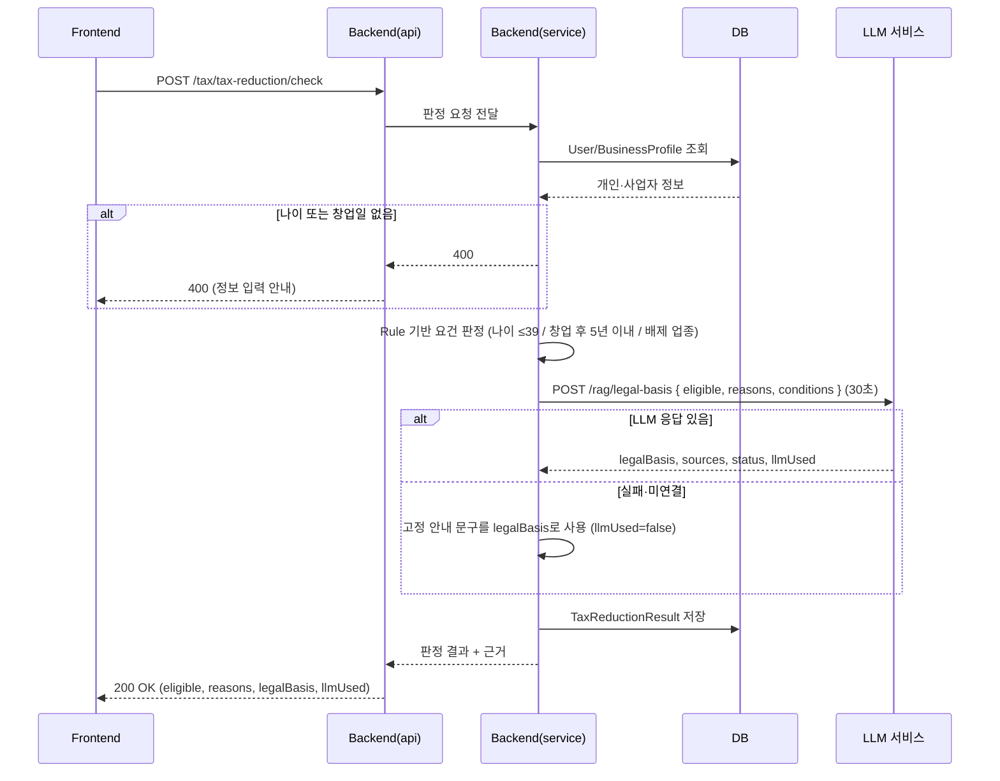
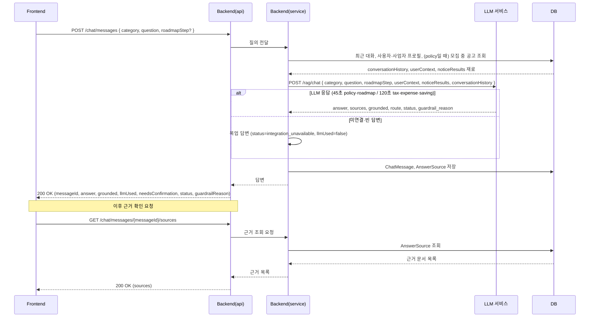
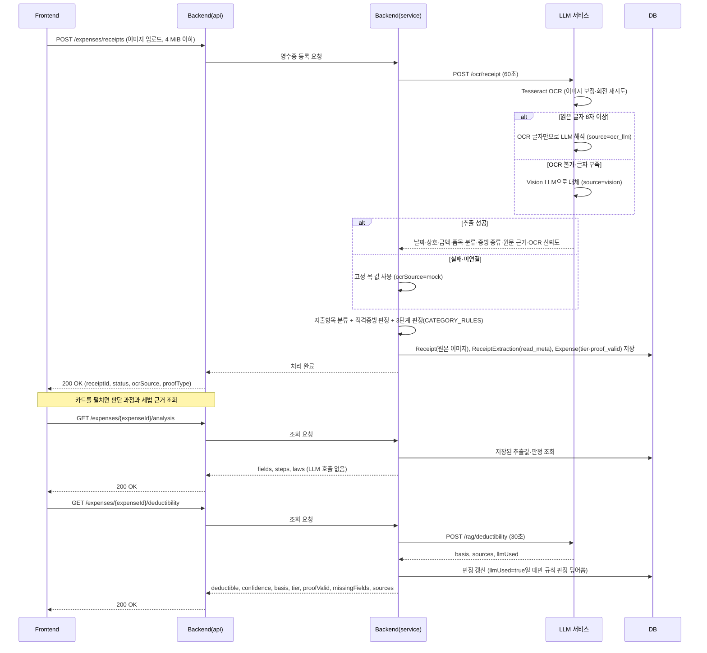
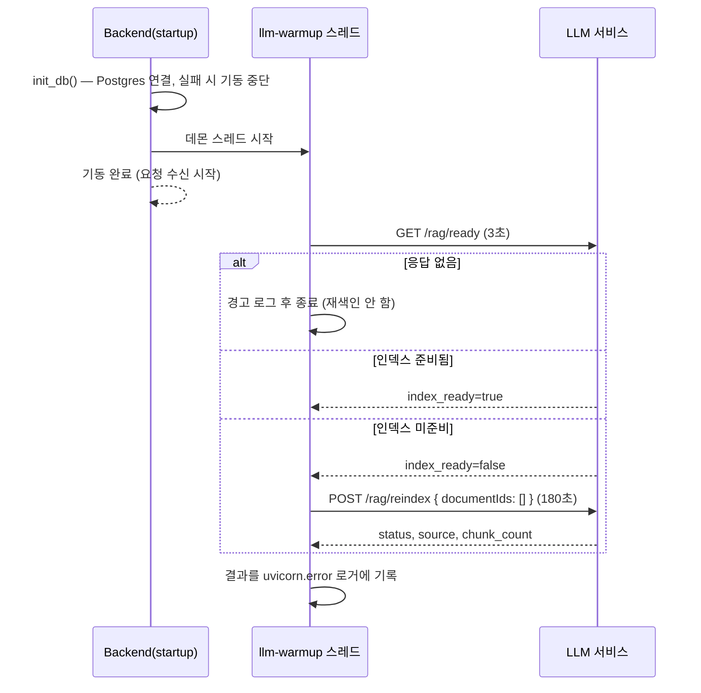
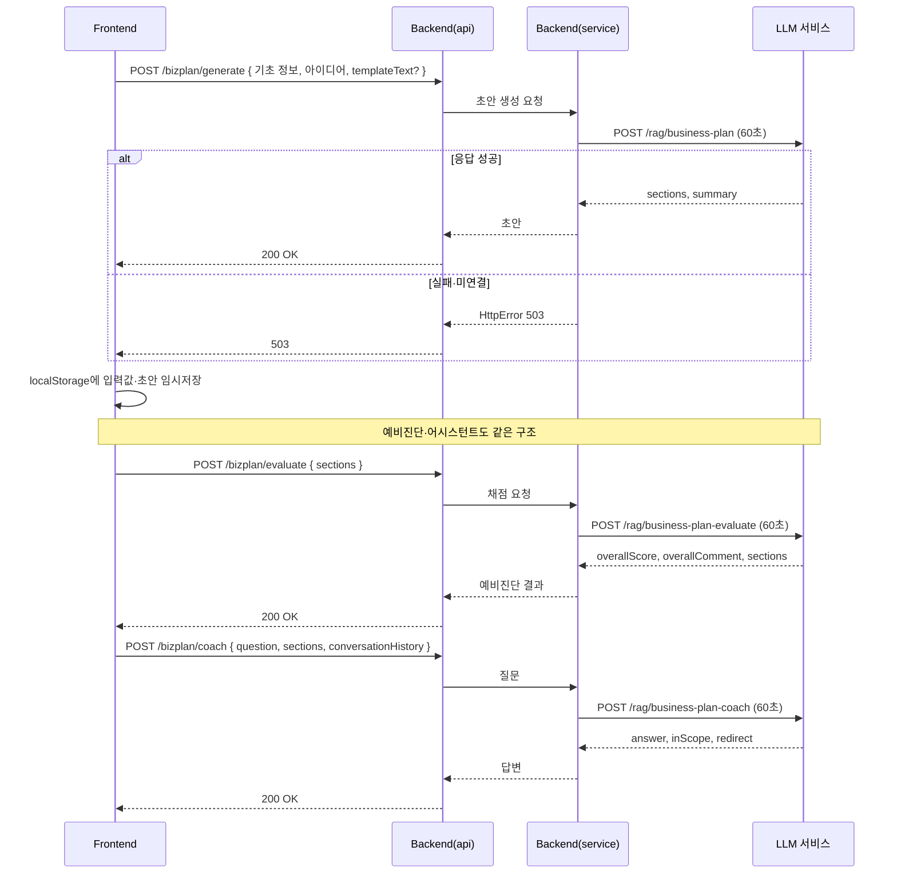

# 시퀀스 다이어그램

핵심 유스케이스의 컴포넌트 간 호출 흐름을 정리한다. 참여자 구성은 `Docs/Design/ARCHITECTURE.md`의 계층 명칭(Controller=`Backend/api`, Service=`Backend/services`)을 그대로 따른다.

## 1. 청년창업 세액감면 자동판정 (FS-13)

Rule 기반 판정과 RAG 근거 제시를 결합하는 것이 핵심 차별점(FS-13)이므로, Service가 판정 로직을 직접 수행한 뒤 LLM 서비스에는 근거 설명만 요청하는 구조로 그렸다(`Backend/services/tax_service.py`). 지역은 Rule 판정에 쓰지 않고 LLM 설명용 `conditions`로만 보낸다. LLM이 준 `sources`는 판정 결과에 저장하지 않는다.

## 2. AI 챗봇 Q&A + 답변 근거 확인 (FS-05, FS-06, FS-08)

답변 생성 시점에 근거 문서를 함께 저장해두므로, 이후 "답변 근거 확인"(FS-08)은 LLM을 다시 호출하지 않고 DB 조회만으로 처리한다.

Service는 LLM을 부르기 전에 두 가지를 조립한다(`Backend/services/chat_service.py`).

- `userContext`: `userId`·나이·지역·사업자 유형·업종·사업자등록일·창업일. 로그인 사용자의 프로필에서 만든다
- `noticeResults`: `category=policy`일 때만 모집 중 공고 상위 20건을 보낸다. 공고 본문은 `NOTICE_TEXT_LIMIT`(800자)로 자른다. 다른 category는 `null`
- `conversationHistory`: 같은 category의 최근 완료 대화(`repo.recent_chats`)

**실제 공고 조회는 Backend가 한다.** LLM은 넘겨받은 목록을 근거로 쓸 뿐 DB를 직접 뒤지지 않는다(`Docs/Design/LLM_API_SPEC_V1.md` 10절 역할 경계).
근거 문서를 못 찾으면 LLM이 `status`로 알리고, Backend는 LLM이 답한 문장과 `status`를 그대로 보존하며 `status≠success`면 `needsConfirmation=true`로 표시한다. 목업 답변은 LLM에 닿지 못했거나 빈 답변일 때만 쓴다.

## 3. 영수증 지출 분석 (FS-14 ~ FS-17)

지출관리 화면(`Frontend/src/pages/ExpenseTracker.jsx`)이 부른다. 여러 장을 고르면 화면이 한 장씩 차례로 `POST /expenses/receipts`를 보낸다.

영수증 등록(FS-14) 한 번에 OCR 추출(FS-15)과 규칙 기반 지출 분류·판정(FS-16, FS-17)이 끝난다. 판단 과정(`/analysis`)은 저장값과 규칙만으로 즉시 응답하고, RAG 근거가 붙는 설명(`/deductibility`)만 조회 시점에 LLM을 부른다(`Backend/services/expense_service.py`). 지출항목을 바꾸는 `PATCH /expenses/{expenseId}`도 규칙 재판정 후 같은 `/deductibility` 흐름을 탄다.

## 4. 기동 시 RAG 인덱스 워밍업

인덱스가 준비되지 않은 채로는 모든 질의가 LLM의 `integration_unavailable` 응답으로 끝나므로, 누가 재색인을 부를 때까지 기다리지 않고 기동 시 한 번 확인한다(`Backend/config/asgi.py` → `Backend/config/api.py`의 `startup` → `Backend/core/llm_client.py`의 `ensure_index_ready`).

데몬 스레드로 도는 이유는 워밍업이 기동을 막지 않게 하기 위해서다. `rag_documents`가 이미 임베딩을 갖고 있고 청크 content가 바뀌지 않았으면 `source: "cache"`(`status: "already_ready"`)로 로드되어 Embedding 재호출이 없다. 변경된 청크가 있으면 그만큼만 임베딩한다. `/rag/ready`에 닿지 못하면(LLM이 늦게 뜬 경우 등) 재색인하지 않으므로, compose는 llm 헬스체크 통과 뒤에 backend를 띄운다.

**질의마다 준비 상태를 확인하던 예전 동작과 혼동하면 안 된다.** 그 왕복은 제거됐고(`Docs/STATUS.md` P0-2-1), 이것은 기동 시 한 번 도는 워밍업이다.

## 5. 사업계획서 초안·예비진단·어시스턴트 (FS-29 ~ FS-31)

세 호출 모두 RAG 검색 그래프를 거치지 않는 단일 LLM 호출이고, Backend는 DB에 아무것도 저장하지 않는다(`Backend/services/bizplan_service.py`). 대화 기록도 화면이 들고 있다가 매 질문에 함께 보낸다.

## 관련 문서

- 전체 시스템 구성·계층 구조: `Docs/Design/ARCHITECTURE.md`
- 기능 정의: `Docs/Design/FUNCTIONAL_SPEC.md`
- 데이터 구조: `Docs/Design/ERD.md`
- Backend↔LLM 계약: `Docs/Design/LLM_API_SPEC_V1.md`
