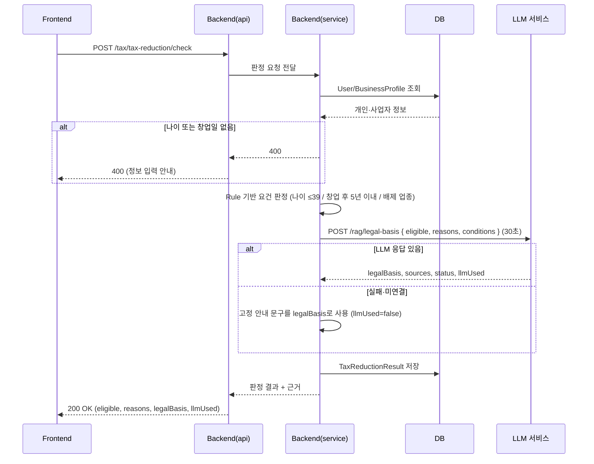
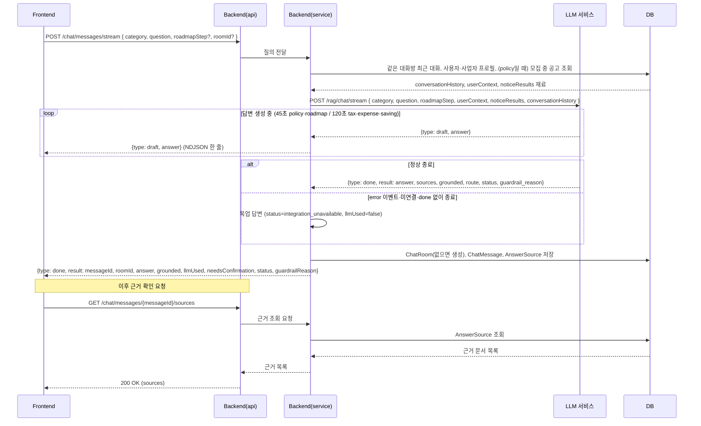
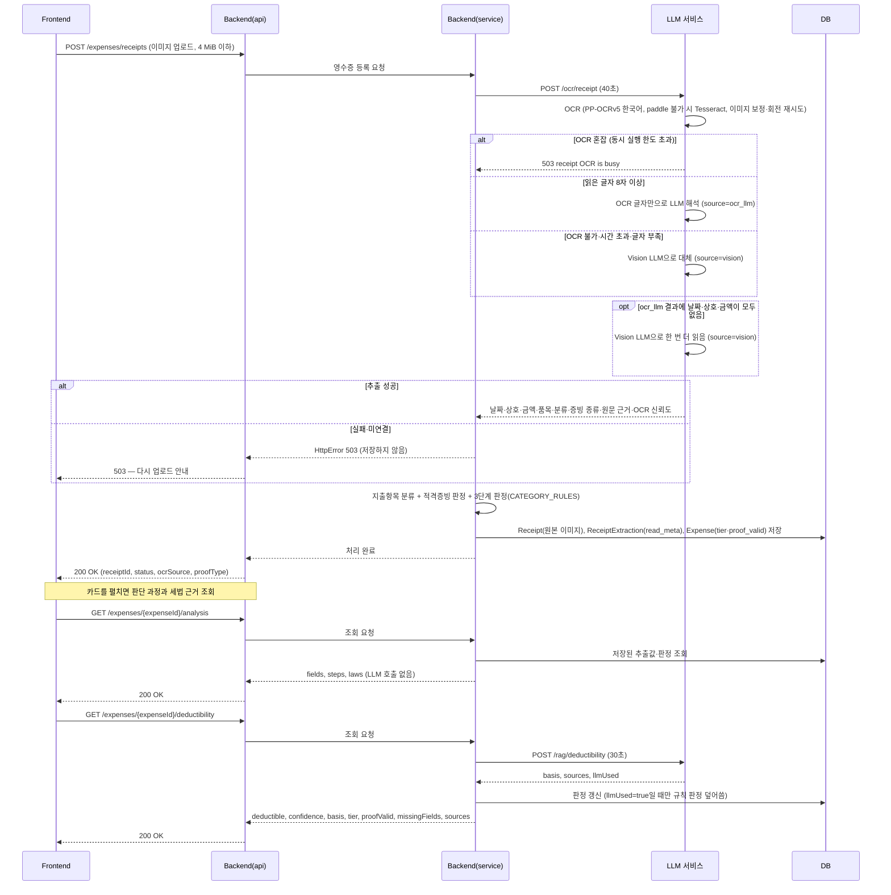
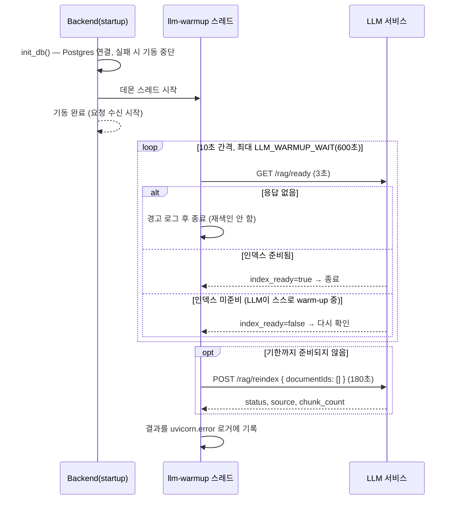
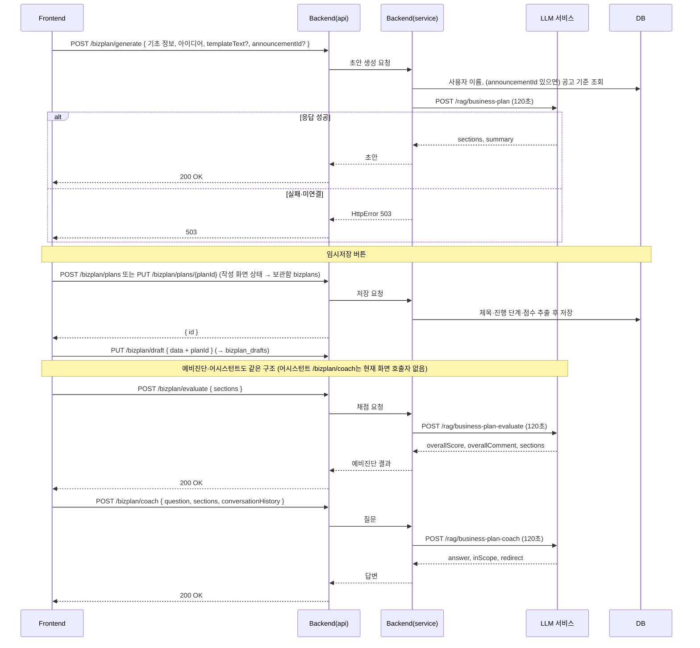
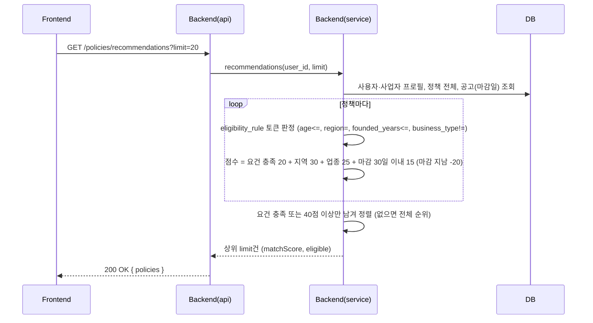
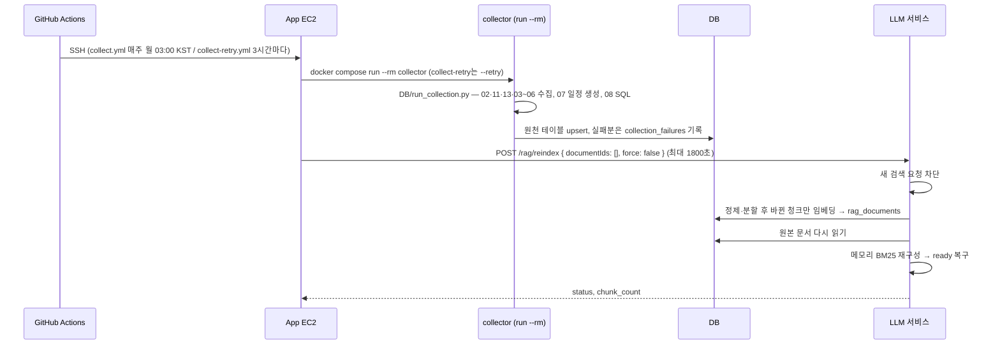

# 시퀀스 다이어그램

핵심 유스케이스의 컴포넌트 간 호출 흐름을 정리한다. 참여자 구성은 `Docs/Design/ARCHITECTURE.md`의 계층 명칭(Controller=`Backend/api`, Service=`Backend/services`)을 그대로 따른다.

## 1. 청년창업 세액감면 자동판정 (FS-13)

```mermaid
sequenceDiagram
    participant FE as Frontend
    participant API as Backend(api)
    participant SVC as Backend(service)
    participant DB as DB
    participant LLM as LLM 서비스

    FE->>API: POST /tax/tax-reduction/check
    API->>SVC: 판정 요청 전달
    SVC->>DB: User/BusinessProfile 조회
    DB-->>SVC: 개인·사업자 정보
    alt 나이 또는 창업일 없음
        SVC-->>API: 400
        API-->>FE: 400 (정보 입력 안내)
    end
    SVC->>SVC: Rule 기반 요건 판정 (나이 ≤39 / 창업 후 5년 이내 / 배제 업종)
    SVC->>LLM: POST /rag/legal-basis { eligible, reasons, conditions } (30초)
    alt LLM 응답 있음
        LLM-->>SVC: legalBasis, sources, status, llmUsed
    else 실패·미연결
        SVC->>SVC: 고정 안내 문구를 legalBasis로 사용 (llmUsed=false)
    end
    SVC->>DB: TaxReductionResult 저장
    SVC-->>API: 판정 결과 + 근거
    API-->>FE: 200 OK (eligible, reasons, legalBasis, llmUsed)
```

Rule 기반 판정과 RAG 근거 제시를 결합하는 것이 핵심 차별점(FS-13)이므로, Service가 판정 로직을 직접 수행한 뒤 LLM 서비스에는 근거 설명만 요청하는 구조로 그렸다(`Backend/services/tax_service.py`). 지역은 Rule 판정에 쓰지 않고 LLM 설명용 `conditions`로만 보낸다. LLM이 준 `sources`는 판정 결과에 저장하지 않는다.

## 2. AI 챗봇 Q&A + 답변 근거 확인 (FS-05, FS-06, FS-08)

```mermaid
sequenceDiagram
    participant FE as Frontend
    participant API as Backend(api)
    participant SVC as Backend(service)
    participant LLM as LLM 서비스
    participant DB as DB

    FE->>API: POST /chat/messages/stream { category, question, roadmapStep?, roomId? }
    API->>SVC: 질의 전달
    SVC->>DB: 같은 대화방 최근 대화, 사용자·사업자 프로필, (policy일 때) 모집 중 공고 조회
    DB-->>SVC: conversationHistory, userContext, noticeResults 재료
    SVC->>LLM: POST /rag/chat/stream { category, question, roadmapStep, userContext, noticeResults, conversationHistory }
    loop 답변 생성 중 (45초 policy·roadmap / 120초 tax·expense·saving)
        LLM-->>SVC: {type: draft, answer}
        SVC-->>FE: {type: draft, answer} (NDJSON 한 줄)
    end
    alt 정상 종료
        LLM-->>SVC: {type: done, result: answer, sources, grounded, route, status, guardrail_reason}
    else error 이벤트·미연결·done 없이 종료
        SVC->>SVC: 목업 답변 (status=integration_unavailable, llmUsed=false)
    end
    SVC->>DB: ChatRoom(없으면 생성), ChatMessage, AnswerSource 저장
    SVC-->>FE: {type: done, result: messageId, roomId, answer, grounded, llmUsed, needsConfirmation, status, guardrailReason}

    Note over FE,API: 이후 근거 확인 요청
    FE->>API: GET /chat/messages/{messageId}/sources
    API->>SVC: 근거 조회 요청
    SVC->>DB: AnswerSource 조회
    DB-->>SVC: 근거 문서 목록
    SVC-->>API: 근거 목록
    API-->>FE: 200 OK (sources)
```

채팅 화면(`Frontend/src/components/AiConsult.jsx`)은 스트리밍 경로(`api.chatStream`)를 쓴다. 스트리밍이 아닌 `POST /chat/messages` → `POST /rag/chat`도 같은 조립·저장 과정을 거치며 마지막에 한 번만 응답한다.

답변 생성 시점에 근거 문서를 함께 저장해두므로, 이후 "답변 근거 확인"(FS-08)은 LLM을 다시 호출하지 않고 DB 조회만으로 처리한다.

Service는 LLM을 부르기 전에 두 가지를 조립한다(`Backend/services/chat_service.py`).

- `userContext`: `userId`·나이·지역·사업자 유형·업종·사업자등록일·창업일. 로그인 사용자의 프로필에서 만든다
- `noticeResults`: `category=policy`일 때만 모집 중 공고 상위 20건을 보낸다. 공고 본문은 `NOTICE_TEXT_LIMIT`(800자)로 자른다. 다른 category는 `null`
- `conversationHistory`: 같은 대화방(`roomId`)의 최근 완료 대화(`repo.recent_chats`). `roomId`가 없으면(새 대화방) 비어 있다

**실제 공고 조회는 Backend가 한다.** LLM은 넘겨받은 목록을 근거로 쓸 뿐 DB를 직접 뒤지지 않는다(`Docs/Design/LLM_API_SPEC_V1.md` 10절 역할 경계).
근거 문서를 못 찾으면 LLM이 `status`로 알리고, Backend는 LLM이 답한 문장과 `status`를 그대로 보존하며 `status≠success`면 `needsConfirmation=true`로 표시한다. 목업 답변은 LLM에 닿지 못했거나 빈 답변일 때만 쓴다.

## 3. 영수증 지출 분석 (FS-14 ~ FS-17)

지출관리 화면(`Frontend/src/pages/ExpenseTracker.jsx`)이 부른다. 여러 장을 고르면 화면이 한 장씩 차례로 `POST /expenses/receipts`를 보낸다.

```mermaid
sequenceDiagram
    participant FE as Frontend
    participant API as Backend(api)
    participant SVC as Backend(service)
    participant LLM as LLM 서비스
    participant DB as DB

    FE->>API: POST /expenses/receipts (이미지 업로드, 4 MiB 이하)
    API->>SVC: 영수증 등록 요청
    SVC->>LLM: POST /ocr/receipt (40초)
    LLM->>LLM: OCR (PP-OCRv5 한국어, paddle 불가 시 Tesseract, 이미지 보정·회전 재시도)
    alt OCR 혼잡 (동시 실행 한도 초과)
        LLM-->>SVC: 503 receipt OCR is busy
    else 읽은 글자 8자 이상
        LLM->>LLM: OCR 글자만으로 LLM 해석 (source=ocr_llm)
    else OCR 불가·시간 초과·글자 부족
        LLM->>LLM: Vision LLM으로 대체 (source=vision)
    end
    opt ocr_llm 결과에 날짜·상호·금액이 모두 없음
        LLM->>LLM: Vision LLM으로 한 번 더 읽음 (source=vision)
    end
    alt 추출 성공
        LLM-->>SVC: 날짜·상호·금액·품목·분류·증빙 종류·원문 근거·OCR 신뢰도
    else 실패·미연결
        SVC-->>API: HttpError 503 (저장하지 않음)
        API-->>FE: 503 — 다시 업로드 안내
    end
    SVC->>SVC: 지출항목 분류 + 적격증빙 판정 + 3단계 판정(CATEGORY_RULES)
    SVC->>DB: Receipt(원본 이미지), ReceiptExtraction(read_meta), Expense(tier·proof_valid) 저장
    SVC-->>API: 처리 완료
    API-->>FE: 200 OK (receiptId, status, ocrSource, proofType)

    Note over FE,API: 카드를 펼치면 판단 과정과 세법 근거 조회
    FE->>API: GET /expenses/{expenseId}/analysis
    API->>SVC: 조회 요청
    SVC->>DB: 저장된 추출값·판정 조회
    SVC-->>API: fields, steps, laws (LLM 호출 없음)
    API-->>FE: 200 OK
    FE->>API: GET /expenses/{expenseId}/deductibility
    API->>SVC: 조회 요청
    SVC->>LLM: POST /rag/deductibility (30초)
    LLM-->>SVC: basis, sources, llmUsed
    SVC->>DB: 판정 갱신 (llmUsed=true일 때만 규칙 판정 덮어씀)
    SVC-->>API: deductible, confidence, basis, tier, proofValid, missingFields, sources
    API-->>FE: 200 OK
```

영수증 등록(FS-14) 한 번에 OCR 추출(FS-15)과 규칙 기반 지출 분류·판정(FS-16, FS-17)이 끝난다. 읽지 못한 영수증을 임의 값으로 저장하면 잘못된 지출이 남으므로 503으로 돌려보내고 아무것도 저장하지 않는다(`expense_service.create_receipt`). OCR 엔진 비교는 `Docs/OCR_PPOCRV5_BENCHMARK.md`. 판단 과정(`/analysis`)은 저장값과 규칙만으로 즉시 응답하고, RAG 근거가 붙는 설명(`/deductibility`)만 조회 시점에 LLM을 부른다(`Backend/services/expense_service.py`). 지출항목을 바꾸는 `PATCH /expenses/{expenseId}`도 규칙 재판정 후 같은 `/deductibility` 흐름을 탄다. OCR이 놓친 값은 화면에서 직접 고친다: `POST /expenses/{expenseId}/items`(품목 추가), `DELETE /expenses/{expenseId}/items/{itemIndex}`(품목 삭제), `PATCH /expenses/{expenseId}/vendor`(상호 수정). 모두 LLM 호출 없이 저장값만 바꾼다.

## 4. 기동 시 RAG 인덱스 워밍업

```mermaid
sequenceDiagram
    participant BE as Backend(startup)
    participant WU as llm-warmup 스레드
    participant LLM as LLM 서비스

    BE->>BE: init_db() — Postgres 연결, 실패 시 기동 중단
    BE->>WU: 데몬 스레드 시작
    BE-->>BE: 기동 완료 (요청 수신 시작)
    loop 10초 간격, 최대 LLM_WARMUP_WAIT(600초)
        WU->>LLM: GET /rag/ready (3초)
        alt 응답 없음
            WU->>WU: 경고 로그 후 종료 (재색인 안 함)
        else 인덱스 준비됨
            LLM-->>WU: index_ready=true → 종료
        else 인덱스 미준비 (LLM이 스스로 warm-up 중)
            LLM-->>WU: index_ready=false → 다시 확인
        end
    end
    opt 기한까지 준비되지 않음
        WU->>LLM: POST /rag/reindex { documentIds: [] } (180초)
        LLM-->>WU: status, source, chunk_count
    end
    WU->>WU: 결과를 uvicorn.error 로거에 기록
```

인덱스가 준비되지 않은 채로는 모든 질의가 LLM의 `integration_unavailable` 응답으로 끝나므로, 누가 재색인을 부를 때까지 기다리지 않고 기동 시 확인한다(`Backend/config/asgi.py` → `Backend/config/api.py`의 `startup` → `Backend/core/llm_client.py`의 `ensure_index_ready`).

데몬 스레드로 도는 이유는 워밍업이 기동을 막지 않게 하기 위해서다. `rag_documents`가 이미 임베딩을 갖고 있고 청크 content가 바뀌지 않았으면 `source: "cache"`(`status: "already_ready"`)로 로드되어 Embedding 재호출이 없다. 변경된 청크가 있으면 그만큼만 임베딩한다. `/rag/ready`에 닿지 못하면(LLM이 늦게 뜬 경우 등) 재색인하지 않으므로, compose는 llm 헬스체크 통과 뒤에 backend를 띄운다.

LLM 서비스도 스스로 워밍업한다. 프로세스가 받은 첫 HTTP 요청(compose 헬스체크 포함) 때 `llm-warmup` 태스크가 인덱스를 만들고 영수증 OCR 모델(PP-OCRv5)을 미리 불러 둔다(`LLM/src/serving/django_config/asgi.py`). 인덱스 준비에 실패하면(Data EC2 일시 불통 등) 60초부터 2배씩 늘려 최대 600초 간격으로 다시 시도한다. Backend가 곧바로 재색인하지 않고 `/rag/ready`만 확인하며 기다리는 이유는, 이 warm-up이 막 만든 인덱스를 다시 지우고 만들지 않기 위해서다.

**질의마다 준비 상태를 확인하던 예전 동작과 혼동하면 안 된다.** 그 왕복은 제거됐고(`Docs/STATUS.md` P0-2-1), 이것은 기동 시 한 번 도는 워밍업이다.

## 5. 사업계획서 초안·예비진단·어시스턴트·보관 (FS-29 ~ FS-31)

```mermaid
sequenceDiagram
    participant FE as Frontend
    participant API as Backend(api)
    participant SVC as Backend(service)
    participant LLM as LLM 서비스
    participant DB as DB

    FE->>API: POST /bizplan/generate { 기초 정보, 아이디어, templateText?, announcementId? }
    API->>SVC: 초안 생성 요청
    SVC->>DB: 사용자 이름, (announcementId 있으면) 공고 기준 조회
    SVC->>LLM: POST /rag/business-plan (120초)
    alt 응답 성공
        LLM-->>SVC: sections, summary
        SVC-->>API: 초안
        API-->>FE: 200 OK
    else 실패·미연결
        SVC-->>API: HttpError 503
        API-->>FE: 503
    end
    Note over FE,DB: 임시저장 버튼
    FE->>API: POST /bizplan/plans 또는 PUT /bizplan/plans/{planId} (작성 화면 상태 → 보관함 bizplans)
    API->>SVC: 저장 요청
    SVC->>DB: 제목·진행 단계·점수 추출 후 저장
    API-->>FE: { id }
    FE->>API: PUT /bizplan/draft { data + planId } (→ bizplan_drafts)

    Note over FE,LLM: 예비진단·어시스턴트도 같은 구조 (어시스턴트 /bizplan/coach는 현재 화면 호출자 없음)
    FE->>API: POST /bizplan/evaluate { sections }
    API->>SVC: 채점 요청
    SVC->>LLM: POST /rag/business-plan-evaluate (120초)
    LLM-->>SVC: overallScore, overallComment, sections
    SVC-->>API: 예비진단 결과
    API-->>FE: 200 OK
    FE->>API: POST /bizplan/coach { question, sections, conversationHistory }
    API->>SVC: 질문
    SVC->>LLM: POST /rag/business-plan-coach (120초)
    LLM-->>SVC: answer, inScope, redirect
    SVC-->>API: 답변
    API-->>FE: 200 OK
```

생성·예비진단·어시스턴트는 RAG 검색 그래프를 거치지 않는 단일 LLM 호출이다. 어시스턴트 대화 기록은 호출자가 들고 있다가 매 질문에 함께 보내는 계약이다. 단, 현재 사업계획서 화면은 `POST /bizplan/coach`를 부르지 않는다(FS-31 ✕). 입력 정리(`/bizplan/refine` → `/rag/business-plan-refine`)도 같은 구조이고, 양식 검사(`/bizplan/template-inspect`)·파일 출력(`/bizplan/render`)은 LLM 서비스의 문서 처리(모델 호출 없음)를 부른다. 시간 제한은 모두 `LLM_TIMEOUT_BIZPLAN`(120초)이다.

저장은 두 단계다(`Backend/services/bizplan_service.py`). `bizplan_drafts`는 지금 작성 화면에 열린 한 건이고, `bizplans`는 보관함이다. 임시저장 `data.planId`가 열린 보관함 건을 가리킨다. 마이페이지 `사업계획서` 메뉴에서 `POST /bizplan/plans/{planId}/open`을 부르면 그 건이 작성 화면(임시저장)으로 복사되고, `POST /bizplan/plans/new`는 임시저장만 비운다.

## 6. 맞춤 정책 추천 (FS-19)

마이페이지(`MyPage.jsx`), 홈의 오늘 챙길 일(`web/WebToday.jsx`), 공고문 분석(`AnnouncementAnalyzer.jsx`)이 부른다.

```mermaid
sequenceDiagram
    participant FE as Frontend
    participant API as Backend(api)
    participant SVC as Backend(service)
    participant DB as DB

    FE->>API: GET /policies/recommendations?limit=20
    API->>SVC: recommendations(user_id, limit)
    SVC->>DB: 사용자·사업자 프로필, 정책 전체, 공고(마감일) 조회
    loop 정책마다
        SVC->>SVC: eligibility_rule 토큰 판정 (age<=, region=, founded_years<=, business_type!=)
        SVC->>SVC: 점수 = 요건 충족 20 + 지역 30 + 업종 25 + 마감 30일 이내 15 (마감 지남 -20)
    end
    SVC->>SVC: 요건 충족 또는 40점 이상만 남겨 정렬 (없으면 전체 순위)
    SVC-->>API: 상위 limit건 (matchScore, eligible)
    API-->>FE: 200 OK { policies }
```

추천은 Backend 규칙만으로 끝나며 LLM을 부르지 않는다(`Backend/services/policy_service.py`의 `recommendations`·`_score_policy`). 요건 문구를 해석하지 못한 정책은 `eligible=None`(판정 불가)으로 두고 가산하지 않는다. LLM 서비스의 `POST /internal/rag/recommendations`는 Backend가 호출하지 않는다.

## 7. 원천 데이터 수집과 재색인

```mermaid
sequenceDiagram
    participant GH as GitHub Actions
    participant APP as App EC2
    participant COL as collector (run --rm)
    participant DB as DB
    participant LLM as LLM 서비스

    GH->>APP: SSH (collect.yml 매주 월 03:00 KST / collect-retry.yml 3시간마다)
    APP->>COL: docker compose run --rm collector (collect-retry는 --retry)
    COL->>COL: DB/run_collection.py — 02·11·13·03~06 수집, 07 일정 생성, 08 SQL
    COL->>DB: 원천 테이블 upsert, 실패분은 collection_failures 기록
    APP->>LLM: POST /rag/reindex { documentIds: [], force: false } (최대 1800초)
    LLM->>LLM: 새 검색 요청 차단
    LLM->>DB: 정제·분할 후 바뀐 청크만 임베딩 → rag_documents
    LLM->>DB: 원본 문서 다시 읽기
    LLM->>LLM: 메모리 BM25 재구성 → ready 복구
    LLM-->>APP: status, chunk_count
```

수집 스크립트는 Backend를 거치지 않고 DB에 직접 쓴다. 재색인이 실패해도 수집 결과 코드는 따로 받아 워크플로 실패로 알린다(`.github/workflows/collect.yml`). 순서와 스크립트별 내용은 `Docs/data_collection_preprocessing.md`.

## 관련 문서

- 전체 시스템 구성·계층 구조: `Docs/Design/ARCHITECTURE.md`
- 기능 정의: `Docs/Design/FUNCTIONAL_SPEC.md`
- 데이터 구조: `Docs/Design/ERD.md`
- Backend↔LLM 계약: `Docs/Design/LLM_API_SPEC_V1.md`
