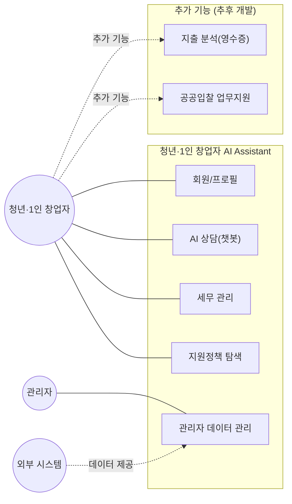
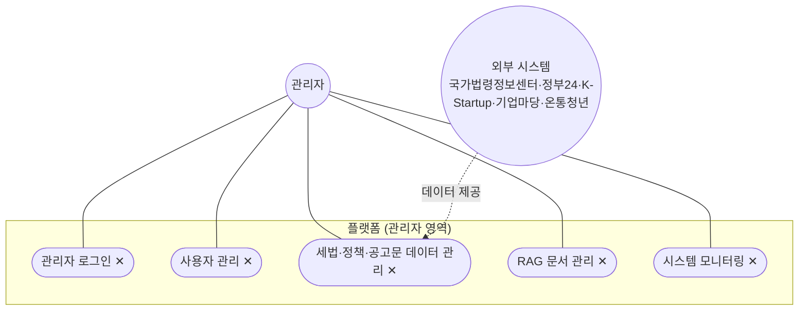

# 유스케이스 다이어그램

청년·1인 창업자 AI Assistant의 Actor별 유스케이스를 정리한다. Actor는 3개로 구성한다.

- **청년·1인 창업자**: 서비스의 주 사용자(Primary Actor)
- **관리자**: 세법·정책·공고문 데이터 및 서비스를 관리
- **외부 시스템**: 국가법령정보센터, 정부24, K-Startup, 기업마당, 온통청년 등 데이터 연계 대상 (하나의 Actor로 통합). 실제 수집은 `DB/scripts/02~06` 스크립트가 DB에 직접 적재한다

현재 범위는 **세무 관리 + 지원금·정책 탐색**을 메인 기능으로 하고, **지출 분석(영수증)과 공공입찰 업무지원은 추가 기능(추후 개발)**으로 범위 밖에 둔다. 추가 기능 목록은 `Docs/README.md` 8절 참고.

## 1. 전체 개요

## 2. 청년·1인 창업자 — 상세 유스케이스

```mermaid
flowchart TD
    User((청년·1인 창업자))

    subgraph SYS["플랫폼"]
        subgraph G1["회원/프로필"]
            UC01(["회원가입"])
            UC02(["로그인"])
            UC03(["개인정보 관리"])
            UC04(["사업자 정보 관리"])
        end

        subgraph G2["AI 상담(챗봇)"]
            UC05(["AI 챗봇 이용"])
            UC06(["세금/경비처리/절세 Q&A"])
            UC07(["정책 Q&A"])
            UC08(["답변 근거 확인"])
        end

        subgraph G3["세무 관리"]
            UC09(["사업자 유형 진단 ✕"])
            UC10(["세금 정보 관리 ✕"])
            UC11(["통합 일정 캘린더 조회"])
            UC12(["맞춤 리마인더 설정 △"])
            UC13(["청년창업 세액감면 자동판정 △"])
        end

        subgraph G4["지출 분석 (추가 기능)"]
            UC14(["영수증 등록"])
            UC15(["영수증 정보 추출(OCR)"])
            UC16(["지출 분류"])
            UC17(["경비처리 가능성 분석"])
        end

        subgraph G5["지원정책 탐색"]
            UC18(["지원정책 검색 ✕"])
            UC19(["맞춤 정책 추천"])
            UC20(["지원 자격 확인 ✕"])
            UC21(["신청기간·방법 확인"])
            UC22(["공고문 AI 요약 △"])
            UC23(["관심 정책 저장"])
        end

        subgraph G6["명세 외 구현 기능"]
            UX1(["창업 로드맵 AI 코치"])
            UX2(["개인 일정 등록·삭제"])
            UX3(["알림함 확인 ✕"])
            UX4(["대화 기록 조회·삭제"])
            UX5(["모집 중 공고·서비스 지표 조회(비로그인)"])
        end
    end

    User --- UC01
    User --- UC02
    User --- UC03
    User --- UC04
    User --- UC05
    User --- UC06
    User --- UC07
    User --- UC08
    User --- UC09
    User --- UC10
    User --- UC11
    User --- UC12
    User --- UC13
    User -.- UC14
    User -.- UC15
    User -.- UC16
    User -.- UC17
    User --- UC18
    User --- UC19
    User --- UC20
    User --- UC21
    User --- UC22
    User --- UC23
    User --- UX1
    User --- UX2
    User --- UX3
    User --- UX4
    User --- UX5

    UC06 -. include .-> UC08
```

노드 뒤 표시는 **화면 연결 여부**다. `✕`는 Backend 구현은 있으나 부르는 화면이 없는 것, `△`는 일부 경로만 연결됐거나 부르는 코드가 죽은 코드(`TaxTool.jsx`·`GovExplorer.jsx`)인 것, 표시가 없으면 살아 있는 화면이 부르는 것이다. 기능별 근거는 `Docs/Design/FUNCTIONAL_SPEC.md`의 `화면 연결` 열에 있다.

`지출 분석`(UC14~17)은 추가 기능(추후 개발)이라 점선으로 표시했다. 번호는 기능명세서(FS-14~17)와의 대응을 위해 유지한다.

`세금/경비처리/절세 Q&A`는 답변마다 근거 문서를 함께 제시해야 하므로 `답변 근거 확인`을 `<<include>>` 관계로 연결했다. RAG 기반 시스템이라는 것을 다이어그램에서도 드러내기 위함이다.

`청년창업 세액감면 자동판정`은 설계 초안에서 `답변 근거 확인`을 include했으나 구현에서는 뺐다. 판정 응답은 LLM이 생성한 `legalBasis` 문장만 담고 근거 문서 목록을 저장·조회하지 않는다(`GET /chat/messages/{id}/sources`는 챗 메시지 전용).

`명세 외 구현 기능`(UX1~5)은 FS 번호가 없지만 코드에 있는 기능이다. 로드맵 코치는 `POST /chat/messages`의 `category=roadmap`, 개인 일정은 `POST`·`DELETE /calendar`, 알림함은 `/notifications`, 대화 기록은 `GET`·`DELETE /chat/messages`, 비로그인 조회는 `GET /announcements`·`GET /stats`다(`Docs/Design/API_SPEC.md`). 이 중 **UX3(알림함 확인)만 화면이 없다.** Backend `/notifications/*` 4개는 구현돼 있으나 부르는 화면이 없고, 마이페이지의 "알림 설정"(`Frontend/src/pages/MyPage.jsx:628-638`)은 서버를 부르지 않는 로컬 토글이다. UX1·2·4·5는 화면까지 연결돼 있다. 기능별 화면 연결 현황은 `Docs/Design/FUNCTIONAL_SPEC.md`의 `화면 연결` 열을 따른다.

## 3. 관리자 · 외부 시스템 — 상세 유스케이스

표시 규칙은 2절과 같다. **관리자 유스케이스 다섯 개 모두 화면이 없다(`✕`).** `/admin/*` 엔드포인트를 부르는 프론트엔드 코드가 없어 `GET /docs`(Swagger UI)나 직접 호출로만 쓸 수 있다.

`Ext -. 데이터 제공 .-> UC26`은 개념적 연결이다. 실제 대량 적재는 관리자 기능을 거치지 않고 `DB/scripts/02~06` 수집 스크립트가 DB에 직접 쓴다(1절 Actor 설명, `Docs/Design/ARCHITECTURE.md` 1절).

## 4. 통합 일정 캘린더 범위 확장

`세금 캘린더 조회`(UC11)는 세금 신고·납부 일정만 다뤘으나, 사용자 캘린더는 지원정책 신청기한과 개인 일정도 함께 보여줘야 하므로 `통합 일정 캘린더 조회`로 범위를 넓혔다. 구현(`Backend/services/calendar_service.py`)은 세금 일정 전체, 내 개인 일정, 그리고 **저장한 정책이거나 아직 마감 전인** 정책 마감일을 보여준다. 추천 결과로는 거르지 않는다. 실데이터 캘린더는 마이페이지에 있고 홈 화면 캘린더는 예시 데이터다. 이에 따라 `맞춤 리마인더 설정`(UC12) 역시 세금·지원금 일정 모두를 대상으로 한다.

## 5. 원본 기능 목록에서 추가한 유스케이스

팀이 정리한 원본 기능 목록(회원가입/로그인/개인정보 입력, 챗봇, 사업자등록 유형진단, 세금 관련 내용 수집, 세금 캘린더·리마인더, 경비처리·절세 Q&A, 청년창업 세액감면 자동판정, 지원금 정책 수집·추천, 세금 영수증 지출분석, 지원사업 공고문 AI 요약)에 없던 항목 중, 유스케이스 다이어그램을 구성하면서 필요하다고 판단해 추가한 것은 다음과 같다.

- **사업자 정보 관리**: 개인정보 입력과 별도로 분리했다. 나이·거주지 같은 개인정보만으로는 세액감면·지원금 판정이 불가능하고, 업종·창업일·사업자 유형 등 사업자 정보가 판정 로직의 실제 입력값이기 때문이다.
- **답변 근거 확인**: RAG 기반 응답이라는 것을 보여주는 핵심 기능이라 판단해 추가했다. Q&A 유스케이스에 `<<include>>`로 연결했다(세액감면 자동판정 연결은 2절 설명대로 구현에서 제외).
- **지원 자격 확인**: "맞춤 정책 추천"(관련성 있는 정책을 보여줌)과 "지원 자격 확인"(실제 신청 조건 충족 여부를 확인함)은 서로 다른 기능이라 분리했다.
- **신청기간·방법 확인**: 정책을 찾는 것에서 끝나지 않고 실제 신청까지 이어지도록 별도 유스케이스로 추가했다.
- **관심 정책 저장**: 구현 난이도는 낮지만 실제 서비스 UX에서 필요한 기능이라 추가했다.
- **영수증 정보 추출(OCR)**: "세금 영수증 지출분석" 한 항목을 등록 → OCR 추출 → 지출 분류 → 경비처리 가능성 분석 네 단계로 구체화했다. 이후 네 단계 전체를 추가 기능(추후 개발)으로 돌렸다.
- **RAG 문서 관리 / 데이터 관리 / 시스템 모니터링(관리자)**: 사용자 쪽 기능만으로는 세법·정책·공고문 데이터가 최신 상태로 유지될 수 없으므로, 관리자 Actor의 유스케이스로 추가했다.
- **공공입찰 업무지원(추가 기능)**: 팀 논의에서 나온 아이디어이지만 이번 프로젝트의 메인 범위(세무 관리·지원금 탐색)에서 제외하기로 했으므로, 전체 개요 다이어그램에만 범위 외 항목으로 표시했다.
