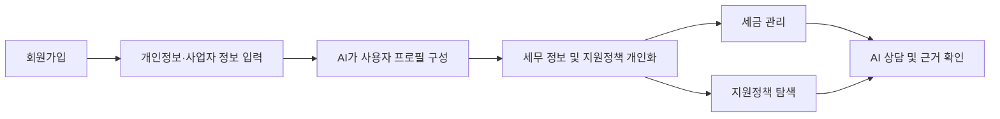

# 청년·1인 창업자 맞춤형 AI 행정·재정 지원 플랫폼

LLM과 RAG(Retrieval-Augmented Generation) 기술을 연동한 내외부 문서 기반 질의응답 시스템으로, 청년·1인 창업자의 세무 관리와 정부·지자체 지원정책 탐색을 지원하는 AI 업무지원 플랫폼이다.

## 1. 프로젝트 개요

청년·1인 창업자는 세금, 세액감면, 정부·지자체 지원사업 등 다양한 행정 정보를 직접 찾아보고 자신의 조건에 해당하는지 판단해야 한다. 그러나 관련 정보가 여러 기관과 공고문에 분산되어 있고, 법령 및 지원 조건이 복잡해 필요한 혜택을 놓치는 경우가 많다.

본 프로젝트는 사용자의 사업자 정보와 개인 조건을 기반으로 세무 정보와 정부·지자체 지원정책을 통합적으로 탐색하고 안내하는 AI 업무지원 플랫폼을 개발한다.

## 2. 핵심 문제

- 세금 및 세액감면 조건이 복잡하여 스스로 판단하기 어려움
- 정부·지자체 지원사업이 여러 기관에 분산되어 있음
- 긴 공고문을 직접 읽고 지원 대상 및 신청 조건을 확인해야 함
- 일반 AI에게 질문할 경우 존재하지 않는 정책이나 부정확한 세무 정보를 제공할 위험이 있음

## 3. 프로젝트 목표

- 환각을 방지하고 원하는 내외부 데이터 범위 안에서 RAG 기반 LLM 질의응답 시스템을 구현하여, 근거 없는 정책·세무 정보를 제공하는 위험을 차단한다.
- 세법·정책 문서를 벡터 형태로 임베딩하여 벡터데이터베이스에 저장하고 검색한다.
- LangChain을 활용해 벡터데이터베이스와 LLM을 연동하고, 조건 기반 판정 로직과 결합해 사용자 맞춤 답변을 제공한다.

## 4. 핵심 기능

### ① AI 세무 Assistant

- 사업자등록 유형 진단(컴포넌트 `BizTypeDiagnosis`만 있고 화면에는 노출되지 않음)
- 사용자 맞춤 세금 정보 제공
- 세금 신고·납부 일정, 개인 일정, 저장한 정책 신청기한을 통합한 마이페이지 캘린더(홈 화면 캘린더는 예시 데이터)
- 맞춤형 세금 리마인더
- 경비처리·절세 Q&A
- 세법 및 국세청 자료 기반 RAG 답변

### ② 청년창업 세액감면 자동 판정

사용자의 나이, 지역, 업종, 창업 여부 및 창업 시점 등의 조건을 분석하여 청년창업 세액감면 요건 충족 여부를 자동으로 판정한다.

단순 LLM 답변이 아니라 조건 기반 판정 + 관련 법령 및 공식 자료를 근거로 결과를 제공하는 것을 핵심 차별점으로 한다.

### ③ 맞춤형 지원금·정책 탐색

- 정부·지자체 지원사업 수집
- 사용자 조건 기반 맞춤 정책 추천
- 지원 자격 비교
- 신청기간 및 신청방법 안내(저장한 정책의 신청 마감일을 마이페이지 캘린더에 연동)
- 관심 정책 저장

### ④ 지원사업 공고문 AI 분석

공고문을 AI가 분석하여 다음 정보를 구조화한다.

- 지원 대상
- 지원 내용 및 금액
- 신청 기간
- 신청 방법
- 제출 서류
- 주요 유의사항

또한 답변에 공식 출처와 근거 문서를 함께 제공하여 정보 신뢰성을 높인다.

현재 상태: Backend `POST /announcements/summary`와 LLM 요약 경로는 살아 있으나 원문을 붙여넣는 화면이 없다(결함 40, `Docs/STATUS.md` 2절). 공고지원 AI 화면은 추천 공고와 공고 상담 AI(`category=policy`)를 제공한다.

## 5. 서비스 흐름



## 6. 데이터 및 AI 기술

### 데이터

- 국세청 및 관련 세법 자료
- 정부·지자체 지원사업 공고
- 온통청년, 정부24 등 공공 정책 데이터
- 지원사업 공고문 및 공식 안내자료

### AI 기술

- **RAG**: 세법·정책 원문 문서를 벡터로 임베딩하여 벡터데이터베이스에 저장하고, 이를 근거로 검색·응답하여 환각을 방지한다.
- **LangChain**: 벡터데이터베이스와 LLM을 연동해 RAG 파이프라인을 구성한다.
- **LLM**: 자연어 상담 및 공고문 분석
- **Rule-based Engine**: 청년창업 세액감면 요건 자동 판정
- **Vision**: 영수증 정보 추출(추가 기능 전용, 8절 참고). 별도 OCR 엔진이 아니라 OpenAI Vision 호출로 처리한다(`LLM/src/rag/backend_tasks.py`의 `extract_receipt`). Backend·LLM 경로는 구현돼 있으나 이를 부르는 화면이 없다
- **Agent 구조**: 세무·정책 등 업무별 정보 검색 및 처리

## 7. 프로젝트 수행 범위

- 데이터 수집 및 가공
- 벡터데이터베이스 생성 및 데이터 저장
- One-shot 또는 Few-shot 활용 프롬프트 템플릿 작성
- 사용할 LLM 모델 선택
- LangChain 기반 RAG 기술로 벡터데이터베이스와 LLM 연동하여 질의응답 구현
- 구현 결과 테스트 및 개선

## 8. 추가 기능(추후 개발)

초기에는 세무 관리 + 지원금·정책 탐색을 핵심 기능으로 개발하고, 아래 기능은 추후 개발한다.

### ① 사업 지출 분석 (FS-14~17)

영수증 등의 지출 자료를 기반으로 **영수증 등록 → 영수증 정보 추출 → 지출 분류 → 경비처리 가능성 안내** 기능을 제공한다.

- 현재 상태: Backend `/expenses/*`, LLM `/ocr/receipt`·`/rag/deductibility`, DB `receipts`·`receipt_extractions`·`expenses` 테이블은 남아 있으나 이를 부르는 화면이 없다. `Frontend/src/pages/MyPage.jsx`의 `ExpenseTracker`는 렌더되지 않는 미사용 컴포넌트다
- 경비처리 질의응답은 핵심 기능인 AI 상담(`category=expense`)으로 계속 제공한다

### ② 공공입찰 검토

기업의 공공입찰 업무까지 확장한다.

세무 관리 → 지원정책 탐색 → 공공입찰 검토

로 기능을 확장하여 청년·1인 창업자의 창업 행정 업무 전반을 지원하는 AI 플랫폼을 목표로 한다.

## 9. 저장소 구조

```
.
├── Backend/         # API 서버 (FastAPI, :8000)
├── Frontend/        # 사용자 화면 (React + Vite, :5173)
├── LLM/             # RAG 파이프라인, 임베딩, 프롬프트, 모델 서빙 (:8001)
├── DB/              # DB 스키마와 수집 스크립트
├── Docs/            # 기획·설계·진행 문서
│   ├── Design/      # 현재 유효한 설계 산출물
│   └── reports/     # 특정 시점의 검수·분석 보고서
├── docker-compose.yml
├── setup.sh         # 로컬 실행 (macOS / Linux / Git Bash)
├── setup.bat        # 로컬 실행 (Windows cmd.exe)
└── .env.example     # 환경변수 키 목록 (값은 비어 있음)
```

## 10. 실행 방법

`.env`는 비밀키가 들어 있어 git으로 공유되지 않는다. **팀에서 파일로 받아 저장소 루트에 두고** 시작한다. 스크립트는 `.env`를 만들어 주지 않는다.

```bash
./setup.sh                 # 전체 기동 후 Frontend 개발 서버까지 실행
./setup.sh --no-frontend   # 컨테이너만 기동하고 종료
```

Windows cmd.exe에서는 `setup.bat`을 같은 인자로 쓴다.

| 대상 | 주소 |
| --- | --- |
| 화면 | http://localhost:5173 |
| Backend API 문서 | http://localhost:8000/docs |
| LLM API 문서 | http://localhost:8001/docs |

- 로컬 개발에서는 `db`·`backend`·`llm`만 Docker Compose로 뜨고 **Frontend는 호스트에서 돈다.** Vite 프록시 대상이 호스트 주소이기 때문이다. compose의 `frontend` 서비스는 `frontend` 프로필에 묶여 있어 평소에는 빌드도 기동도 되지 않는다 (12절 참고)
- `Ctrl+C`는 Frontend만 멈춘다. 컨테이너까지 내리려면 `docker compose down`
- `OPENAI_API_KEY`가 없어도 화면·DB·정책 조회는 정상이고 AI 답변만 목업이 된다
- Docker Compose v2.1.1 이상이 필요하다. `setup.bat`의 메시지는 cmd.exe 인코딩 제약 때문에 영문이다
- 단계별 동작과 문제 해결은 `setup.sh` 상단 주석과 `Docs/STATUS.md` 4절 참고. LLM 서비스만 따로 띄우려면 `LLM/RUN_GUIDE.md`

## 11. Git 커밋 메시지 규약
형식: `Type: 설명` — Type은 영문 대문자로 시작, 설명은 한글로 간결하게

| Type | 설명 |
| --- | --- |
| Feat | 새로운 기능 추가 |
| Fix | 버그 수정 |
| Docs | 문서 추가·수정 |
| Design | UI/화면·스타일 관련 변경 |
| Refactor | 기능 변경 없는 코드 구조 개선 |
| Test | 테스트 코드 추가·수정 |
| Chore | 빌드, 설정, 패키지 등 기타 작업 |

예시: `Feat: 홈 화면 캘린더 위젯 추가`, `Docs: tech-stack.md 프레임워크 반영`

## 12. 배포 (학원 내부망)

팀원 한 명의 노트북이 서버가 되어 네 컨테이너를 모두 돌리고, 나머지 인원은 브라우저로 접속한다. nginx가 화면과 API를 같은 출처에서 서빙하므로 접속자는 Backend 주소를 알 필요가 없다.

### 서버 담당자

```bash
git clone <repo> && cd SKN34-3rd-3Team
# .env 는 git 으로 공유되지 않으므로 파일로 받아 저장소 루트에 둔다
docker compose --profile frontend up -d --build
# 발표자료(/ppt/)까지 함께 띄울 때
docker compose --profile frontend --profile presentation up -d --build
```

`ipconfig` 로 내부망 IPv4를 확인해 팀에 공유한다. 시작 전에 두 가지를 해 둬야 한다.

1. **방화벽에서 80 포트를 연다.** 컨테이너가 `0.0.0.0:80` 에 바인딩해도 윈도우 인바운드 기본값이 차단이라 다른 기기에서는 막힌다. 관리자 PowerShell에서 실행한다.

   ```powershell
   New-NetFirewallRule -DisplayName "SKN34 app (HTTP 80)" -Direction Inbound -Protocol TCP -LocalPort 80 -Action Allow -Profile Domain,Private
   ```

   먼저 `Get-NetConnectionProfile` 로 현재 네트워크가 Domain·Private·Public 중 무엇으로 잡혀 있는지 보고 `-Profile` 을 맞춘다. 접속자는 80만 쓰므로 8000·8001·5432는 열지 않아도 된다.

2. **절전 모드를 끈다.** 호스트가 잠들면 전원이 들어와 있어도 접속이 끊긴다. 화면 끄기는 두어도 된다.

### 접속자

브라우저에 `http://<서버노트북IP>/` 를 친다. **그 외에 할 일이 없다.** 저장소도 Node도 Docker도 필요 없다.

발표자료(Slidev)는 같은 주소의 `http://<서버노트북IP>/ppt/` 다. 별도 포트가 아니라 경로로 갈리므로 방화벽은 80만 열면 된다. presentation 프로필을 띄우지 않았다면 이 경로만 502가 나고 서비스 화면은 영향받지 않는다.

화면이 호출하는 `/api/*` 는 접속한 주소로 되돌아와 nginx가 `backend:8000` 으로 넘긴다. 번들에는 상대 경로만 들어 있어 서버 IP가 바뀌어도 프론트를 다시 빌드할 필요가 없다.

### 한계

- DHCP라 서버 노트북의 IP가 바뀔 수 있다. 바뀌면 새 주소를 다시 공유한다
- 그 노트북을 끄거나 재우면 서비스가 멈춘다
- HTTPS가 없어 로그인 토큰이 평문으로 오간다. 내부망 시연 범위에서만 쓴다

### 상태 확인

기동 직후 AI 답변이 실제로 나오는지는 `curl -fsS http://<서버노트북IP>/api/health` 의 `ragReady` 로 판정한다. **true 여야 실답변이고, false 면 목업이 내려온다.** backend 는 llm 이 healthy 가 된 뒤에 뜨면서 RAG 인덱스를 한 번 깨우므로 정상 경로에서는 수동 재색인이 필요 없다. frontend(nginx) 는 backend 의 `/health` 헬스체크가 healthy 가 된 뒤에 뜬다. 인덱스는 `rag_documents` 의 기존 임베딩을 재사용하므로(`index_source: cache`) 기동만으로 임베딩 비용이 발생하지 않는다.

화면만 다시 배포하려면 `docker compose --profile frontend up -d --build frontend` 를 쓴다. 단 backend 는 `--reload` 없이 돌므로 Backend 코드가 바뀐 pull 뒤에는 화면만 재배포하지 말고 `docker compose --profile frontend up -d --build` 로 backend 까지 다시 만든다. 구 backend 에 새 화면이 붙으면 대화방 삭제가 전체 기록 삭제로 동작할 수 있다(`Docs/reports/INTEGRATION_ISSUES_0914.md` 3절).

### 데이터가 없는 노트북이 서버를 맡을 때

`policies`·`rag_documents` 는 저장소에 없고 `DB/scripts` 의 수집 결과물이다. 서버 노트북의 볼륨은 비어서 시작하므로 데이터를 옮겨야 한다. 수집과 임베딩을 다시 돌리면 시간과 비용이 드니 덤프를 복원한다.

```bash
# 데이터가 있는 노트북에서
docker compose exec -T db pg_dump -U <user> -Fc <db> > startup_platform.dump
# 서버 노트북에서 (저장소 클론, .env 배치, db 컨테이너 기동 후)
docker compose exec -T db pg_restore -U <user> -d <db> --clean --if-exists < startup_platform.dump
```

복원 후 `GET /api/health` 의 `ragChunks` 가 10,523인지로 확인한다.

덤프를 옮기는 대신 서버 노트북의 `.env` 에 `COMPOSE_DB_HOST=<데이터 있는 노트북 IP>` 를 넣어 DB만 원격으로 쓸 수도 있다. `docker-compose.yml` 의 `DATABASE_URL` 이 이미 이 변수를 받으므로 코드 변경은 필요 없다. 다만 노트북 두 대가 모두 켜져 있어야 해서 실패 지점이 늘어난다.
