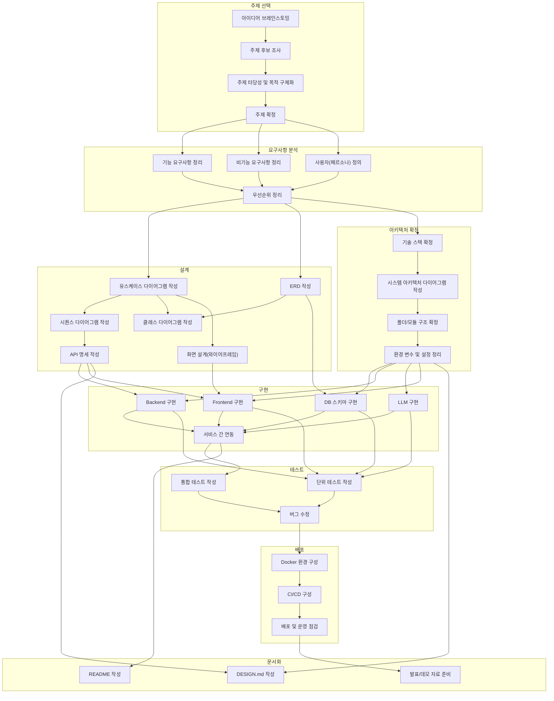

# TODO

- 갱신일: 2026-09-15
- 기준 커밋: `e48c609` (`develop`)

체크 상태는 코드 기준이다. 현재 상태의 서술은 `Docs/STATUS.md`에 있다.

## 작업 흐름 (병렬/순차)

> 설계(P3)와 아키텍처 확정(P4)은 요구사항 분석이 끝나면 서로 병렬로 진행 가능. 구현(P5) 내부의 DB/Backend/LLM/Frontend도 각자 선행 산출물만 준비되면 병렬 진행 가능.

## 주제 선택
- [x] 아이디어 브레인스토밍
- [x] 주제 후보 조사
- [x] 주제 타당성 및 목적 구체화
- [x] 주제 확정

## 요구사항 분석
- [x] 기능 요구사항 정리
- [ ] 비기능 요구사항 정리
- [ ] 사용자(페르소나) 정의
- [ ] 우선순위 정리

## 설계 (ERD/유스케이스 등)
- [x] 유스케이스 다이어그램 작성
- [x] ERD 작성
- [x] 시퀀스 다이어그램 작성
- [x] 클래스 다이어그램 작성
- [x] API 명세 작성
- [ ] 화면 설계(와이어프레임)

## 아키텍처 확정
- [x] 기술 스택 확정
- [x] 시스템 아키텍처 다이어그램 작성
- [x] 폴더/모듈 구조 확정
- [x] 환경 변수 및 설정 정리

## 구현
- [x] DB 스키마 구현
- [x] Backend 구현
- [x] LLM 구현
- [x] Frontend 구현
- [x] 서비스 간 연동

## 테스트
- [x] 단위 테스트 작성 — LLM(`LLM/tests/`)과 Backend 일부(`Backend/tests/`, 5개 파일). Frontend는 없음
- [ ] 통합 테스트 작성 — 실제 OpenAI·Cohere·PostgreSQL 연동 검증이 남음
- [ ] 버그 수정 — 통합 결함 42건 중 24건 해결·3건 오탐, 15건 미해결(보류 2건 포함)(`Docs/reports/INTEGRATION_ISSUES_0910.md`). 시연 결함 13건 중 9건 해결·2건 일부 해결·2건 미해결(`Docs/reports/INTEGRATION_ISSUES_0914.md`)

## 배포
- [x] Docker 환경 구성 — `docker-compose.yml`, `setup.sh`, `setup.bat`. `frontend` 프로필의 nginx 컨테이너(`:80`)가 화면과 `/api`를 같은 출처에서 서빙
- [ ] CI/CD 구성
- [ ] 배포 및 운영 점검 — 학원 내부망 절차는 `Docs/README.md` 12절에 있음. 도메인·HTTPS 없음

## 문서화
- [ ] DESIGN.md 작성
- [ ] README 작성
- [ ] 발표/데모 자료 준비
