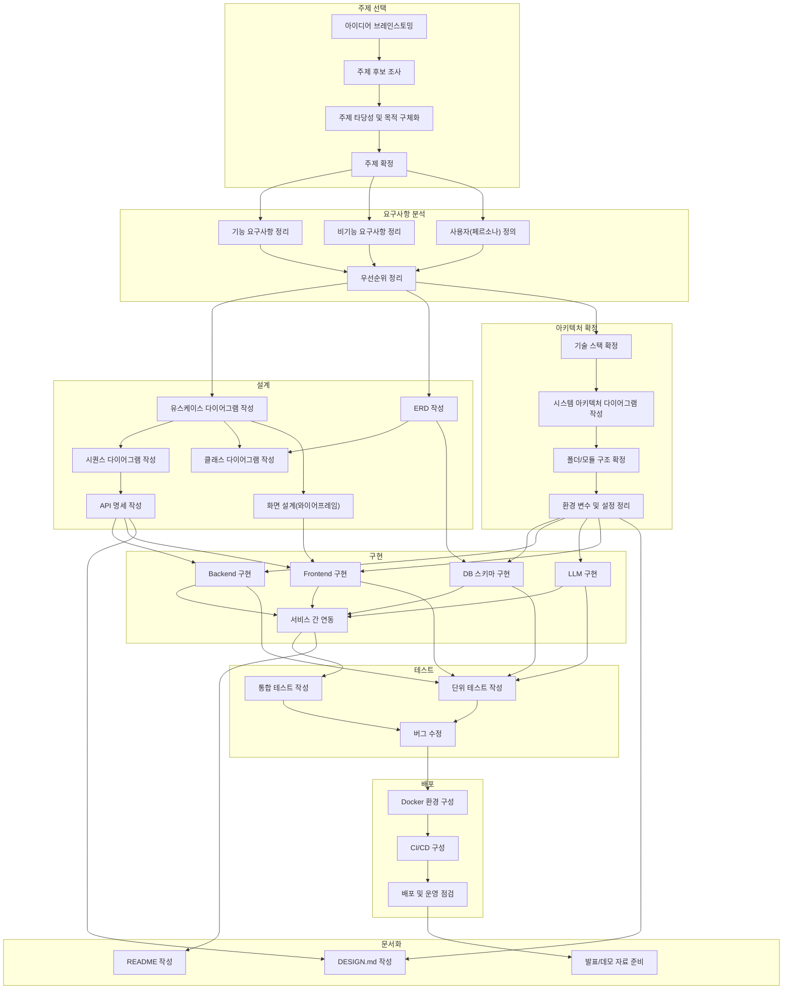

# TODO

- 갱신일: 2026-10-07
- 기준 커밋: `4b62f33` (`develop`)

체크 상태는 코드 기준이다. 현재 상태의 서술은 `Docs/STATUS.md`에 있다.

## 작업 흐름 (병렬/순차)

```mermaid
flowchart TD
    subgraph P1["주제 선택"]
        TP1["아이디어 브레인스토밍"] --> TP2["주제 후보 조사"] --> TP3["주제 타당성 및 목적 구체화"] --> TP4["주제 확정"]
    end

    subgraph P2["요구사항 분석"]
        RQ1["기능 요구사항 정리"]
        RQ2["비기능 요구사항 정리"]
        RQ3["사용자(페르소나) 정의"]
        RQ4["우선순위 정리"]
        RQ1 --> RQ4
        RQ2 --> RQ4
        RQ3 --> RQ4
    end

    subgraph P3["설계"]
        DS1["유스케이스 다이어그램 작성"]
        DS2["ERD 작성"]
        DS3["시퀀스 다이어그램 작성"]
        DS4["클래스 다이어그램 작성"]
        DS5["API 명세 작성"]
        DS6["화면 설계(와이어프레임)"]
        DS1 --> DS3
        DS1 --> DS4
        DS2 --> DS4
        DS3 --> DS5
        DS1 --> DS6
    end

    subgraph P4["아키텍처 확정"]
        AR1["기술 스택 확정"] --> AR2["시스템 아키텍처 다이어그램 작성"] --> AR3["폴더/모듈 구조 확정"] --> AR4["환경 변수 및 설정 정리"]
    end

    subgraph P5["구현"]
        IM1["DB 스키마 구현"]
        IM2["Backend 구현"]
        IM4["LLM 구현"]
        IM5["Frontend 구현"]
        IM6["서비스 간 연동"]
        IM1 --> IM6
        IM2 --> IM6
        IM4 --> IM6
        IM5 --> IM6
    end

    subgraph P6["테스트"]
        TS1["단위 테스트 작성"] --> TS3["버그 수정"]
        TS2["통합 테스트 작성"] --> TS3
    end

    subgraph P7["배포"]
        DP1["Docker 환경 구성"] --> DP2["CI/CD 구성"] --> DP3["배포 및 운영 점검"]
    end

    subgraph P8["문서화"]
        DC1["DESIGN.md 작성"]
        DC2["README 작성"]
        DC3["발표/데모 자료 준비"]
    end

    TP4 --> RQ1
    TP4 --> RQ2
    TP4 --> RQ3

    RQ4 --> DS1
    RQ4 --> DS2
    RQ4 --> AR1

    DS2 --> IM1
    AR4 --> IM1
    DS5 --> IM2
    AR4 --> IM2
    AR4 --> IM4
    DS6 --> IM5
    DS5 --> IM5
    AR4 --> IM5

    IM1 --> TS1
    IM2 --> TS1
    IM4 --> TS1
    IM5 --> TS1
    IM6 --> TS2

    TS3 --> DP1

    AR4 --> DC1
    DS5 --> DC1
    IM6 --> DC2
    DP3 --> DC3
```

> 설계(P3)와 아키텍처 확정(P4)은 요구사항 분석이 끝나면 서로 병렬로 진행 가능. 구현(P5) 내부의 DB/Backend/LLM/Frontend도 각자 선행 산출물만 준비되면 병렬 진행 가능.

## 주제 선택
- [x] 아이디어 브레인스토밍
- [x] 주제 후보 조사
- [x] 주제 타당성 및 목적 구체화
- [x] 주제 확정

## 요구사항 분석
- [x] 기능 요구사항 정리
- [ ] 비기능 요구사항 정리
- [ ] 사용자(페르소나) 정의
- [ ] 우선순위 정리

## 설계 (ERD/유스케이스 등)
- [x] 유스케이스 다이어그램 작성
- [x] ERD 작성
- [x] 시퀀스 다이어그램 작성
- [x] 클래스 다이어그램 작성
- [x] API 명세 작성
- [ ] 화면 설계(와이어프레임)

## 아키텍처 확정
- [x] 기술 스택 확정
- [x] 시스템 아키텍처 다이어그램 작성
- [x] 폴더/모듈 구조 확정
- [x] 환경 변수 및 설정 정리

## 구현
- [x] DB 스키마 구현
- [x] Backend 구현
- [x] LLM 구현
- [x] Frontend 구현
- [x] 서비스 간 연동

## 테스트
- [x] 단위 테스트 작성 — LLM(`LLM/tests/`, 46개 파일), Backend(`Backend/tests/`, 17개 파일), Frontend(`Frontend/tests/`, 3개 파일), 서버 스크립트(`scripts/tests/`, 3개 파일)
- [ ] 통합 테스트 작성 — 실제 OpenAI·Cohere·PostgreSQL 연동 검증이 남음
- [ ] 버그 수정 — 남은 결함은 `Docs/STATUS.md` 2절(미해결 3건·일부 해결 2건·보류 1건)

## 배포
- [x] Docker 환경 구성 — `docker-compose.yml`(+ 개발용 `docker-compose.dev.yml`), `setup.sh`, `setup.bat`. `frontend` 프로필의 nginx 컨테이너(`:80`)가 화면과 `/api`를 같은 출처에서 서빙. AWS용 `docker-compose.app.yml`·`docker-compose.data.yml`
- [x] CI/CD 구성 — GitHub Actions `deploy.yml`(테스트 → main 병합 시 App EC2 배포), `collect.yml`(주간 수집·재색인), `collect-retry.yml`(실패 재시도·재색인), `health-check.yml`(6시간마다 운영 `/api/health` 확인)
- [ ] 배포 및 운영 점검 — 학원 내부망 절차는 `Docs/README.md` 12절, AWS 절차는 `Docs/AWS_DEPLOY_GUIDE.md`. HTTPS(nginx 443·Let's Encrypt)·PWA 구성은 코드에 반영됨. AWS 운영 검증(챕터 1)은 `Docs/reports/AWS_CHAPTER1_ISSUE_VERIFICATION_REPORT_20261006.md`에 기록됨

## 문서화
- [ ] DESIGN.md 작성
- [ ] README 작성
- [ ] 발표/데모 자료 준비
