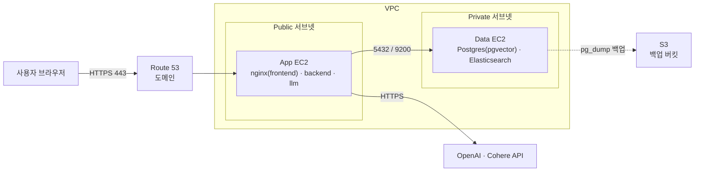

# AWS 마이그레이션 계획

> 작성일 2026-09-28, develop `d35f0c4` 기준. 학원 내부망 노트북 배포(`Docs/README.md` 12절)를 AWS로 옮기는 계획. 코드 변경 전 설계 단계 문서.
>
> 2026-09-28 `origin/feature/scheduler`(DB 수집 스케줄러) 검토 결과를 반영해 수집 스케줄링을 GitHub Actions로 확정(10절).

## 1. 배경과 목표

현재 배포는 팀원 노트북 1대에서 `docker compose --profile frontend up -d --build`로 모든 컨테이너를 실행하는 방식.

| 현재 한계 | 영향 |
|---|---|
| DHCP로 서버 IP 변동 | 접속 주소 재공유 필요 |
| 노트북 전원·절전 의존 | 노트북 종료 시 서비스 중단 |
| 도메인·HTTPS 없음 | 로그인 토큰 평문 전송, PWA 적용 불가 |
| DB·ES 포트 호스트 노출(5432, 9200) | 내부망 한정이라 허용했으나 외부 공개 시 위험 |

목표
- 상시 접속 가능한 서버 확보
- 도메인 + HTTPS 적용
- 상태가 있는 계층과 없는 계층을 분리해 확장 가능한 구조 확보

## 2. PWA와의 우선순위

**AWS 마이그레이션 우선.**

- PWA의 Service Worker는 HTTPS 필수(localhost만 예외). 현재 HTTP·IP 접속 환경에서는 설치 프롬프트와 SW 등록 불가
- AWS 이전으로 도메인·HTTPS를 확보해야 PWA의 전제 조건 충족
- PWA 작업(manifest, 아이콘, `vite-plugin-pwa`, nginx 캐시 헤더)은 프론트 한정 소규모 변경이라 localhost에서 병행 개발 가능. 실기기 설치 검증만 AWS 이후 진행

## 3. 현재 구성

`docker-compose.yml` 기준.

| 서비스 | 이미지/빌드 | 호스트 포트 | 상태 저장 |
|---|---|---|---|
| frontend | `Frontend/Dockerfile` (nginx 정적 빌드, `/api/` 프록시) | 80 | 없음 |
| backend | `Backend/Dockerfile` (Django ASGI) | 8000 | 없음 |
| llm | `LLM/Dockerfile` (LangGraph, tesseract, hwp-cli) | 8001 | 없음 (4절 참고) |
| db | `pgvector/pgvector:pg16` | 5432 | 있음 (`db_data` 볼륨) |
| db-migrate | `pgvector/pgvector:pg16` (`app_extras.sql` 재적용) | - | 없음 |
| elasticsearch | `./elasticsearch` (Nori 포함 빌드) | 9200 | 있음 (`elasticsearch_data`, 재생성 가능) |
| presentation | `./Presentation` (Slidev) | - | 없음 |

## 4. 상태 점검 결과

App 계층을 별도 서버로 분리하거나 여러 대로 늘리려면 backend·llm이 로컬 디스크에 상태를 남기지 않아야 함. 코드 확인 결과는 다음과 같음.

| 항목 | 확인 내용 | 결론 |
|---|---|---|
| 사업계획서 파일 생성 | `tempfile.TemporaryDirectory` 안에서 생성 후 응답 (`LLM/src/features/business_plan_documents.py:1442`) | 로컬 잔존 파일 없음 |
| 영수증 원본 | `receipts.image_data BYTEA`로 DB 저장 (`DB/app_extras.sql:20`) | DB에만 존재 |
| 벡터 인덱스 파일 캐시 | `VECTOR_INDEX_CACHE_PATH`는 `in_memory` 백엔드 경로(`load_or_build_document_index`)에서만 사용. compose는 `VECTOR_STORE_BACKEND=postgres`로 `rag_documents` 테이블 사용 | 운영 경로에서 미사용 |
| Elasticsearch 인덱스 | Backend 기동 시 `/rag/ready=false`면 `/rag/reindex`로 Postgres 원본에서 ES 전체 재색인 (`Docs/reports/ELASTICSEARCH_SERVING_CONSISTENCY_FIX_REPORT_20260922.md`) | 이전 대상 아님, 자동 재생성 |
| 로그인 토큰 | `TOKEN_SECRET` HMAC 서명 토큰, 서버 세션 없음 (`Backend/core/security.py`) | 서버 상태 없음. 단, 모든 App 인스턴스가 같은 `TOKEN_SECRET` 사용 필요 |

→ **이전해야 할 데이터는 Postgres 하나.**

## 5. DB 배치 결정

S3는 오브젝트 스토리지라 SQL 질의 불가. Postgres(pgvector) 대체 불가.

| 방식 | 장점 | 단점 | 결정 |
|---|---|---|---|
| EC2 컨테이너 (현 compose의 `db` 그대로) | 코드·compose 변경 최소, 추가 비용 없음 | 백업·패치·장애 대응 직접 수행 | **1차 채택** |
| RDS for PostgreSQL (pgvector 확장 지원) | 자동 백업, 패치, Multi-AZ | 월 비용 추가 | 확장 단계에서 도입 |

S3 용도
- DB 백업 보관: `pg_dump` 결과 주기 업로드
- 이전 시 dump 전달 경유지

RDS 전환 시 `DATABASE_URL`/`COMPOSE_DB_HOST`만 RDS 엔드포인트로 교체하면 되는 구조. 코드 변경 불필요.

## 6. 목표 아키텍처: EC2 2대 계층 분리

단순히 인스턴스 수를 늘리는 대신 **상태 없는 App 계층과 상태 있는 Data 계층을 분리**하는 방식.



| 구분 | App EC2 | Data EC2 |
|---|---|---|
| 서브넷 | Public (Elastic IP) | Private |
| 컨테이너 | frontend, backend, llm, (presentation), db-migrate(배포 시 1회 실행) | db, elasticsearch |
| 인바운드 | 80, 443 전체 허용 / 22 관리자 IP만 | 5432, 9200은 App EC2 보안그룹에서만 허용 |
| 권장 메모리 | 4GB급 (LLM 이미지에 tesseract·hwp-cli 포함) | 8GB급 (ES 힙 1g + Postgres + OS 여유) |
| 스토리지 | 기본 EBS | ES·Postgres 볼륨용 EBS 증설 |

Private 서브넷의 Data EC2는 외부 인터넷 불필요(이미지 pull 시에만 NAT 또는 VPC 엔드포인트 필요). 비용을 줄이려면 Public 서브넷에 두되 보안그룹으로 외부 인바운드를 전부 차단하는 방식도 가능.

## 7. 필요 변경 사항

| 대상 | 변경 내용 |
|---|---|
| `docker-compose.yml` | App용(`docker-compose.app.yml`)과 Data용(`docker-compose.data.yml`)으로 분리하거나 profile로 분리 |
| llm 서비스 `ELASTICSEARCH_URL` | `http://elasticsearch:9200` 하드코딩 → `${ELASTICSEARCH_URL}` 환경변수로 변경 |
| `COMPOSE_DB_HOST` | Data EC2 private IP 지정 (이미 변수로 분리되어 있음) |
| backend·llm `depends_on` | 다른 호스트의 db·elasticsearch는 compose 의존성으로 대기 불가 → 해당 항목 제거, healthcheck 재시도에 의존 |
| 호스트 포트 노출 | App: 8000·8001 매핑 제거 / Data: 5432·9200은 private IP에만 바인딩 |
| 소스 bind mount | 운영에서는 `./Backend:/app`, `./LLM:/app` 제거, 빌드된 이미지만으로 실행 |
| `Frontend/nginx.conf` | 443 server 블록 추가, 80 → 443 리다이렉트, Let's Encrypt(certbot) 인증서 경로 지정 |
| db-migrate 서비스 | Data용이 아닌 App용 compose로 이동, `-h db` → `-h ${COMPOSE_DB_HOST}`(Data EC2 private IP). main 병합 배포 시 App EC2에서 실행되어 스키마 자동 반영 |
| collector 서비스 (신규) | `DB/`에 Dockerfile이 없어 수집 전용 이미지 정의 필요. App compose에 `profiles: ["collector"]`로 추가해 평상시 기동에서 제외, 스케줄 실행 시에만 `run --rm` |
| `DB/run_collection.py` SQL 실행 | `docker exec -i startup_db psql` 하드코딩 → DB와 다른 호스트에서 동작 불가. `DB_HOST` 기준 psycopg2(기존 의존성)로 SQL 파일 실행하도록 변경 |

## 8. 이전 절차

1. VPC, 서브넷, 보안그룹 생성
2. Data EC2 기동 → Docker 설치 → Data용 compose 실행 (`db`, `elasticsearch`)
3. 데이터 이전 (`Docs/README.md` 12절 명령 재사용)
   ```bash
   # 데이터 있는 로컬에서
   docker compose exec -T db pg_dump -U <user> -Fc <db> > startup_platform.dump
   aws s3 cp startup_platform.dump s3://<backup-bucket>/migration/
   # Data EC2에서
   aws s3 cp s3://<backup-bucket>/migration/startup_platform.dump .
   docker compose exec -T db pg_restore -U <user> -d <db> --clean --if-exists < startup_platform.dump
   ```
4. App EC2 기동 → `.env` 배치 → `db-migrate` 1회 실행 → App용 compose 실행 (backend 기동 시 ES 자동 재색인)
5. 도메인 연결(Route 53 A 레코드 → Elastic IP), certbot으로 인증서 발급, nginx 443 적용
6. 12절 검증 항목 수행

## 9. 운영

| 항목 | 방식 |
|---|---|
| 시크릿 | `.env`는 서버에만 배치, 커밋 금지. 필요 시 SSM Parameter Store로 이전 |
| 백업 | Data EC2 cron으로 일 1회 `pg_dump` → S3 업로드, 버킷 수명주기로 오래된 백업 삭제 |
| 인증서 갱신 | certbot 자동 갱신 타이머 + nginx reload |
| CI/CD | `main` 병합 시 GitHub Actions가 App EC2에 자동 배포 (아래 배포 자동화, `Docs/TODO.md` 배포 항목). 데이터 수집(10절)과 접속 방식·Secrets 공유 |
| 모니터링 | CloudWatch 기본 지표(CPU, 디스크), `/api/health` 외부 헬스체크 |

### 배포 자동화 (main 병합 → AWS 자동 반영)

코드 변경 시 GitHub과 AWS에 각각 올리는 과정 불필요. **`main` 병합이 곧 운영 배포.**

```
develop → main PR 병합
      ↓ push 이벤트
GitHub Actions
  ① 테스트: Backend unittest, Frontend node:test + 빌드
      ↓ 통과 시에만 진행
  ② SSH로 App EC2 접속
      ↓
App EC2
  git pull origin main
  → db-migrate 1회 실행 (app_extras.sql 적용)
  → docker compose --profile frontend up -d --build (변경된 서비스만 재생성)
```

```yaml
# .github/workflows/deploy.yml (요약)
name: deploy
on:
  push:
    branches: [main]
concurrency:
  group: ec2-app            # 수집 workflow와 같은 그룹 → 배포·수집 동시 실행 방지
  cancel-in-progress: false
jobs:
  test:
    runs-on: ubuntu-latest
    steps:
      - uses: actions/checkout@v4
      - uses: astral-sh/setup-uv@v6
      - run: cd Backend && uv run python -m unittest discover tests
      - uses: actions/setup-node@v4
        with: { node-version: 24 }
      - run: cd Frontend && npm ci && node --test "tests/*.test.mjs" && npm run build
  deploy:
    needs: test
    runs-on: ubuntu-latest
    timeout-minutes: 40
    steps:
      - uses: appleboy/ssh-action@v1
        with:
          host: ${{ secrets.EC2_HOST }}
          username: ${{ secrets.EC2_USER }}
          key: ${{ secrets.EC2_SSH_KEY }}
          command_timeout: 35m
          script: |
            set -e
            cd ~/SKN34-4th-3Team
            git pull origin main
            docker compose run --rm db-migrate
            docker compose --profile frontend up -d --build
```

#### 빌드 방식

| 구분 | 방식 | 판단 |
|---|---|---|
| 1차 | **EC2 직접 빌드**: App EC2에서 `up -d --build` | 채택. 추가 설정 없음 |
| 전환 기준 | 배포 시간이 과도하게 길어지거나, 빌드 중 메모리 부족(OOM)으로 실패 또는 서비스 응답 저하 | LLM 이미지(tesseract, hwp-cli 설치)가 가장 무거움 |
| 전환안 | Actions에서 이미지 빌드 → GHCR 또는 ECR push → App EC2는 `docker compose pull && up -d` | EC2 부하 제거, 배포 시간 단축, 이전 이미지 태그로 롤백 가능. 대신 레지스트리 인증 설정 추가 |

#### 자동 반영 대상과 수동 대상

| 대상 | 반영 | 방식 |
|---|---|---|
| 코드 (frontend, backend, llm, presentation) | 자동 | main 병합 시 재빌드·재시작 |
| DB 스키마 (`DB/app_extras.sql`) | 자동 | 배포 스크립트의 `db-migrate` 실행. 전 문장이 재실행 안전 |
| ES 인덱스 | 자동 | backend 기동 시 인덱스가 비어 있으면 재색인 |
| 정책 데이터 | 자동(주기) | 수집 workflow(10절)가 주기 갱신 |
| `.env` (API 키, 비밀번호) | **수동** | Git 미포함. 서버에서 직접 수정 후 해당 서비스 재시작 |
| Data EC2 구성 (Data용 compose, `elasticsearch/` 이미지) | **수동** | 변경 빈도 낮음. App EC2를 경유해 SSH 접속 후 직접 재기동 |
| 인프라 (보안그룹, 인스턴스 사양, 도메인) | **수동** | AWS 콘솔에서 변경 |
| `DB/01_schema.sql` | **수동** | 빈 볼륨 최초 생성 시에만 적용. 변경 시 `app_extras.sql`에 재실행 안전한 형태로 추가하는 것이 원칙 |

#### 주의점

- 재빌드·재시작 동안 수 초~수십 초 접속 중단. 무중단 배포는 11절 ALB 단계에서 도입
- `main` 병합 = 운영 배포이므로 `main` 브랜치 보호 규칙 적용(PR 리뷰 필수, 테스트 통과 필수)
- 서버에서 직접 코드를 수정하지 않음. 수정하면 `git pull` 충돌로 배포 실패
- 배포 실패 시 롤백: 문제 커밋을 revert해 main에 병합 → 자동 재배포

## 10. 데이터 수집 스케줄링 (GitHub Actions)

### 방식 결정

GitHub Actions `schedule`(cron) + `workflow_dispatch`(수동 실행) → SSH로 App EC2 접속 → App EC2에서 수집 실행.

- GitHub 실행 서버(GitHub-hosted runner)는 외부 인터넷에 있어 Private 서브넷 DB에 직접 접근 불가 → DB 접근은 App EC2에서 수행
- EC2 crontab 대비 실행 기록·실패 메일 알림을 Actions 화면에서 확인 가능, 스케줄 설정이 저장소에 코드로 남아 리뷰 가능
- 컨테이너 안 `schedule` 루프(`feature/scheduler`의 `DB/scheduler.py`) 미채택: 컨테이너 재시작 시 7일 카운트가 초기화되어 재배포가 잦으면 수집이 한 번도 돌지 않을 수 있음

### 실행 흐름

| 순서 | 작업 | 명령 (App EC2) | 비고 |
|---|---|---|---|
| ① | DB 백업 | `pg_dump -h <Data EC2 private IP>` → `aws s3 cp` | 수집 실패 시 복원 기준. App EC2 IAM 역할에 S3 쓰기 권한 필요 |
| ② | 수집 | `docker compose --profile collector run --rm collector` | `run_collection.py` 실행. 스크립트 하나라도 실패하면 exit 1 |
| ③ | 임베딩·ES 재색인 | `docker compose exec -T llm curl -fsS --max-time 1800 -X POST localhost:8001/rag/reindex -H 'Content-Type: application/json' -d '{"documentIds":[]}'` | 필수 단계. 아래 설명 참고 |
| ④ | 상태 확인 | `curl -fsS https://<도메인>/api/health` | `ragReady=true`, `ragChunks` 증가 확인 |

③이 필요한 이유: 수집 스크립트는 `policies` 등 원본 테이블만 갱신함. Backend는 기동 워밍업에서 `index_ready=false`일 때만 재색인을 호출(`Backend/core/llm_client.py:84-91`)하므로 기존 인덱스가 있으면 신규 정책이 임베딩·ES에 반영되지 않음. `/rag/reindex`는 신규·변경 청크만 임베딩하고 ES는 전체 재색인함.

### Workflow 예시

```yaml
# .github/workflows/collect.yml
name: collect-data
on:
  schedule:
    - cron: "0 18 * * 0"   # UTC 기준. 매주 월요일 03:00 KST
  workflow_dispatch:
concurrency:
  group: ec2-app           # 배포 workflow와 같은 그룹 → 배포·수집 동시 실행 방지
  cancel-in-progress: false
jobs:
  collect:
    runs-on: ubuntu-latest
    timeout-minutes: 90
    steps:
      - uses: appleboy/ssh-action@v1
        with:
          host: ${{ secrets.EC2_HOST }}
          username: ${{ secrets.EC2_USER }}
          key: ${{ secrets.EC2_SSH_KEY }}
          command_timeout: 80m
          script: |
            set -e
            cd ~/SKN34-4th-3Team
            ./scripts/collect_pipeline.sh   # ①~④ 순서 실행 (신규 작성)
```

### 주의사항

- `schedule`은 **기본 브랜치(`main`)에 있는 workflow만** 실행됨 → `develop` 병합만으로는 동작하지 않음
- 공개 저장소는 60일간 커밋 활동이 없으면 스케줄 workflow가 자동 비활성화됨
- cron은 UTC 기준이며, GitHub 부하에 따라 수 분~수십 분 지연 가능
- 22번 포트: 비밀번호 로그인 비활성화, 키 인증만 허용. GitHub 실행 서버 IP가 고정되지 않아 관리자 IP로만 제한하기 어려움 → 보안 강화가 필요하면 AWS SSM Run Command(OIDC 인증)로 전환해 22번 포트를 닫음
- 공개 저장소에서 self-hosted runner는 사용 금지(포크 PR이 서버에서 코드를 실행할 수 있음)
- 수집 API 키(`GOV24_API_KEY`, `LAW_API_KEY`, `ONTONG_YOUTH_API_KEY`)와 DB 접속 정보는 App EC2의 `.env`에만 두고 GitHub Secrets에는 SSH 접속 정보만 등록

### `feature/scheduler` 처리 방침

| 항목 | 처리 |
|---|---|
| `DB/run_collection.py` | SQL 실행부를 `DB_HOST` 기준으로 수정 후 병합 |
| `11_collect_nts_interpretation.py` | `COLLECTION_SEQUENCE`에 등록됐으나 파일 미커밋(커밋 `4be8473`은 목록 한 줄만 추가) → 파일 추가 전에는 수집이 항상 실패 |
| `DB/scheduler.py`, `schedule` 의존성 | 병합하지 않음 (GitHub Actions로 대체) |
| workflow 파일, collector 서비스 | AWS 구조 확정 후 작성 |

## 11. 확장 경로 (현 단계 미적용)

| 단계 | 내용 |
|---|---|
| App 수평 확장 | ALB + ACM 인증서 + Auto Scaling Group으로 App EC2 복수 운영 |
| DB 관리형 전환 | Data EC2의 Postgres → RDS for PostgreSQL (pgvector) |
| 검색 관리형 전환 | Elasticsearch → Amazon OpenSearch Service (Nori 플러그인 지원 여부·버전 호환성 사전 확인 필요) |

App 수평 확장 전 해결할 과제
- **재색인 트리거 중복**: 현재 Backend 기동마다 `/rag/ready`를 확인하고 필요 시 `/rag/reindex`를 호출함. App 인스턴스가 여러 대면 동시 재색인 가능성 존재 → 재색인을 배포 단계의 1회성 작업으로 분리 필요
- **ES 동기화 실패 상태의 프로세스 메모리 보관**: 재색인 실패 시 해당 LLM 프로세스만 ES 검색을 비활성화하고 다른 인스턴스와 공유하지 않음 → 인스턴스 간 상태 불일치 가능

실제 트래픽 없이 ALB·Auto Scaling을 먼저 도입하면 효과 검증 없이 비용만 증가. 현 단계에서는 2대 분리 구조와 이 확장 경로 문서화로 대응.

## 12. 검증 항목

- [ ] `https://<도메인>/api/health` 응답에서 `ragReady=true`, `ragChunks=10,523`
- [ ] 로그인, 정책 검색, 세무 질의(nginx `proxy_read_timeout 180s` 구간), 사업계획서 생성, 영수증 업로드 동작
- [ ] `http://` 접속 시 `https://`로 리다이렉트
- [ ] 외부에서 5432, 9200, 8000, 8001 접근 차단
- [ ] App EC2 재시작 후 ES 자동 재색인 정상 동작
- [ ] S3 백업 파일로 복원 리허설
- [ ] main 병합 후 deploy workflow 성공, 변경 사항이 운영 화면에 반영
- [ ] 테스트 실패 시 deploy job이 실행되지 않음
- [ ] 수집 workflow `workflow_dispatch` 수동 실행 성공
- [ ] 수집 후 `ragChunks` 증가, 신규 정책이 검색 결과에 노출
- [ ] 수집 스크립트 실패 시 workflow 실패 처리 및 GitHub 알림 수신

## 13. 비용 항목

EC2 2대(인스턴스 + EBS), Elastic IP, S3(백업 용량), Route 53(호스팅 영역 + 도메인), 데이터 전송, (Private 서브넷 사용 시) NAT Gateway. 금액은 선택한 리전·인스턴스 유형 기준으로 [AWS 요금 계산기](https://calculator.aws/)에서 산정. 학습·시연 기간 외에는 인스턴스 중지로 비용 절감 가능(EBS·Elastic IP 비용은 유지).
