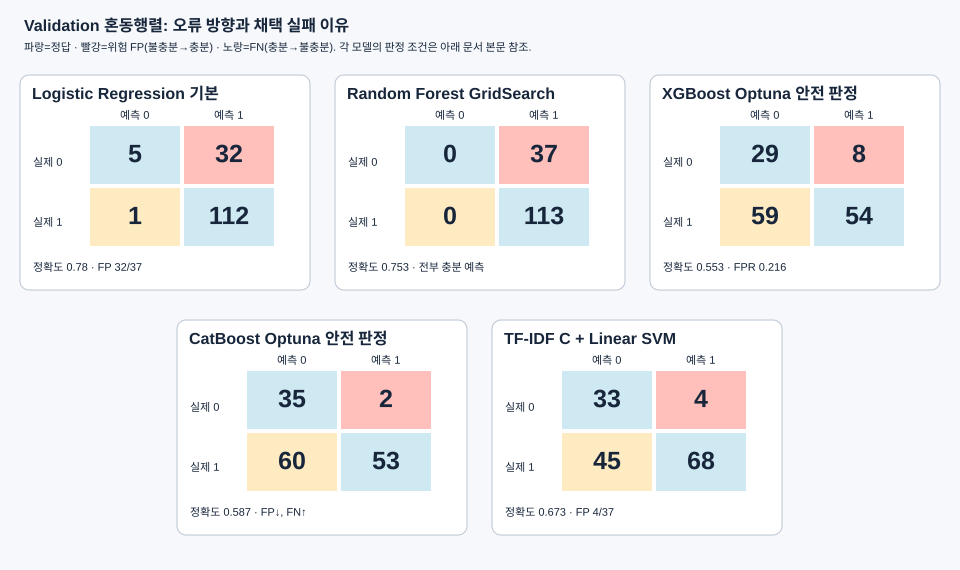

# LLM Judge의 ML 대체 검토와 최종 결정 (2026-09-21)

## 결론

**현재의 ML 대체안은 운영에 채택하지 않고 기존 LLM Judge를 유지한다.** 최종 판단 근거는 임의로 정한 오프라인 정확도 목표가 아니라, 운영 그래프에서 Judge만 CatBoost로 교체한 세금 법령 E2E 비교 결과다. LLM Judge 대비 CatBoost Judge의 턴 통과율은 `77.8% → 22.2%`, 시나리오 통과율은 `77.8% → 11.1%`, grounded 검사 통과율은 `100.0% → 22.2%`로 크게 하락했고 평균 지연시간도 `12.46초 → 16.49초`로 증가했다. 따라서 현재 모델은 운영 Judge를 대체할 때 정확성과 속도 모두 개선하지 못했다. 봉인된 ML Test는 실행하지 않았으므로 Test 성능을 주장하지 않는다.

> **범위:** 여기서 대체하려 한 대상은 질문과 검색된 Top-5 근거가 답변에 충분한지 판정하는 LLM의 기능이다. 학습 데이터용 이진 Judge(`충분=1`, `불충분=0`)로 대체 가능성을 시험했다. 운영 정책 경로는 별도 LLM 충분성 Judge를 호출하지 않고, 운영 세금 경로는 이진 라벨보다 많은 후속 처리용 필드를 반환하므로, 이번 ML 실험 결과를 운영 전체 Judge의 동일 기능 검증으로 확대 해석하지 않는다.

## 검토 흐름

| 단계 | 문제 인식과 시도 | 확인 결과·다음 판단 |
|---|---|---|
| 1. 지연시간 문제 인식 | 충분성 판정에 LLM 호출이 들어가므로 운영 응답 지연을 줄일 대안을 검토했다. 검색·Rerank 이후의 수치로 판정을 대체할 수 있는지 질문했다. | 이 단계의 **실제 Judge 지연시간·절감 폭은 측정하지 않았다**. ML 대체는 속도 개선 가설이지 입증된 개선이 아니다. |
| 2. 전통 ML 데이터 준비 | 정책 500건·세금 500건의 LLM Teacher 라벨을 사용했다. Dense/BM25/RRF/Rerank의 25개 수치형 Feature에 질문·Top-5 근거 기반 11개 Feature를 더했다. Train/Validation/Test는 700/150/150건으로 고정했다. | 라벨은 충분 749건·불충분 251건으로 불균형하다. 정확도만 높아도 위험한 `실제 불충분(0) → 예측 충분(1)` 오판이 가려질 수 있어 FP/FPR을 별도 추적했다. |
| 3. Logistic Regression·Random Forest·XGBoost·CatBoost | 노트북에서 기본 모델과 탐색 모델을 비교했다. 초기 실험 기록의 기본 XGBoost는 Train `1.00` 대 CV 약 `0.74`로 과적합이 뚜렷했고, Validation에서 위험한 FP도 많았다. | 트리 복잡도를 낮추거나 클래스 가중치를 조절해도 정확도와 안전성을 동시에 확보하지 못했다. 이후 동일 분할·5-fold·Train OOF 임계값으로 XGBoost/CatBoost를 재검증했다. |
| 4. 안전 기준을 건 재검증 | Train OOF에서 FPR ≤ `0.10`인 임계값 중 정확도가 가장 높은 값을 고르고, Train–CV 정확도 격차 ≤ `0.10`을 요구했다. 정확도 `0.90`, FPR `0.10`은 후보를 점검하기 위한 오프라인 목표로 사용했다. | Train CV로 선정된 XGBoost/Optuna의 Validation 정확도는 `0.553`, FPR은 `0.216`이었다. Validation에서 가장 높은 CatBoost/Optuna도 정확도 `0.587`, FPR `0.054`였다. 이 결과는 후보의 한계를 보여주는 보조 근거이며, 최종 미채택 판단은 운영 그래프 E2E 비교로 내렸다. |
| 5. TF-IDF + Linear SVM / Logistic Regression 확장 | 점수만으로 근거의 의미적 적합성을 표현하기 어렵다고 보고, 질문만(A), 질문+Top-5 근거와 유사도(B), B+36개 수치형 Feature(C)를 같은 분할에서 비교했다. 12개 조합×5-fold를 Train에서 탐색했다. | Train CV로 선정된 **C+Linear SVM**의 Validation 정확도는 `0.673`, 위험 FP는 `4/37`건(FPR `0.108`)이었다. 질문·근거 원문을 넣어도 목표 정확도 `0.90`과 FPR `0.10`을 동시에 충족하지 못했다. |
| 6. 운영 그래프 E2E 검증과 최종 결정 | 운영 `build_graph()`의 Router·Dense+Nori·RRF·Cohere·세금 Multi-hop·최종 LLM 답변은 유지하고, 세금 근거 판정 의존성만 CatBoost로 교체해 법령 9시나리오·18턴을 비교했다. | CatBoost Judge는 턴 통과 `4/18`, 시나리오 통과 `1/9`, status 통과 `4/18`, grounded 통과 `4/18`에 그쳤다. LLM Judge의 `14/18`, `7/9`, `14/18`, `18/18`보다 크게 낮고 평균 지연도 `+4.03초` 증가했으므로 운영 대체안을 미채택했다. |

노트북의 초기 모델 수치는 주로 기본 `predict()` 임계값에서, 별도 HPO·TF-IDF 보고서 수치는 **Train OOF에서 FPR 제한을 걸어 정한 임계값**에서 계산했다. 따라서 서로 다른 표의 정확도를 단일 조건 A/B처럼 직접 비교하지 않는다. 이 오프라인 결과는 E2E 후보를 고르고 오류 구조를 확인하는 과정이며, **최종 운영 미채택의 직접 근거는 CatBoost Judge 적용 후 세금 E2E 성능이 크게 하락한 결과**다.

## 모델별 성능과 혼동행렬

모든 행렬은 **Validation 150건**의 `[[TN, FP], [FN, TP]]` 순서다. 행은 실제 라벨 `0/1`, 열은 예측 라벨 `0/1`이며, `0=불충분`, `1=충분`이다. 따라서 오른쪽 위 **FP가 근거 불충분을 충분하다고 통과시키는 위험한 오판**이다. Validation에는 실제 불충분 37건·충분 113건이 있으므로 FPR ≤ `0.10`은 FP 최대 3건을 뜻한다. 정확도 목표는 ≥ `0.90`, 즉 정답 135건 이상이다.

그래프는 각 계열의 **대표 사례**이며 모델별 전체 혼동행렬은 아래 표에 모두 적었다. 색은 절대 건수에 따른 강도가 아니라 판정 유형(TN·TP/FP/FN)을 구분한다.

### 1) 초기 수치형 Feature 모델: 노트북에 저장된 출력

아래는 [실험 노트북](<../ML/info copy.ipynb>)의 **현재 저장된 출력**에서 읽은 Validation 결과다. 이 실험은 기본 `predict()` 판정이며 HPO 안전 임계값 표와 비교 조건이 다르다. 노트북은 여러 번 수정·재실행되어 [이전 인수인계 로그](WORK_LOG_0920_JUDGE_ML_EXPERIMENT_HANDOFF.md)에 적힌 초기 XGBoost 수치(정확도 약 `0.81`, FP `17`)와 현재 저장된 기본 모델 출력(정확도 `0.76`, FP `21`)이 일치하지 않는다. 여기서는 현재 파일의 출력만 인용하고, 당시 수치는 별도 실험 기록으로 취급한다. 행렬은 저장된 classification report의 클래스별 support·recall·accuracy로 복원했다.

| 모델·판정 방식 | Train 정확도 | Val 정확도 | Val Macro F1 | Val 불충분 Recall | Val FP/FPR | 혼동행렬 `[[TN,FP],[FN,TP]]` | 채택이 어려운 이유 |
|---|---:|---:|---:|---:|---:|---|---|
| Logistic Regression 기본 | 0.76 | 0.78 | 0.55 | 0.14 | 32/0.865 | `[[5,32],[1,112]]` | 충분 쪽으로 치우쳐 불충분 37건 중 32건을 통과시킴 |
| Logistic Regression RandomizedSearch | 0.66 | 0.68 | 0.64 | 0.68 | 12/0.324 | `[[25,12],[36,77]]` | FP를 줄였지만 정확도·FPR 모두 미달, FN 36건 발생 |
| Random Forest 기본 | — | 0.753 | — | 0.324 | 25/0.676 | `[[12,25],[12,101]]` | 정확도가 다수 클래스만 예측하는 기준선 약 0.753과 같고 FP 25건 |
| Random Forest GridSearch(`recall(1)`) | 0.75 | 0.753 | 0.43 | 0.00 | 37/1.000 | `[[0,37],[0,113]]` | 전부 충분(1)으로 예측한 실패 사례 |
| Random Forest RandomizedSearch | 0.80 | 0.753 | 0.70 | 0.676 | 12/0.324 | `[[25,12],[25,88]]` | 불충분 검출은 늘었지만 정확도·FPR 미달 |
| XGBoost 기본 | 1.00 | 0.76 | 0.66 | 0.43 | 21/0.568 | `[[16,21],[15,98]]` | Train–CV 격차가 크고 위험 FP 21건 |
| CatBoost 기본 | 0.98 | 0.80 | 0.65 | 0.30 | 26/0.703 | `[[11,26],[4,109]]` | 학습 점수는 높지만 Validation에서 위험 FP 26건 |
| CatBoost RandomizedSearch | 0.75 | 0.73 | 0.69 | 0.76 | 9/0.243 | `[[28,9],[31,82]]` | FP는 줄었지만 정확도와 FPR 목표 미달 |

정확도 약 `0.753`은 Validation 150건 중 충분(1) 113건을 **모두 충분으로 예측해도** 얻는 값이다. 따라서 Random Forest GridSearch의 `0.753`은 유용한 판별력을 의미하지 않는다. Logistic Regression 기본과 CatBoost 기본도 정확도만 보면 이보다 높지만, 혼동행렬의 오른쪽 위 FP가 너무 크다.

### 2) XGBoost·CatBoost 안전 임계값 재검증

다음은 [HPO 전체 보고서](../data/processed/judge_v2/hpo_v1/search_results.md)의 동일 5-fold·Train OOF 임계값 절차를 적용한 결과다. 탐색마다 Train OOF에서 FPR ≤ `0.10`인 임계값을 선정하고, Validation에는 그대로 적용했다. **Train에서 제한을 만족해도 Validation에서 FPR을 보장하지는 않는다.** 행렬은 보고서의 정책·세금별 행렬을 합산했다.

| 모델 | 탐색 | CV 정확도 | Train–CV 격차 | Val 정확도 | Val Macro F1 | Val FP/FPR | Val 혼동행렬 `[[TN,FP],[FN,TP]]` | 미달 사유 |
|---|---|---:|---:|---:|---:|---:|---|---|
| XGBoost | 기본 | 0.431 | 0.166 | 0.407 | 0.406 | 5/0.135 | `[[32,5],[84,29]]` | 격차·정확도·FPR 모두 미달 |
| XGBoost | RandomizedSearch | 0.520 | 0.020 | 0.567 | 0.561 | 3/0.081 | `[[34,3],[62,51]]` | FPR 통과, 정확도 미달·FN 62건 |
| XGBoost | Optuna **(Train CV 선정)** | 0.530 | 0.028 | 0.553 | 0.541 | 8/0.216 | `[[29,8],[59,54]]` | 정확도·FPR 미달 |
| CatBoost | 기본 | 0.460 | 0.181 | 0.480 | 0.479 | 4/0.108 | `[[33,4],[74,39]]` | 격차·정확도·FPR 모두 미달 |
| CatBoost | RandomizedSearch | 0.507 | 0.080 | 0.533 | 0.528 | 5/0.135 | `[[32,5],[65,48]]` | 정확도·FPR 미달 |
| CatBoost | Optuna | 0.513 | 0.017 | 0.587 | 0.581 | 2/0.054 | `[[35,2],[60,53]]` | FPR 통과, 정확도 미달·FN 60건 |

혼동행렬을 2×2로 읽으면, 안전 임계값의 대가가 더 분명하다. 오른쪽 위 위험 FP를 줄이는 동안 왼쪽 아래 FN이 커져 충분한 근거도 불충분으로 돌려보냈다.

| XGBoost 기본 판정(노트북) | 예측 0 | 예측 1 | CatBoost Optuna 안전 판정 | 예측 0 | 예측 1 |
|---|---:|---:|---|---:|---:|
| 실제 0(불충분) | TN 16 | **FP 21** | 실제 0(불충분) | TN 35 | **FP 2** |
| 실제 1(충분) | FN 15 | TP 98 | 실제 1(충분) | **FN 60** | TP 53 |

위 도식은 **서로 다른 판정 조건의 오류 구조**를 보여주는 예시이지, 같은 임계값에서의 모델 간 우열 비교가 아니다. CatBoost Optuna의 FP는 허용 범위지만, FN 60건 때문에 Validation 정확도는 `0.587`에 머문다. 반대로 Train CV 선정 XGBoost Optuna는 Validation FP 8건으로 안전 기준도 깨졌다.

### 3) TF-IDF + Linear SVM / Logistic Regression

점수만으로 근거의 관련성을 표현하기 어려워 [TF-IDF 전체 보고서](../data/processed/judge_v2/tfidf_v2/search_results.md)에서 질문 원문과 실제 Top-5 근거를 이용했다. A=질문만, B=질문+근거·유사도, C=B+기존 수치형 36개다. 같은 12개 후보 조합·5-fold, Train OOF 안전 임계값을 사용했다. SVM 임계값은 확률이 아닌 **decision margin**이다.

| 입력 | 모델 | CV 정확도 | Train–CV 격차 | Val 정확도 | Val Macro F1 | Val 불충분 Recall | Val FP/FPR | Val 혼동행렬 `[[TN,FP],[FN,TP]]` |
|---|---|---:|---:|---:|---:|---:|---:|---|
| A 질문 | Linear SVM | 0.570 | 0.052 | 0.640 | 0.625 | 0.892 | 4/0.108 | `[[33,4],[50,63]]` |
| A 질문 | Logistic Regression | 0.580 | 0.023 | 0.633 | 0.612 | 0.811 | 7/0.189 | `[[30,7],[48,65]]` |
| B 질문+근거 | Linear SVM | 0.546 | 0.071 | 0.593 | 0.584 | 0.892 | 4/0.108 | `[[33,4],[57,56]]` |
| B 질문+근거 | Logistic Regression | 0.561 | 0.029 | 0.607 | 0.591 | 0.838 | 6/0.162 | `[[31,6],[53,60]]` |
| C 근거+수치 | Linear SVM **(Train CV 선정)** | 0.597 | 0.070 | 0.673 | 0.655 | 0.892 | 4/0.108 | `[[33,4],[45,68]]` |
| C 근거+수치 | Logistic Regression | 0.593 | 0.056 | 0.667 | 0.649 | 0.892 | 4/0.108 | `[[33,4],[46,67]]` |

| C + Linear SVM 혼동행렬 | 예측 0 | 예측 1 |
|---|---:|---:|
| 실제 0(불충분) | TN 33 | **FP 4** |
| 실제 1(충분) | **FN 45** | TP 68 |

C+Linear SVM이 이 계열에서 가장 높은 Validation 정확도 `0.673`을 보였지만, 목표 `0.90`과 FPR `0.10`을 모두 넘지 못했다. A→B에서 성능이 자동으로 개선되지도 않았고, C를 추가해도 충분성 판단을 신뢰할 수준에는 이르지 못했다. 정책 불충분 10건 중 FP 3건(FPR `0.30`), 세금 불충분 27건 중 FP 1건(FPR 약 `0.037`)으로 범주별 편차도 있었다. 질문-only A가 일부 지표에서 높더라도 근거를 보지 않으므로 운영의 근거 충분성 판단을 대신할 수 없다.

**오프라인 실험 종합:** 어느 실험도 Validation에서 높은 정확도와 낮은 위험 FP를 동시에 보여주지 못했다. 다만 정확도 `0.90`과 FP 최대 3건은 실험 과정에서 설정한 목표이므로, 이것만으로 운영 채택 여부를 확정하지 않았다. 최종 결정은 아래 운영 그래프 E2E 결과를 기준으로 했다.

## 운영 그래프 E2E 결과와 최종 미채택 근거

[CatBoost Judge 운영 그래프 E2E 비교](CATBOOST_JUDGE_COMPARISON.md)에서는 운영 그래프의 검색·Rerank·Multi-hop·최종 답변 생성을 유지하고 세금 근거 충분성 Judge만 CatBoost로 교체했다. 정책 63건은 원래 별도 LLM 충분성 Judge가 없어 회귀 확인용이며, 실제 Judge 교체 판단은 세금 법령 9시나리오·18턴 결과를 기준으로 한다.

| 세금 E2E 지표 | 기존 Elasticsearch + LLM Judge | Elasticsearch + CatBoost Judge | 변화 |
|---|---:|---:|---:|
| 턴 통과 | 14/18 (77.8%) | 4/18 (22.2%) | -55.6%p |
| 시나리오 통과 | 7/9 (77.8%) | 1/9 (11.1%) | -66.7%p |
| status 검사 | 14/18 (77.8%) | 4/18 (22.2%) | -55.6%p |
| grounded 검사 | 18/18 (100.0%) | 4/18 (22.2%) | -77.8%p |
| 평균 E2E 지연시간 | 12.46초 | 16.49초 | +4.03초 |

CatBoost Judge는 46회의 Multi-hop 판정 중 충분을 4회, 불충분을 42회 출력했다. 이 횟수 자체를 정확도로 해석하지는 않지만, 최종 status·grounded 검사 실패가 14턴에서 함께 발생했고 전체 답변 통과율이 크게 하락했다. 또한 기대했던 지연시간 단축도 나타나지 않았다. 따라서 **현재 CatBoost Judge는 실제 운영 흐름에서 LLM Judge보다 답변 성공률이 낮고 더 느리므로 채택하지 않는다.**

## 운영 판단과 다음 검토

- CatBoost Judge의 세금 E2E 턴 통과율과 grounded 통과율이 모두 `22.2%`에 그쳤고 평균 지연도 증가했으므로 운영 Judge는 현행 LLM 경로를 유지한다.
- 이후 지연시간을 줄이려면 실제 요청에서 단계별 호출 횟수·p50/p95 시간·입출력 토큰과 판정 오류를 함께 측정하고, 출력 필드·반복 호출·캐시 적중 등 운영 경로를 **한 변수씩** 검증한다. 이는 이번 ML 대체 결정과 별개의 후속 과제다.
- Teacher 라벨 전체가 수동 검증된 정답은 아니며, 60건 선행 검수만 수행했다. 새 Feature·모델을 재검토하더라도 먼저 라벨 품질과 정책/세금별 실패 사례를 확인하고, Validation 기준 통과 후에만 고정 Test를 한 번 평가한다.

## 근거 파일

- [ML 실험 상세 기록](WORK_LOG_0920_JUDGE_ML_EXPERIMENT_HANDOFF.md)
- [전통 ML 실험 노트북](<../ML/info copy.ipynb>) 및 [XGBoost·CatBoost 안전 기준 탐색 보고서](../data/processed/judge_v2/hpo_v1/search_results.md)
- [TF-IDF + SVM/LR 전체 탐색 보고서](../data/processed/judge_v2/tfidf_v2/search_results.md)
- [CatBoost Judge 운영 그래프 E2E 비교](CATBOOST_JUDGE_COMPARISON.md)
- [학습용 Judge 그래프](../ML/judge_training_graph.py), [운영 그래프](../src/rag/graph.py)

`LLM/work_log`와 `LLM/data/processed`는 현재 Git 무시 대상이다. 다른 환경에 인수인계할 때는 이 문서와 결과 보고서를 별도로 전달해야 한다.
