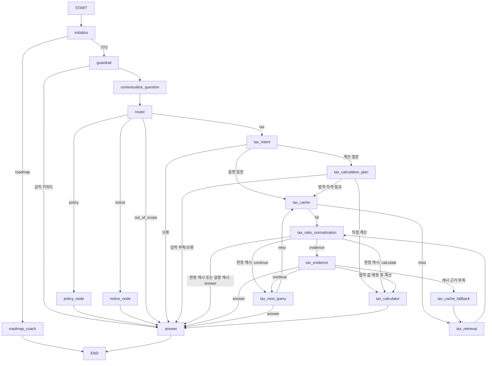

# LLM LangGraph 현재 구조 및 인수인계 가이드

이 문서는 현재 `LLM/` 코드의 실제 구현을 기준으로 작성한 AI/개발자용 인수인계
문서다. 설계 아이디어가 아니라 현재 코드가 어떻게 실행되는지 설명한다.

## 1. 핵심 요약

일반 대화는 금지 키워드 Guardrail을 거쳐, 이력이 있으면 현재 질문을 독립 질문으로
재작성한 뒤 Structured Output Router에서 `policy`, `notice`, `tax`, `out_of_scope` 중
하나로 분류한다. Backend `category`는 허용 route 제약으로 적용된다.

- Policy: 패싯 검색어별 Dense + BM25 → RRF → Cohere Rerank → Unified Answer
- Notice: Backend가 전달한 실제 공고 결과 → Unified Answer
- Tax: Tax Intent → (계산 시 Planner) → Semantic Cache 조회 → miss면 Hybrid Retrieval →
  비율 정규화 → Evidence 평가 → 필요 시 Multi-hop → 선택적 deterministic 계산 →
  Unified Answer
- Roadmap: 범위 판정 + 일반 안내를 단일 Structured Output 호출로 처리 → END

Notice는 RAG를 사용하지 않는다. Tax 계산의 숫자는 LLM이 계산하지 않으며,
LLM은 `TaxCalculationPlan`만 만들고 `calculate_tax_plan()`이 `Decimal`로 계산한다.

## 2. 주요 파일 지도

| 파일 | 책임 |
| --- | --- |
| `src/rag/graph.py` | GraphState, 모든 node, conditional edge, Graph compile |
| `src/rag/tax.py` | Tax Evidence/Next Query/계산 계획 schema와 법령 참조 해석 |
| `src/rag/tax_cache.py` | 세금 Semantic Cache(`TaxRagCache`). 검색 근거·근거 판정 저장/복원 |
| `src/rag/guardrails.py` | 금지 키워드, 질문 길이·top_k 검증 |
| `src/rag/history.py` | 대화 이력 정규화와 Prompt용 절삭 |
| `src/rag/context_builder.py` | 검색 결과를 Answer Context로 직렬화 |
| `src/rag/discovery.py` | Policy 검색어 정규화·패싯 검색어·개인화 Query |
| `src/rag/backend_tasks.py` | legal-basis·deductibility·공고 요약·영수증 추출 단일 작업 |
| `src/serving/tax_calculators_docstring.py` | 세금 계산기 5종과 `calculate_tax()` dispatcher |
| `src/rag/answer.py` | 공통 Structured Answer와 안전한 fallback |
| `src/rag/roadmap.py` | 로드맵 범위·압축 Context·단일 호출 코치 |
| `src/data/tax_normalization.py` | `N분의 M` 비율의 deterministic 추출/표현 |
| `src/vectorstores/hybrid.py` | BM25, RRF, Dense+BM25 orchestration |
| `src/vectorstores/postgres.py` | pgvector 저장·Dense 검색 |
| `src/rag/reranker.py` | Cohere Rerank와 공통 결과 schema 유지 |
| `src/features/indexing.py` | DB/PDF 문서 Chunking 및 검색기 준비 |
| `src/data/postgres_repository.py` | PostgreSQL 원천 데이터의 읽기·정제 |
| `src/serving/rag_routes.py` | 실제 HTTP 진입점과 Graph 실행 |
| `src/serving/schemas.py` | Backend↔LLM 및 내부 API Pydantic 계약 |
| `src/serving/errors.py` | HTTP 오류 코드·응답 형식 |
| `src/core/config.py` | 모델, 검색, DB, Cohere, MAX_HOPS, Tax Cache 설정 |
| `src/core/database.py` | `psycopg_pool` 커넥션 풀(1~16) |

## 3. 실제 HTTP 진입점

### Backend 어댑터

- `GET /rag/ready`
- `POST /rag/reindex`
- `POST /rag/chat`

`POST /rag/chat`의 핵심 입력은 다음과 같다.

```json
{
  "category": "policy",
  "question": "질문",
  "roadmapStep": null,
  "userContext": null,
  "noticeResults": null,
  "conversationHistory": []
}
```

- `category`: `tax | expense | saving | policy | roadmap`. 일반 category는 Router 제안을 허용 route로 보정하는
  제약이다. `_route_for_category()`가 아래 표대로 결정적으로 적용한다
  (`Docs/Design/LLM_API_SPEC_V1.md` §3과 동일).

  | category | 허용 route |
  | --- | --- |
  | `tax` | `tax` |
  | `expense` | `tax` |
  | `saving` | `tax`, `policy` |
  | `policy` | `policy`, `notice` |
  | `roadmap` | 전용 `roadmap` branch |

- `userContext`: Backend가 인증 사용자 정보로 조립한 선택값이다.
- `conversationHistory`: 완료된 과거 user/assistant 대화 최대 20개 메시지다. 없으면 기존
  단일 질문 흐름을 유지하고, 있으면 Router 전에 생략 표현만 복원한다. API는 최대
  10쌍·12,000자를 받지만 실제 Contextualize와 Answer 모델 Prompt에는 최근
  5쌍·4,000자만 전달한다.
- `roadmapStep`: Roadmap의 현재 탭 `A|B|C|D|E|F|Z`. Roadmap Prompt 우선순위에만
  사용하며 다른 category에서는 거부한다.
- `noticeResults`: Backend가 조회한 실제 공고 목록이다.
  - 필드 자체가 없거나 `null`: `integration_unavailable`
  - `[]`: Backend 조회 성공, 결과 0건이므로 `no_result`
  - 값이 있는 배열: Notice Answer Context로 사용

### 내부 호환 API

- `GET /internal/rag/ready`
- `POST /internal/rag/index`
- `POST /internal/rag/answer`
- `POST /internal/rag/recommendations`

`/rag/chat`과 `/internal/rag/answer`는 모두 `rag_routes._execute_graph()`를 통해
동일한 LangGraph를 실행한다. 정책 추천 endpoint는 기존 `PolicyDiscoveryService`
호환 경로를 유지한다.

## 4. Graph dependency 조립

`build_graph()`는 다음 의존성을 주입받는다.

- `llm`: Router, Tax Intent, 입력 Planner, Evidence, Next Query, Answer Structured Output
- `policy_search`: Policy용 `HybridSearch`
- `tax_search`: Tax용 `HybridSearch`; 없으면 `policy_search`를 공유
- `notice_search`: Backend가 전달한 공고 결과를 반환하는 일반 callable
- `rerank`: 테스트 대역 또는 Cohere reranker
- `tax_intent_classifier`, `tax_calculation_planner`, `tax_evidence_evaluator`,
  `tax_next_query_generator`, `tax_calculator`, `question_contextualizer`, `roadmap_coach`:
  테스트 가능한 선택적 대역
- `tax_cache`: `TaxRagCache`. `TAX_CACHE_ENABLED`이고 Dense 검색기가
  `PostgresVectorSearch`일 때만 `RagRuntime.require_graph()`가 만든다. 없으면 cache node는 miss로 통과
- `settings`: top-k, Cohere, `TAX_MAX_HOPS`, Tax Cache 임계값 등

`RagRuntime`(`src/serving/rag_routes.py`)은 채팅 모델, `HybridSearch`, 컴파일된 Graph를
프로세스 안에 캐시하고 인덱스가 바뀔 때만 다시 만든다. 요청마다 `build_graph()`를
호출하지 않는다.

Backend 함수는 Tool이 아니다. `@tool`, `ToolNode`, Agent, ReAct를 사용하지 않는다.

## 5. GraphState

`GraphState`는 `TypedDict`이며 `query`만 필수 입력이다.

| 필드 | 작성 node/진입점 | 주요 사용처 |
| --- | --- | --- |
| `query` | HTTP entry | Router, 모든 branch, Answer |
| `category` | Backend adapter | Router 결과를 허용 route로 보정 |
| `roadmap_step` | Backend adapter | Roadmap 답변에서 현재 단계 우선 |
| `policy_id`, `top_k`, `decision` | 내부 API | Policy 검색/Answer |
| `route`, `personalized` | Router | conditional route, Context 사용 |
| `user_context` | HTTP entry/initialize | 개인화 Query, Tax 판단/계산 계획 |
| `conversation_history` | Backend adapter/initialize | 후속 질문 복원과 Answer 대화 문맥 |
| `standalone_query` | Contextualize node | Guardrail, Router, 검색, Tax 판단/계획 |
| `search_query` | Policy/Tax Next Query | 실제 검색 Query |
| `retrieved_docs` | Policy/Tax Retrieval | RRF 결과 또는 누적 후보 |
| `reranked_docs` | Policy/Tax Retrieval | 최종 근거 및 Answer |
| `normalized_ratios` | Tax Ratio node | Evidence와 Tax Answer Context |
| `hop_count`, `search_history` | Tax Retrieval | Multi-hop 제한/중복 방지 |
| `last_retrieval_count` | Tax Retrieval | 새 근거 없음 판단 |
| `evidence_sufficient` | Tax Evidence | 3-way routing, Answer status |
| `missing_information` | Tax Evidence | Next Query와 Answer |
| `missing_user_context` | Tax Evidence/Planner | 즉시 종료 및 추가 입력 안내 |
| `calculation_required`, `calculation_type` | Tax Intent | 계산 경로와 계산기 종류의 단일 기준 |
| `calculation_inputs`, `missing_calculation_inputs` | Tax Planner | 명시된 사용자 값과 추가로 필요한 현실 정보 |
| `requires_legal_eligibility` | Tax Intent | 법령 RAG 선행 여부 |
| `resolved_calculation_inputs` | Tax Evidence | 근거로 확정한 calculator 내부 값 |
| `calculation_source_numbers` | Tax Evidence | 내부 법적 값의 실제 근거 번호 |
| `calculation_assumptions` | Tax Planner | 기본값으로 계산할 때 사용자에게 공개할 가정 |
| `calculation_result` | Tax Calculator | Tax Answer Context |
| `notice_results` | Notice node | Notice Answer Context |
| `notice_backend_available` | Notice node | no-result와 미연결 구분 |
| `termination_reason` | 각 branch | routing과 최종 status 결정 |
| `answer`, `answer_status` | Unified Answer | HTTP 응답 |
| `cited_source_numbers`, `answer_sources` | Unified Answer | 검증된 실제 출처 응답 |
| `guardrail_reason` | Guardrail/Router | `out_of_scope` 등 차단 사유 |
| `personalized_search_query`, `dense_docs`, `bm25_docs` | Policy node | 검색 단계 추적 |
| `policy_ranked_candidates`, `policy_supporting_docs` | Policy node | 정책별 대표 근거와 보조 근거 |
| `tax_general_explanation`, `defaulted_calculation_inputs` | Tax Intent/Planner | 일반 설명, 기본값으로 채운 입력 |
| `tax_retrieval_trace`, `tax_started_at` | Tax Retrieval | 단계별 지연(`TAX_LATENCY` 로그) |
| `tax_cache_hit`, `tax_cache_decision_hit`, `tax_cache_retrieval_only` | Tax Cache | cache 이후 routing |
| `tax_cache_embedding`, `tax_cache_prior_evidence_ids` | Tax Cache | 저장 시 질문 Embedding 재사용, 이전 Hop 근거 id |

## 6. 전체 Graph



Roadmap은 최근 대화 5쌍·4,000자, 압축된 7단계 Context와 최소 사용자 정보만 한 번의
모델 호출에 전달한다. `in_scope`, `redirect`, `answer`를 함께 받고 범위 밖 `answer`는
폐기한 뒤 세무·공고 메뉴 또는 로드맵 범위 안내를 결정적으로 반환한다. 모델 또는
구조화 출력 실패도 추가 호출 없이 `error`로 종료한다.

## 7. Router

`guardrail`은 모델 호출 전에 `RAG_BLOCKED_KEYWORDS` 금지 키워드만 검사해 `out_of_scope`로
바로 `answer`에 보낸다. 키워드로 판단하기 어려운 범위 밖 요청은 Router가 분류한다.

`contextualize_question`은 대화 이력이 있을 때만 Structured Output을 호출한다.
`category`가 `tax`·`expense`·`policy`이고 지시어 없이 주제어가 있는 독립 질문이면
정규식으로 판단해 호출을 건너뛴다. 대명사와
생략된 조건만 복원하며 답변이나 새 사실을 만들지 않는다. 실패하거나 결과가 비정상이면
원래 질문으로 계속 진행한다. 과거 assistant 답변은 대화 문맥일 뿐 출처 근거가 아니다.

`RouteDecision`은 자유 문자열 parsing이 아닌 Structured Output이다.

```python
route: Literal["policy", "notice", "tax", "out_of_scope"]
personalized: bool
```

`out_of_scope`는 `guardrail_reason="out_of_scope"`로 `answer`에 합류하며 응답 status는
`no_result`다. 그 외 route는 `_route_for_category()`가 category 허용 목록으로 보정한다.

`personalized=True`는 사용자 Context가 필요한 질문이라는 뜻이다. 사용자 정보가
실제로 제공됐다는 뜻은 아니다.

## 8. Policy branch

1. `build_policy_initial_search_queries()`가 정규화된 질문에서 패싯 검색어 목록을 만든다.
   `personalized=True`이고 `user_context`가 있으면 `build_personalized_query()` 결과를
   목록에 **추가**한다.
2. 검색어마다 `HybridSearch.search_stages()`를 병렬 실행한다. 검색 단계에서
   `source_types=("policy", "announcement")`, `require_policy_id=True`로 사전 필터한다.
3. `reciprocal_rank_fusion()`이 모든 Dense·BM25 목록을 `chunk_id` 기준으로 결합한다.
4. Cohere가 RRF 후보를 재정렬한다. Cohere 설정/API 오류 시 RRF 상위 결과를 사용한다.
5. `_select_policy_documents()`가 정책별 대표 근거(`reranked_docs`)와 보조 근거를 나눈다.
6. 질문이 요구한 정보가 근거에 없으면 `partial_evidence`로 표시한다.

주요 종료 사유:

- `policy_retriever_unavailable`
- `retrieval_error`
- `no_result`
- `partial_evidence`
- `policy_evidence_ready`

## 9. Notice branch

Notice node는 Vector DB, BM25, RRF, Cohere를 호출하지 않는다.

- `notice_search is None`: `notice_integration_unavailable`
- Backend 호출 오류: `notice_backend_error`
- 정상 0건: `no_result`
- 정상 결과: `notice_results_ready`

실제 공고 필터, 모집 상태, 날짜 판단, SQL은 Backend 책임이다. LLM에 이 로직을
복제하지 않는다.

## 10. Tax branch

### 10.1 Intent와 Calculation Planner

Tax 진입점은 `tax_intent`이다. `TaxIntentDecision`이 계산 필요 여부와
`calculation_type`을 한 번만 결정한다. 설명 질문은 곧바로 기존 RAG로 이동하고,
계산 질문은 `tax_calculation_plan`에서 질문과 `user_context`에 실제 존재하는 사용자
값만 추출한다. Planner는 계산 종류를 다시 분류하지 않는다.

법적 자격 판단 없이 실행할 수 있는 `income_tax`, `withholding_tax`, `general_vat`,
`simplified_vat_output_tax`는 입력이 충분하면 RAG를 생략한다.
`startup_tax_reduction`과 기존 법령 비율 계산은 RAG와 Evidence 검증을 먼저 거친다.

`DEFAULT_CALCULATION_INPUTS`가 있는 계산은 누락 값을 기본값으로 채우고 가정 문구를
`calculation_assumptions`에 남긴다(원천징수 가족 1명·자녀 0명, 일반 VAT 매입세액·
세액공제·기납부세액·가산세 0원).

`startup_tax_reduction`은 질문에 없는 값을 `user_context`에서 결정적으로 선채움한다.
`age`, `region`(→사업장 위치, "잠정 사용" 가정 문구), `business.industry`,
`business.founded_at`(→창업연도). 그래도 부족한 값은 감면 적용 전 세액 → 최초 창업 여부 →
창업연도 → 나이 → 사업장 위치 → 업종 순서로 **최대 2개만** `missing_user_context`에 담고,
`need_more_info` 답변 앞에 가정 문구를 붙인다.

### 10.2 Retrieval

각 Hop은 기존 Hybrid Retrieval과 Cohere Rerank를 사용한다. Tax 검색은
`source_types=("tax_document",)`로 Dense·BM25 단계에서 사전 필터한다.

- 첫 Hop은 `build_tax_initial_search_queries()`의 패싯 검색어를 병렬 검색한다
- `parse_exact_legal_query()`가 `○○법 제N조` 형식을 찾으면 법령·조문 정확 검색 결과를 앞에 합친다
- Hop 검색 전체에 20초 제한(`TAX_HOP_SEARCH_TIMEOUT_SECONDS`), 초과 시 `retrieval_timeout`

- 실제 검색을 실행할 때만 `hop_count` 증가
- 실행 Query는 `search_history`에 추가
- Query가 이미 history에 있으면 `duplicate_query`
- `TAX_MAX_HOPS` 이상이면 `max_hops`
- `merge_evidence()`가 `chunk_id` 기준으로 Hop 간 근거를 누적
- 새 Chunk가 없으면 `no_new_evidence`

### 10.3 Semantic Cache

`tax_cache` node는 `tax_retrieval` 앞에서 `TaxRagCache.lookup()`을 호출한다. 데이터는
PostgreSQL `tax_rag_cache`(`DB/app_extras.sql`)에 있다. 근거 본문은 저장하지 않고
`rag_documents.id`만 저장했다가 `get_tax_evidence_by_ids()`로 되살린다. 캐시 저장 뒤
수정됐거나(`updated_at`) 준비되지 않은 청크가 하나라도 있으면 그 항목은 쓰지 않는다.

조회 순서:

1. 질문·사용자 조건·이전 Hop 근거 id로 만든 `cache_key` 정확 일치
2. 없으면 질문 Embedding 코사인 유사도 상위 5건. `TAX_CACHE_SIMILARITY_THRESHOLD`(기본 0.95)
   미만이면 중단
3. 판정 서명(질문 범위·세금 판단에 영향을 주는 조건)이 같고 유사도가
   `TAX_CACHE_DECISION_SIMILARITY_THRESHOLD`(기본 0.98, 앞 값 이상이어야 함) 이상이면
   근거·Hop Query·근거 판정을 복원
4. 판정 재사용 조건을 못 맞추면 근거만 `retrieval` 모드로 기존 근거에 합친다

| 모드 | 복원 내용 | 이후 경로 |
| --- | --- | --- |
| `decision` | 근거 + `TaxEvidenceDecision` | Evidence LLM 없이 저장된 판정으로 routing |
| `full` | 근거 + Hop Query | 계산 불필요면 `answer`, 필요하면 Evidence 재평가 |
| `retrieval` | 근거만 누적(`hop_count` +1) | 일반 Evidence 평가 |

- 판정 캐시는 LLM 모델명·캐시 버전·이전 근거 id가 같을 때만 쓰고, 근거 부족 판정은 6시간만 유효하다
- `full` 모드에서 Evidence가 근거 부족으로 판단하면 `tax_cache_fallback`이 상태를 비우고 새 검색부터 다시 한다
- 저장 시점은 두 가지다. Hop 1 이상에서 근거 판정 직후(판정 포함), 그리고 캐시 miss 요청이 인용 출처와 함께 `success`로 끝났을 때
- 조회·저장 실패는 경고 로그만 남기고 일반 Multi-hop으로 계속한다
- `TAX_CACHE_ENABLED=false`이거나 in-memory 검색기면 cache node는 항상 miss다

### 10.4 Ratio Normalization

`tax_ratio_normalization` node는 LLM을 호출하지 않는다. 검색된 문서에서
`분모분의 분자` 패턴을 구조화한다.

```json
{
  "raw": "100분의 75",
  "numerator": 75,
  "denominator": 100,
  "percent": 75,
  "decimal": 0.75,
  "context": "원문 주변 문장",
  "chunk_id": "tax_document-..."
}
```

Normalizer는 이 값이 세율, 감면율, 공제율인지 판단하지 않고 실제 세액 계산도 하지
않는다. DB 원문, Chunk 본문, metadata를 변경하지 않으므로 이 단계 때문에 재색인할
필요가 없다. Prompt에 문서를 직렬화할 때는 이해 보조용으로 원문 옆에 `%`를 붙인다.

### 10.5 Evidence Evaluator

`TaxEvidenceDecision` Structured Output:

```python
sufficient: bool
missing_information: list[str]
missing_user_context: list[str]
calculation_required: bool
resolved_category: StartupCategory | None
resolved_region: StartupRegion | None
resolved_rate_percent: str | None
cited_source_numbers: list[int]
reason: str
```

`calculation_required`와 `calculation_type`의 기준은 Tax Intent이며 Evidence가 이를
뒤집지 않는다. Evidence 이후 routing은 다음 규칙을 유지한다.

1. `evidence_sufficient=True` + 법적 계산 + 내부 값 확정 → `calculate`
2. `evidence_sufficient=True` + 계산 불필요 → `answer`
3. Evidence 부족 + 종료 사유 없음 → `continue`
4. Evidence 부족 + 종료 사유 있음 → `answer`
5. `full` 모드 cache hit인데 Evidence 부족 → `cache_fallback`

판정 Prompt에는 문서 전문 대신 질문 용어·법령 신호어가 많은 문장을 문서당 500자까지
발췌해 넣는다(`_format_evidence_for_evaluation`). 출처 번호는 유지한다.

`MAX_HOPS`에 도달해도 `evidence_sufficient=True`로 바꾸지 않는다.

### 10.6 Reference와 Next Query

`resolve_legal_reference()`가 LLM Query 생성보다 먼저 실행된다.

최소 지원 패턴:

- `○○법 제N조`
- `○○법 시행령 제N조`
- `같은 법 제N조`
- `제N조에 따른`
- `대통령령으로 정하는`

명시적 참조를 찾지 못하면 `resolve_missing_information_query()`가 부족 정보 목록으로
규칙 기반 Query를 먼저 시도하고, 그래도 없을 때만 `TaxNextQuery` Structured Output을 호출한다.

```python
query: str | None
target_law: str | None
target_article: str | None
reason: str
```

새 Query가 있으면 `retry → tax_cache`(miss면 `tax_retrieval`), 없거나 중복/오류이면
`answer`로 직접 이동한다. Next Query 실패는 계산 필요를 뜻하지 않는다.

### 10.7 Calculation

`tax_calculator`는 Tool이 아닌 일반 LangGraph node이다. 다음 경로로 실행한다.

- 직접 계산: `Tax Intent → Planner → tax_calculator → Answer`
- 법적 계산: `Tax Intent → Planner → 기존 Multi-hop RAG → Evidence → tax_calculator → Answer`

실제 계산은 `src/serving/tax_calculators_docstring.py`의 `calculate_tax()` dispatcher를
재사용한다. 지원 계산은 종합소득세, 근로소득 간이세액 산식 계산, 일반과세 VAT,
간이과세 기본 매출세액, 창업 세액감면이다. 근로소득 간이세액은 외부 CSV·DB 또는
표 행 데이터를 주입하지 않고 월급여·공제대상가족 수·자녀 수로 직접 계산한다.
종합소득세 2023~2025 외 귀속연도는 가까운 연도로 대체하지 않는다.

원천징수 질문에 가족·자녀 수가 없으면 본인 포함 가족 1명, 자녀 0명을 기본 가정으로
계산한다. Answer는 이 가정을 명시하고 실제 값을 제공하면 재계산할 수 있다고 안내한다.

창업 세액감면의 `category`, `region`은 사용자에게 enum으로 요구하지 않는다. Evidence가
실제 사용자 정보와 법령 근거를 이용해 확정하고 유효한 출처 번호를 제시한 경우에만
calculator에 전달한다.

기존 generic 법령 비율 계산도 호환 경로로 유지한다.

`TaxCalculationPlan`은 OpenAI Structured Output 호환을 위해 금액과 비율을 숫자
문자열로 받는다. `Decimal` 타입을 schema에 직접 사용하면 일부 OpenAI response
format에서 지원하지 않는 regex가 생성되므로 다시 사용하지 않는다.

```python
calculation_type: Literal[
    "percentage_of_amount",
    "reduction_amount",
    "amount_after_reduction",
]
base_amount: str | None
rate_percent: str | None
missing_inputs: list[str]
cited_source_numbers: list[int]
reason: str
```

`calculate_tax_plan()`의 검증 순서:

1. 필수 입력 존재 확인
2. 문자열을 `Decimal`로 변환
3. 기준금액 음수 및 비율 0~100 범위 확인
4. 출처 번호 범위 확인
5. 해당 비율이 인용 문서 원문에 실제 존재하는지 확인
6. Python `Decimal`로 계산

generic 계산은 기준금액의 비율, 감면액, 감면 후 금액만 담당하며 기존 출처·비율
검증을 그대로 적용한다.

## 11. Unified Answer

모든 branch는 하나의 `answer` node로 합류한다.

`UnifiedAnswerResult`:

```python
answer: str
status: Literal[
    "success",
    "need_more_info",
    "insufficient_evidence",
    "no_result",
    "integration_unavailable",
    "error",
]
cited_source_numbers: list[int]
```

- 성공 시 현재 route에 필요한 Context만 LLM에 전달한다.
- 실패/무결과/미연결은 `fallback_answer()`로 결정적으로 응답한다. 추가 입력 요청은 최대 2개로 자른다.
- 예외: `insufficient_evidence`여도 인용 가능한 근거가 있으면(`partial_evidence_answer`)
  LLM이 확인된 사실 범위의 답변을 생성하고 status는 유지한다.
- 출처 metadata를 LLM이 생성하게 하지 않는다.
- LLM이 선택한 번호를 실제 source 개수와 대조한다.
- 중복 source는 `chunk_id`, `id`, `notice_id` 우선으로 제거한다.
- Answer node는 검색, Evidence 판단, Next Query, 계산을 수행하지 않는다.

## 12. termination_reason → 사용자 상태

대표 매핑은 다음과 같다.

| termination_reason | answer_status |
| --- | --- |
| retriever/integration unavailable, `unsupported_tax_year` | `integration_unavailable` |
| `missing_user_context`, `missing_calculation_input`, `calculation_input_error` | `need_more_info` |
| `no_result` 또는 근거 문서 없음 | `no_result` |
| MAX_HOPS, 중복 Query, 새 근거 없음, `partial_evidence` | `insufficient_evidence` |
| retrieval/evidence/query/plan/tax intent 내부 오류, `notice_backend_error` | `error` |
| 계산 비율·출처 검증 실패 | `insufficient_evidence` |
| 근거 충분/계산 완료 | `success` |

정확한 최종 매핑은 `graph._answer_status()`가 source of truth다.

## 13. 검색 및 인덱스 생명주기

PostgreSQL 원천:

- `policies`
- `announcements`
- `tax_documents`

파생 Vector 저장소는 `rag_documents`다. 원본 테이블은 인덱싱 과정에서 읽기 전용으로
취급한다.

파생 캐시 저장소는 `tax_rag_cache`다(10.3).

현재 `RagRuntime.ready`는 DB에 Embedding이 존재한다는 뜻이 아니라 현재 프로세스에
검색 객체가 조립됐다는 뜻이다. 서버를 재시작하면 pgvector 데이터는 남지만
메모리의 BM25/HybridSearch는 다시 준비해야 한다.

LLM 프로세스는 기동 시 검색기를 스스로 로드하지 않는다. `/rag/reindex` 또는
`/internal/rag/index`가 검색기를 준비하며, 청크 content의 SHA-256이 같으면 Embedding을
재사용한다(`index_source: cache`, reindex 응답 status `already_ready`). Compose 기동에서는
Backend의 `llm-warmup` 스레드가 `/rag/ready`를 확인하고 준비되지 않았으면 `/rag/reindex`를
한 번 호출하므로 수동 작업이 필요 없다. LLM 컨테이너만 재시작했으면 수동 reindex가 필요하다.
준비되지 않은 상태의 `/rag/chat`은 200 + `integration_unavailable`로 응답한다.

## 14. 주요 환경변수

```dotenv
PORT=8001
DATABASE_URL=...
VECTOR_STORE_BACKEND=postgres
LLM_MODEL=...
EMBEDDING_MODEL=text-embedding-3-small
OPENAI_API_KEY=...
RETRIEVAL_MODE=hybrid
HYBRID_DENSE_CANDIDATE_K=20
HYBRID_BM25_CANDIDATE_K=20
HYBRID_RRF_K=60
COHERE_API_KEY=...
COHERE_RERANK_MODEL=rerank-v4.0-fast
COHERE_RERANK_CANDIDATE_K=20
TAX_MAX_HOPS=3
TAX_CACHE_ENABLED=true
TAX_CACHE_SIMILARITY_THRESHOLD=0.95
TAX_CACHE_DECISION_SIMILARITY_THRESHOLD=0.98
```

실제 secret을 코드·문서·로그에 기록하지 않는다. Cohere가 미설정이면 RRF fallback을
사용한다.

## 15. 현재 알려진 제한사항

1. LLM 프로세스 자체의 startup load는 없다. Backend 워밍업이 대신하므로 LLM만 재시작하면 수동 reindex가 필요하다.
2. Notice의 실제 조회/필터는 Backend가 `noticeResults`를 전달해야 동작한다(현재 `category=policy`에서 전달).
3. Tax와 Policy가 같은 Hybrid corpus를 공유하며 `source_type`으로 검색 단계에서 사전 분리된다.
4. Tax Ratio Normalizer는 값만 추출하며 비율의 법적 의미는 Evidence 단계가 판단한다.
5. Semantic Cache는 첫 질문의 지연을 줄이지 못한다.
6. Cohere가 없거나 실패하면 RRF로 동작하므로 결과 품질 차이를 평가해야 한다.
7. 원본 PDF는 Git에서 제외되어 있으며 일부 PDF 테스트는 로컬 파일이 있어야 한다.
8. `category=tax`·`expense`는 route가 이미 확정되지만 Router LLM 호출은 그대로 실행된다(결함 45).

## 16. 테스트

```powershell
cd LLM
uv run pytest -q
```

테스트 파일 32개, 354건이다. 2026-09-15 로컬 실행 결과는 `346 passed, 8 failed`이며, 실패는
원본 PDF(`src/data/RAG_data`) 등 로컬 데이터가 필요한 테스트다. 주요 테스트:

- `tests/test_graph.py`: Router, Policy/Notice branch, isolation
- `tests/test_tax_graph.py`: single/multi-hop, 3-way edge, Reference 우선, MAX_HOPS,
  계산 진입 조건, deterministic 계산
- `tests/test_tax_document_preprocessing.py`: 비율 추출, 원문 보존
- `tests/test_tax_cache.py`: cache key·판정 서명·모드별 복원, 무효화 조건
- `tests/test_reranker.py`: Cohere metadata 보존
- `tests/test_rag_api.py`: 실제 HTTP entry와 Backend adapter 계약
- `tests/test_evaluator.py`, `tests/test_evaluation_metrics.py`: 평가 호환성

## 17. 변경 시 반드시 지킬 불변 조건

1. Notice를 RAG로 대체하지 않는다.
2. Evidence 부족 상태를 계산 node로 보내지 않는다.
3. Next Query의 실패/중복/없음은 `answer`로 보낸다.
4. `MAX_HOPS`를 근거 충분으로 바꾸지 않는다.
5. Ratio Normalizer는 원문을 수정하거나 세금을 계산하지 않는다.
6. LLM에게 실제 산술 결과를 맡기지 않는다.
7. 계산 비율은 인용 문서 원문에 실제 존재해야 한다.
8. LLM이 source metadata를 생성하게 하지 않는다.
9. Backend 함수는 Tool Calling이나 Agent로 노출하지 않는다.
10. DB 원본, 원본 PDF, 실제 secret을 변경하거나 커밋하지 않는다.
11. Tax Cache는 근거 본문이 아닌 `rag_documents.id`만 저장하고, 복원 시 현재 DB 청크로 검증한다.

## 18. 다음 작업 권장 순서

1. `category`로 route가 확정된 요청의 Router LLM 호출 생략(결함 45)
2. `startup_tax_reduction` 계산 경로의 남은 입력 요청 개선(결함 44)
3. 실제 Tax 질문셋으로 Hop 수, Evidence 정확도, Reference 추적, Cache 적중률 평가
4. Dense / Hybrid / Hybrid+Cohere 비교 평가
