# 청년·1인 창업자 AI 행정·재정 지원 플랫폼

> LLM과 RAG(Retrieval-Augmented Generation) 기술을 연동한 내외부 문서 기반 질의응답 시스템으로,    
청년·1인 창업자의 세무 관리와 정부·지자체 지원정책 탐색을 지원하는 AI 업무지원 플랫폼

---

## 📑 목차

- [1. 팀 소개](#1-팀-소개)
- [2. 프로젝트 개요](#2-프로젝트-개요)
- [3. 기술 스택](#3-기술-스택)
- [4. 데이터 및 AI 기술](#4-데이터-및-ai-기술)
- [5. 프로젝트 수행 범위](#5-프로젝트-수행-범위)
- [6. 시스템 아키텍처](#6-시스템-아키텍처)
- [7. 저장소 구조](#7-저장소-구조)
- [8. 요구사항 명세서](#8-요구사항-명세서)
- [9. Diagram](#9-diagram)
  - [9.1 유스케이스 다이어그램](#91-유스케이스-다이어그램)
  - [9.2 ERD](#92-erd)
  - [9.3 클래스 다이어그램](#93-클래스-다이어그램)
  - [9.4 시퀀스 다이어그램](#94-시퀀스-다이어그램)
- [10. 주요 프로시저](#10-주요-프로시저)
- [11. WBS](#11-wbs)
- [12. 수행결과](#12-수행결과)
- [13. 트러블슈팅](#13-트러블슈팅)
- [14. 테스트 보고서](#14-테스트-보고서)
- [15. 향후 확장](#15-향후-확장)
- [16. 실행 방법](#16-실행-방법)
- [17. 한 줄 회고](#17-한-줄-회고)

---

## 1. 팀 소개

### 팀명

**FIFO**


### 팀원

| 이름 | 담당 | 설명 | GitHub |
| :---: | :---: | :---: | :---: |
| 김태윤 | **PM** | 아키텍처 설계 · 기능 통합 · 발표 | [](https://github.com/kty2001) |
| 김현지 | **DB** | 데이터 수집 · DB 구현 | [](https://github.com/HJK013) |
| 전진영 | **Backend** | backend 목업 | [](https://github.com/msi67811-jpg) |
| 채정석 | **Frontend** | 프론트엔드 구현 · 화면/UI 설계 | [](https://github.com/qnfdhk-rgb) |
| 황호순 | **LLM** | LangGraph 기반 챗봇 구현 | [](https://github.com/Amber8800) |


---

## 2. 프로젝트 개요

### 프로젝트명

**창업ON : 청년·1인 창업자 AI 지원 플랫폼**

<br>

### 프로젝트 소개

청년·1인 창업자는 세금, 세액감면, 정부·지자체 지원사업 등 다양한 행정 정보를 직접 찾아보고 자신의 조건에 해당하는지 판단해야 합니다.      
그러나 관련 정보가 여러 기관과 공고문에 분산되어 있고, 법령 및 지원 조건이 복잡해 필요한 혜택을 놓치는 경우가 많습니다.

본 프로젝트는 사용자의 사업자 정보와 개인 조건을 기반으로 세무 정보와 정부·지자체 지원정책을 통합적으로 탐색하고 안내하는 AI 업무지원 플랫폼을 개발합니다. 

<br>

### 프로젝트 필요성

- 세금 및 세액감면 조건이 복잡하여 스스로 판단하기 어렵습니다.
- 정부·지자체 지원사업이 여러 기관에 분산되어 있습니다.
- 긴 공고문을 직접 읽고 지원 대상 및 신청 조건을 확인해야 합니다.
- 일반 AI에게 질문할 경우 존재하지 않는 정책이나 부정확한 세무 정보를 제공할 위험이 있습니다.

<br>

### 프로젝트 목표

- 환각을 방지하고 원하는 내외부 데이터 범위 안에서 RAG 기반 LLM 질의응답 시스템을 구현하여, 근거 없는 정책·세무 정보를 제공하는 위험을 차단합니다.
- 세법·정책 문서를 벡터 형태로 임베딩하여 벡터데이터베이스에 저장하고 검색합니다.
- LangChain을 활용해 벡터데이터베이스와 LLM을 연동하고, 조건 기반 판정 로직과 결합해 사용자 맞춤 답변을 제공합니다.

<br>

### 핵심 기능

#### ① AI 세무 Assistant

<details>
<summary>&nbsp;&nbsp;AI를 통한 세무 업무 지원</summary>
<br>

- 사업자등록 유형 진단
- 사용자 맞춤 세금 정보 제공
- 세금 신고·납부 일정 및 지원금 신청기한을 통합한 홈 화면 캘린더
- 맞춤형 세금 리마인더
- 경비처리·절세 Q&A
- 세법 및 국세청 자료 기반 RAG 답변

</details>


#### ② 청년창업 세액감면 자동 판정

<details>
<summary>&nbsp;&nbsp;청년창업 세액감면 요건 충족 여부 자동 판정</summary>
<br>

- 사용자의 나이, 지역, 업종, 창업 여부 및 창업 시점 등의 조건을 분석하여 판정함.
- 단순 LLM 답변이 아닌, 조건 기반 판정 + 관련 법령 및 공식 자료를 근거로 결과 제공.

</details>

#### ③ 맞춤형 지원금·정책 탐색

<details>
<summary>&nbsp;&nbsp;사용자에게 적합한 조건의 지원 정책을 쉽게 확인할 수 있게 함</summary>
<br>

- 정부·지자체 지원사업 수집
- 사용자 조건 기반 맞춤 정책 추천
- 지원 자격 비교
- 신청기간 및 신청방법 안내(홈 화면 캘린더에 신청 마감일 연동)
- 관심 정책 저장

</details>

#### ④ 지원사업 공고문 AI 분석

<details>
<summary>&nbsp;&nbsp;AI가 공고문을 분석하여 중요 정보를 구조화</summary>
<br>

- 지원 대상
- 지원 내용 및 금액
- 신청 기간
- 신청 방법
- 제출 서류
- 주요 유의사항

또한 답변에 공식 출처와 근거 문서를 함께 제공하여 정보 신뢰성을 높임.

</details>

<br>


---

## 3. 기술 스택

| 구분 | 기술 |
| --- | --- |
| **Backend** |    |
| **LLM / AI** |     |
| **Database** |   |
| **Frontend** |   |
| **Infra** |   |
| **패키지 관리** |   |
| **협업** |   |


## 4. 데이터 및 AI 기술

<details open>
<summary><b>&nbsp;&nbsp;데이터</b></summary>
<br>

- 관련 세법 자료 
- 정부24 공공서비스(혜택) 정보 — 창업·청년·소상공인 등 키워드 기반 정책 데이터
- K-Startup(창업진흥원) 지원사업 공고 — 만 20~39세 대상, 모집 중인 공고
- 기업마당(중소벤처기업부) 중소기업 지원사업 공고
- 온통청년 청년정책 — 창업·벤처·중소기업·대출·자금·보증 관련만 필터링 수집

위 4개 소스에서 수집한 세법·시행령·시행규칙 등 4,459건 및 정책 총 2,931건, 그중 공고 2,187건

데이터 수집·전처리 상세 내용은 [Docs/data_collection_preprocessing.md](Docs/data_collection_preprocessing.md) 참고

</details>
<br>

<details open>
<summary><b>&nbsp;&nbsp;AI 기술</b></summary>
<br>

- **RAG**: 세법·정책 원문 문서를 벡터로 임베딩하여 벡터데이터베이스에 저장하고, 이를 근거로 검색·응답하여 환각을 방지
- **LangChain**: 벡터데이터베이스와 LLM을 연동해 RAG 파이프라인을 구성
- **LLM**: 자연어 상담 및 공고문 분석
- **Rule-based Engine**: 청년창업 세액감면 요건 자동 판정
- **Agent 구조**: 세무·정책 등 업무별 정보 검색 및 처리

</details>


## 5. 프로젝트 수행 범위

- 데이터 수집 및 가공
- 벡터데이터베이스 생성 및 데이터 저장
- One-shot 또는 Few-shot 활용 프롬프트 템플릿 작성
- 사용할 LLM 모델 선택
- LangChain 기반 RAG 기술로 벡터데이터베이스와 LLM 연동하여 질의응답 구현
- 구현 결과 테스트 및 개선

---

## 6. 시스템 아키텍처

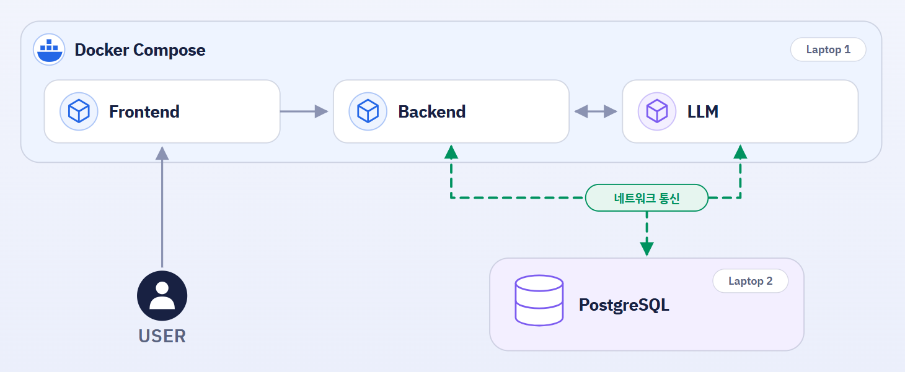

- **Frontend → Backend**: 외부에 노출되는 유일한 진입점. Frontend가 실행되고, api 요청이 프록시를 거쳐 Backend로 감
- **Backend → LLM**: LLM 서비스는 외부에 직접 노출되지 않고, Backend가 Docker 내부 네트워크에서 호출. RAG 질의응답·세액감면판정 근거 생성·공고문 요약을 담당
- **DB**: 관계형 데이터와 벡터 데이터를 Postgres + pgvector 하나로 통합 관리. Backend와 LLM이 각자 필요한 부분에 직접 접속
- **외부 시스템**: 국세청·정부24·온통청년 등에서 받아온 원천 데이터는 관리자 기능을 통해 적재됨


---

## 7. 저장소 구조

```
.
├── Backend/         # API 서버 (FastAPI, :8000)
├── Frontend/        # 사용자 화면 (React + Vite, :5173)
├── LLM/             # RAG 파이프라인, 임베딩, 프롬프트, 모델 서빙 (:8001)
├── DB/              # DB 스키마와 수집 스크립트
├── Docs/            # 기획·설계·진행 문서
│   ├── Design/      # 현재 유효한 설계 산출물
│   └── reports/     # 특정 시점의 검수·분석 보고서
├── presentation/    # 발표자료(PPT, 데모 영상 등)
├── docker-compose.yml
├── setup.sh         # 로컬 실행 (macOS / Linux / Git Bash)
├── setup.bat        # 로컬 실행 (Windows cmd.exe)
└── .env.example     # 환경변수 키 목록 (값은 비어 있음)
```

## 8. 요구사항 명세서


| 구분 | 기능ID | 기능명 |
| --- | --- | --- |
| 회원/프로필 | FS-01~04 | 회원가입, 로그인, 개인정보 관리, 사업자 정보 관리 |
| AI 상담(챗봇) | FS-05~08 | AI 챗봇 이용, 세금/경비처리/절세 Q&A, 정책 Q&A, 답변 근거 확인 |
| 세무 관리 | FS-09~13 | 사업자 유형 진단, 세금 정보 관리, 통합 일정 캘린더, 맞춤 리마인더, 청년창업 세액감면 자동판정 |
| 지출 분석 | FS-14~17 | 영수증 등록, 영수증 정보 추출(OCR), 지출 분류, 경비처리 가능성 분석 |
| 지원정책 탐색 | FS-18~23 | 지원정책 검색, 맞춤 정책 추천, 지원 자격 확인, 신청기간·방법 확인, 공고문 AI 요약, 관심 정책 저장 |
| 관리자 | FS-24~28 | 관리자 로그인, 사용자 관리, 세법·정책·공고문 데이터 관리, RAG 문서 관리, 시스템 모니터링 |

---

## 9. Diagram

### 9.1 유스케이스 다이어그램


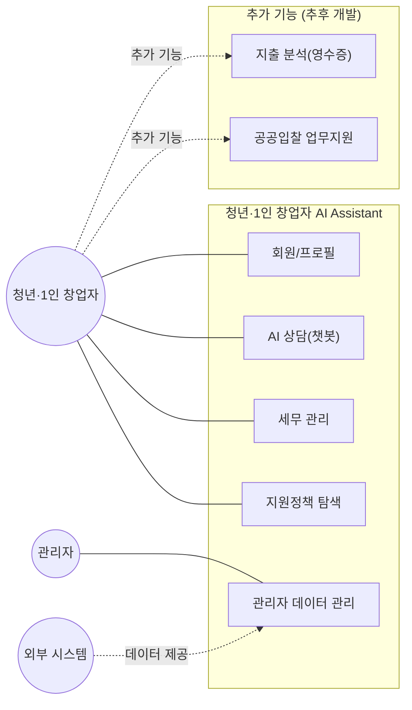
```mermaid
flowchart LR
    User((청년·1인 창업자))
    Admin((관리자))
    Ext((외부 시스템))

    subgraph Platform["청년·1인 창업자 AI Assistant"]
        A["회원/프로필"]
        B["AI 상담(챗봇)"]
        C["세무 관리"]
        E["지원정책 탐색"]
        F["관리자 데이터 관리"]
    end

    subgraph Future["추가 기능 (추후 개발)"]
        D["지출 분석(영수증)"]
        G["공공입찰 업무지원"]
    end

    User --- A
    User --- B
    User --- C
    User --- E
    Admin --- F
    Ext -. 데이터 제공 .-> F
    User -. 추가 기능 .-> D
    User -. 추가 기능 .-> G
```

<details>
<summary>설명</summary>
<br>

Actor는 청년·1인 창업자(주 사용자) / 관리자 / 외부 시스템(국가법령정보센터·정부24·K-Startup·기업마당·온통청년, 하나로 통합)으로 총 셋으로 구분됨. 
지출 분석(영수증)과 공공입찰 업무지원은 추가 기능으로 추후 개발 예정.

</details>
<br>

**청년·1인 창업자 — 상세 유스케이스**


```mermaid
flowchart TD
    User((청년·1인 창업자))

    subgraph SYS["플랫폼"]
        subgraph G1["회원/프로필"]
            UC01(["회원가입"])
            UC02(["로그인"])
            UC03(["개인정보 관리"])
            UC04(["사업자 정보 관리"])
        end

        subgraph G2["AI 상담(챗봇)"]
            UC05(["AI 챗봇 이용"])
            UC06(["세금/경비처리/절세 Q&A"])
            UC07(["정책 Q&A"])
            UC08(["답변 근거 확인"])
        end

        subgraph G3["세무 관리"]
            UC09(["사업자 유형 진단"])
            UC10(["세금 정보 관리"])
            UC11(["통합 일정 캘린더 조회"])
            UC12(["맞춤 리마인더 설정"])
            UC13(["청년창업 세액감면 자동판정"])
        end

        subgraph G4["지출 분석 (추가 기능)"]
            UC14(["영수증 등록"])
            UC15(["영수증 정보 추출(OCR)"])
            UC16(["지출 분류"])
            UC17(["경비처리 가능성 분석"])
        end

        subgraph G5["지원정책 탐색"]
            UC18(["지원정책 검색"])
            UC19(["맞춤 정책 추천"])
            UC20(["지원 자격 확인"])
            UC21(["신청기간·방법 확인"])
            UC22(["공고문 AI 요약"])
            UC23(["관심 정책 저장"])
        end

        subgraph G6["명세 외 구현 기능"]
            UX1(["창업 로드맵 AI 코치"])
            UX2(["개인 일정 등록·삭제"])
            UX3(["알림함 확인"])
            UX4(["대화 기록 조회·삭제"])
            UX5(["모집 중 공고·서비스 지표 조회(비로그인)"])
        end
    end

    User --- UC01
    User --- UC02
    User --- UC03
    User --- UC04
    User --- UC05
    User --- UC06
    User --- UC07
    User --- UC08
    User --- UC09
    User --- UC10
    User --- UC11
    User --- UC12
    User --- UC13
    User -.- UC14
    User -.- UC15
    User -.- UC16
    User -.- UC17
    User --- UC18
    User --- UC19
    User --- UC20
    User --- UC21
    User --- UC22
    User --- UC23
    User --- UX1
    User --- UX2
    User --- UX3
    User --- UX4
    User --- UX5

    UC06 -. include .-> UC08
```

<details>
<summary>설명</summary>
<br>

`지출 분석`(UC14~17)은 추후 개발 예정인 기능이라 점선으로 표시. 
`세금/경비처리/절세 Q&A`는 답변마다 근거 문서를 함께 제시해야 하므로 `답변 근거 확인`을 `<<include>>` 관계로 연결. 

`명세 외 구현 기능`(UX1~5)은 FS 번호는 없지만 실제 코드·화면에 있는 기능 : 로드맵 코치(`POST /chat/messages`의 `category=roadmap`), 개인 일정(`POST`·`DELETE /calendar`), 알림함(`/notifications`), 대화 기록(`GET`·`DELETE /chat/messages`), 비로그인 조회(`GET /announcements`·`GET /stats`).

</details>
<br>

**관리자 · 외부 시스템 — 상세 유스케이스**

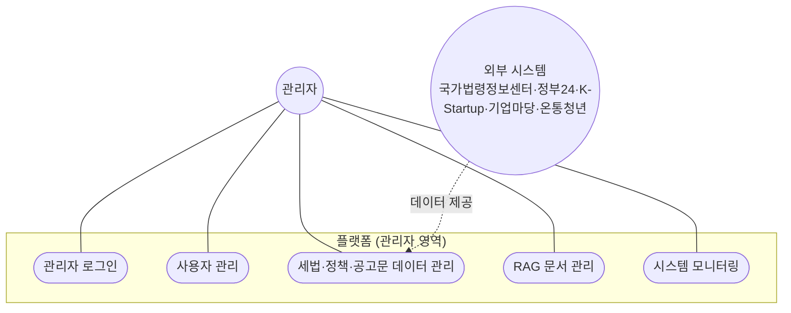
```mermaid
flowchart TD
    Admin((관리자))
    Ext(("외부 시스템<br/>국가법령정보센터·정부24·K-Startup·기업마당·온통청년"))

    subgraph SYS2["플랫폼 (관리자 영역)"]
        UC24(["관리자 로그인"])
        UC25(["사용자 관리"])
        UC26(["세법·정책·공고문 데이터 관리"])
        UC27(["RAG 문서 관리"])
        UC28(["시스템 모니터링"])
    end

    Admin --- UC24
    Admin --- UC25
    Admin --- UC26
    Admin --- UC27
    Admin --- UC28
    Ext -. 데이터 제공 .-> UC26
```

<details>
<summary>설명</summary>
<br>

실제 데이터 수집은 [DB/scripts/02~06](DB/scripts) 스크립트가 DB에 직접 적재.

</details>

---

### 9.2 ERD


```mermaid
erDiagram
    users ||--o| business_profiles : has
    users ||--o{ chat_messages : sends
    chat_messages ||--o{ answer_sources : cites
    users ||--o| tax_info : manages
    calendar_events ||--o{ reminders : triggers
    users ||--o{ reminders : sets
    policies ||--o{ calendar_events : "due date of"
    policies ||--o{ rag_documents : "chunked into"
    users ||--o{ tax_reduction_results : requests
    users ||--o{ receipts : uploads
    receipts ||--o| receipt_extractions : "extracted as"
    receipts ||--o{ expenses : yields
    users ||--o{ expenses : owns
    admin_users ||--o{ policies : manages
    policies ||--o{ announcements : posts
    announcements ||--o| announcement_summaries : "summarized as"
    users ||--o{ saved_policies : saves
    policies ||--o{ saved_policies : "saved by"
    admin_users ||--o{ tax_documents : uploads
    users ||--o{ calendar_events : "owns (USER type)"
    users ||--o{ notifications : receives

    users {
        int id PK
        string email
        string password_hash
        string name
        int age
        string region
        string phone
        string status "DEFAULT 'active'"
        datetime created_at
    }

    business_profiles {
        int id PK
        int user_id FK "UNIQUE"
        string business_type
        string industry
        date business_registered_at
        date founded_at
    }

    chat_messages {
        int id PK
        int user_id FK
        string category
        string question
        string answer
        datetime created_at
    }

    answer_sources {
        int id PK
        int message_id FK
        string title
        string url
        string excerpt
    }

    tax_info {
        int id PK
        int user_id FK
        string tax_type
        string details
        datetime updated_at
    }

    calendar_events {
        int id PK
        string event_type "TAX / POLICY / USER"
        string business_type "TAX 타입일 때만 사용"
        int policy_id FK "POLICY 타입일 때만 사용"
        int user_id FK "USER 타입일 때만 사용"
        string title
        date due_date
        string description
    }

    reminders {
        int id PK
        int user_id FK
        int event_id FK
        datetime notify_at
        boolean dispatched "DEFAULT false"
        datetime created_at
    }

    tax_reduction_results {
        int id PK
        int user_id FK
        boolean eligible
        string reasons
        string legal_basis
        datetime judged_at
    }

    receipts {
        int id PK
        int user_id FK
        string image_url
        string status "DEFAULT 'pending'"
        datetime created_at
    }

    receipt_extractions {
        int id PK
        int receipt_id FK "UNIQUE"
        date date
        string vendor
        int amount
        string items
    }

    expenses {
        int id PK
        int receipt_id FK
        int user_id FK
        string category
        int amount
        date date
        boolean deductible
        float deductible_confidence
        string deductible_basis
    }

    policies {
        int id PK
        int admin_id FK
        string title
        string region
        string industry
        string target
        string benefit
        string eligibility_rule
        string source
        datetime created_at
    }

    announcements {
        int id PK
        int policy_id FK
        string raw_content
        string source_url
        date apply_start_date
        date apply_end_date
        string apply_method
        datetime created_at
    }

    announcement_summaries {
        int id PK
        int announcement_id FK "UNIQUE"
        string target
        string benefit
        string period
        string documents
        string notes
        string source
        boolean llm_used "DEFAULT false"
    }

    saved_policies {
        int id PK
        int user_id FK "UNIQUE with policy_id"
        int policy_id FK "UNIQUE with user_id"
        datetime saved_at
    }

    admin_users {
        int id PK
        string email
        string password_hash
        string role
        datetime created_at
    }

    tax_documents {
        int id PK
        int admin_id FK
        string title
        string law_name
        string content
        string source
        datetime created_at
    }

    rag_documents {
        int id PK
        string source_type
        int source_id
        string chunk_id "UNIQUE"
        int policy_id FK
        string content
        string embedding_status
        vector embedding "VECTOR(1536), HNSW + vector_cosine_ops 인덱스"
        datetime updated_at
    }

    tax_rag_cache {
        bigint id PK
        string cache_key "UNIQUE"
        string question
        vector question_embedding "VECTOR(1536)"
        jsonb cached_result
        datetime created_at
    }

    notifications {
        int id PK
        int user_id FK
        string kind
        string title
        string body
        string channel
        string status
        boolean read_flag "DEFAULT false"
        datetime created_at
    }
```

<details>
<summary><b>&nbsp;&nbsp;주요 테이블 관계 설명</b></summary>
<br>

- **User – BusinessProfile**: 1:1. 개인정보와 사업자 정보를 분리해 API도 별도 엔드포인트로 관리
- **CalendarEvent**: `event_type`이 `TAX`(세금 일정) / `POLICY`(지원정책 마감일) / `USER`(사용자 직접 등록) 세 값을 가지며, 공용 마스터 데이터와 사용자 소유 행이 한 테이블에 공존
- **RagDocument**: `source_type` + `source_id`로 `tax_documents`/`policies`/`announcements` 여러 테이블을 논리적으로 참조하고, `policy_id`는 `policies(id)`를 가리키는 실제 FK. `policies` 행을 지우면 CASCADE로 관련 `rag_documents` 청크도 함께 삭제됨
- **Notification**: 앱 알림함·메일 대기열·브라우저 푸시를 한 테이블로 관리

</details>

---

### 9.3 클래스 다이어그램

**Model 클래스**

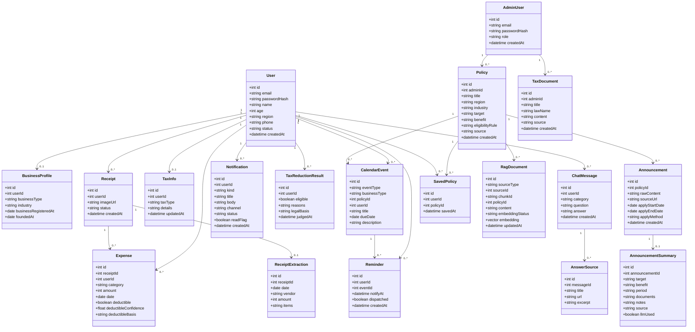
```mermaid
classDiagram
    class User {
        +int id
        +string email
        +string passwordHash
        +string name
        +int age
        +string region
        +string phone
        +string status
        +datetime createdAt
    }

    class BusinessProfile {
        +int id
        +int userId
        +string businessType
        +string industry
        +date businessRegisteredAt
        +date foundedAt
    }

    class ChatMessage {
        +int id
        +int userId
        +string category
        +string question
        +string answer
        +datetime createdAt
    }

    class AnswerSource {
        +int id
        +int messageId
        +string title
        +string url
        +string excerpt
    }

    class TaxInfo {
        +int id
        +int userId
        +string taxType
        +string details
        +datetime updatedAt
    }

    class CalendarEvent {
        +int id
        +string eventType
        +string businessType
        +int policyId
        +int userId
        +string title
        +date dueDate
        +string description
    }

    class Reminder {
        +int id
        +int userId
        +int eventId
        +datetime notifyAt
        +boolean dispatched
        +datetime createdAt
    }

    class Notification {
        +int id
        +int userId
        +string kind
        +string title
        +string body
        +string channel
        +string status
        +boolean readFlag
        +datetime createdAt
    }

    class TaxReductionResult {
        +int id
        +int userId
        +boolean eligible
        +string reasons
        +string legalBasis
        +datetime judgedAt
    }

    class Receipt {
        +int id
        +int userId
        +string imageUrl
        +string status
        +datetime createdAt
    }

    class ReceiptExtraction {
        +int id
        +int receiptId
        +date date
        +string vendor
        +int amount
        +string items
    }

    class Expense {
        +int id
        +int receiptId
        +int userId
        +string category
        +int amount
        +date date
        +boolean deductible
        +float deductibleConfidence
        +string deductibleBasis
    }

    class Policy {
        +int id
        +int adminId
        +string title
        +string region
        +string industry
        +string target
        +string benefit
        +string eligibilityRule
        +string source
        +datetime createdAt
    }

    class Announcement {
        +int id
        +int policyId
        +string rawContent
        +string sourceUrl
        +date applyStartDate
        +date applyEndDate
        +string applyMethod
        +datetime createdAt
    }

    class AnnouncementSummary {
        +int id
        +int announcementId
        +string target
        +string benefit
        +string period
        +string documents
        +string notes
        +string source
        +boolean llmUsed
    }

    class SavedPolicy {
        +int id
        +int userId
        +int policyId
        +datetime savedAt
    }

    class AdminUser {
        +int id
        +string email
        +string passwordHash
        +string role
        +datetime createdAt
    }

    class TaxDocument {
        +int id
        +int adminId
        +string title
        +string lawName
        +string content
        +string source
        +datetime createdAt
    }

    class RagDocument {
        +int id
        +string sourceType
        +int sourceId
        +string chunkId
        +int policyId
        +string content
        +string embeddingStatus
        +vector embedding
        +datetime updatedAt
    }

    User "1" --> "0..1" BusinessProfile
    User "1" --> "0..*" ChatMessage
    ChatMessage "1" --> "0..*" AnswerSource
    User "1" --> "0..1" TaxInfo
    Policy "1" --> "0..*" CalendarEvent
    CalendarEvent "1" --> "0..*" Reminder
    User "1" --> "0..*" Reminder
    User "1" --> "0..*" TaxReductionResult
    User "1" --> "0..*" Receipt
    Receipt "1" --> "0..1" ReceiptExtraction
    Receipt "1" --> "0..*" Expense
    User "1" --> "0..*" Expense
    AdminUser "1" --> "0..*" Policy
    Policy "1" --> "0..*" Announcement
    Announcement "1" --> "0..1" AnnouncementSummary
    User "1" --> "0..*" SavedPolicy
    Policy "1" --> "0..*" SavedPolicy
    Policy "1" --> "0..*" RagDocument
    AdminUser "1" --> "0..*" TaxDocument
    User "1" --> "0..*" CalendarEvent
    User "1" --> "0..*" Notification
```

<details>
<summary>설명</summary>
<br>

- 속성 타입·제약: ERD 참고
- RagDocument: `sourceType`/`sourceId`(논리 참조) + `policyId`(실제 FK) 혼재
- Receipt·ReceiptExtraction·Expense: 추가 기능(추후 개발)용, 화면 미연결
- `tax_rag_cache`: Backend 미사용 파생 테이블이라 클래스 제외

</details>

**Service 클래스**


```mermaid
classDiagram
    class AuthService {
        +signup(email, password, name) int
        +login(email, password) Token
        +adminLogin(email, password) Token
    }

    class UserService {
        +getMe(userId) User
        +updateMe(userId, payload) User
        +getBusinessProfile(userId) BusinessProfile
        +updateBusinessProfile(userId, payload) BusinessProfile
        +onboardingComplete(userId) bool
    }

    class ChatService {
        +suggestedQuestions(category) string[]
        +sendMessage(userId, category, question, roadmapStep) ChatMessage
        +listMessages(userId, category) ChatMessage[]
        +clearMessages(userId, category) int
        +deleteMessages(userId, messageIds) int
        +getSources(messageId, userId) AnswerSource[]
    }

    class CalendarService {
        +listEvents(year, month, eventType, userId) CalendarEvent[]
        +createPersonalEvent(userId, title, dueDate, description, remind, notifyAt) CalendarEvent
        +deletePersonalEvent(userId, eventId)
        +listReminders(userId) Reminder[]
        +createReminder(userId, eventId, notifyAt) int
        +deleteReminder(userId, reminderId)
    }

    class TaxService {
        +diagnose(conditions) DiagnosisResult
        +getTaxInfo(userId) TaxInfo
        +updateTaxInfo(userId, taxInfo) TaxInfo
        +checkTaxReduction(userId) TaxReductionResult
        +latestTaxReduction(userId) TaxReductionResult
    }

    class ExpenseService {
        +createReceipt(userId, filename, imageBase64, mimeType) Receipt
        +getExtraction(receiptId, userId) ReceiptExtraction
        +listExpenses(userId, category, fromDate, toDate) Expense[]
        +updateCategory(expenseId, userId, category) DeductibilityResult
        +deleteExpense(expenseId, userId)
        +deductibility(expenseId, userId) DeductibilityResult
    }

    class PolicyService {
        +search(keyword, region, industry, userId, offset, limit) Policy[]
        +recommendations(userId, limit) Policy[]
        +detail(policyId) Policy
        +eligibility(policyId, userId) EligibilityResult
        +listOpenAnnouncements(limit) Announcement[]
        +announcementSummary(announcementId) AnnouncementSummary
        +summarizeText(rawContent, source) AnnouncementSummary
        +savePolicy(userId, policyId)
        +unsavePolicy(userId, policyId)
        +savedList(userId) Policy[]
    }

    class NotifyService {
        +listNotifications(userId) Notification[]
        +unreadCount(userId) int
        +markRead(userId, notificationId)
        +notifyNow(userId, eventId)
        +dispatchDueReminders() int
    }

    class AdminService {
        <<logical>>
        +getUsers(page) User[]
        +getUserDetail(userId) User
        +updateUserStatus(userId, status) User
        +registerTaxDocument(data) TaxDocument
        +registerPolicy(data) Policy
        +registerAnnouncement(data) Announcement
        +reindexRagDocuments()
        +getMonitoringData() Metrics
    }

    class LLMServiceClient {
        <<external>>
        +llmStatus() Status
        +ensureIndexReady() IndexState
        +ragAnswer(question, category, userContext, noticeResults, conversationHistory, roadmapStep) Answer
        +explainTaxReduction(eligible, reasons, conditions) Explanation
        +extractReceipt(filename, imageBase64, mimeType) ReceiptFields
        +explainExpense(category, vendor, amount, items) DeductibilityResult
        +summarizeAnnouncement(rawContent, source) Summary
        +reindex()
    }

    AuthService ..> User
    AuthService ..> AdminUser
    UserService ..> User
    UserService ..> BusinessProfile
    ChatService ..> ChatMessage
    ChatService ..> AnswerSource
    ChatService ..> LLMServiceClient
    CalendarService ..> CalendarEvent
    CalendarService ..> Reminder
    TaxService ..> TaxInfo
    TaxService ..> TaxReductionResult
    TaxService ..> BusinessProfile
    TaxService ..> LLMServiceClient
    ExpenseService ..> Receipt
    ExpenseService ..> ReceiptExtraction
    ExpenseService ..> Expense
    ExpenseService ..> LLMServiceClient
    PolicyService ..> Policy
    PolicyService ..> Announcement
    PolicyService ..> AnnouncementSummary
    PolicyService ..> SavedPolicy
    PolicyService ..> LLMServiceClient
    AdminService ..> AdminUser
    AdminService ..> TaxDocument
    AdminService ..> Policy
    AdminService ..> Announcement
    AdminService ..> RagDocument
    AdminService ..> LLMServiceClient
    NotifyService ..> Notification
    CalendarService ..> Notification
```

<details>
<summary>설명</summary>
<br>

- `API_SPEC.md` 라우트 그룹 중 비즈니스 로직 있는 그룹만 클래스화
- 메서드명·인자: `Backend/services` 함수 선언 그대로 camelCase 변환
- `stats`·`system`·`AdminService`: 대응 Service 모듈 없음(`core.repo` 직접 호출)
- `LLMServiceClient`: `llm_client.py` 함수와 1:1 대응, 재시도 없음
- 실패 시 대부분 `None` → 목업 처리(일부는 503/404/502로 실패 노출)

</details>

---

### 9.4 시퀀스 다이어그램

<a id="seq-tax-reduction"></a>
**① 청년창업 세액감면 자동판정 (FS-13)**

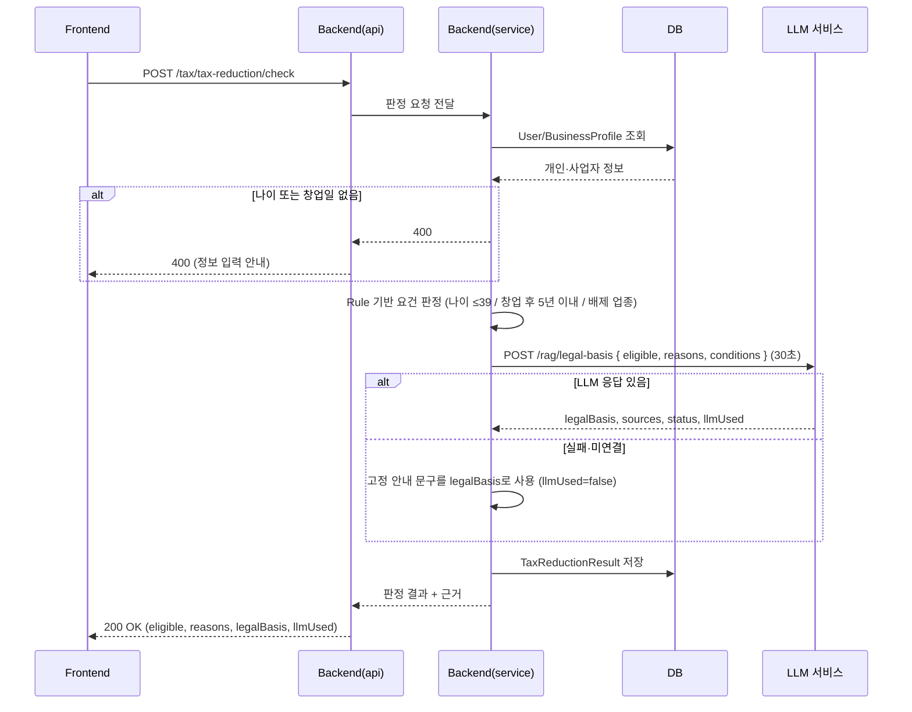
```mermaid
sequenceDiagram
    participant FE as Frontend
    participant API as Backend(api)
    participant SVC as Backend(service)
    participant DB as DB
    participant LLM as LLM 서비스

    FE->>API: POST /tax/tax-reduction/check
    API->>SVC: 판정 요청 전달
    SVC->>DB: User/BusinessProfile 조회
    DB-->>SVC: 개인·사업자 정보
    alt 나이 또는 창업일 없음
        SVC-->>API: 400
        API-->>FE: 400 (정보 입력 안내)
    end
    SVC->>SVC: Rule 기반 요건 판정 (나이 ≤39 / 창업 후 5년 이내 / 배제 업종)
    SVC->>LLM: POST /rag/legal-basis { eligible, reasons, conditions } (30초)
    alt LLM 응답 있음
        LLM-->>SVC: legalBasis, sources, status, llmUsed
    else 실패·미연결
        SVC->>SVC: 고정 안내 문구를 legalBasis로 사용 (llmUsed=false)
    end
    SVC->>DB: TaxReductionResult 저장
    SVC-->>API: 판정 결과 + 근거
    API-->>FE: 200 OK (eligible, reasons, legalBasis, llmUsed)
```

<details>
<summary>설명</summary>
<br>

Rule 기반 판정과 RAG 근거 제시를 결합하는 것이 핵심 차별점(FS-13)이므로, Service가 판정 로직을 직접 수행한 뒤 LLM 서비스에는 근거 설명만 요청. 
지역은 Rule 판정에 쓰지 않고 LLM 설명용 `conditions`로만 전송. 
LLM이 준 `sources`는 판정 결과에 저장하지 않음.

</details>
<br>

<a id="seq-chat-qa"></a>
**② AI 챗봇 Q&A + 답변 근거 확인 (FS-05, FS-06, FS-08)**

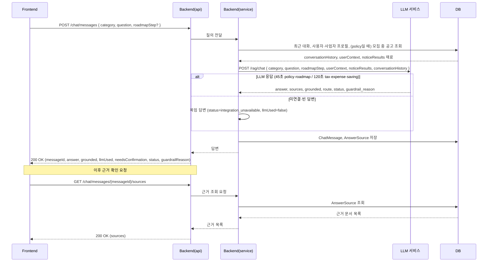
```mermaid
sequenceDiagram
    participant FE as Frontend
    participant API as Backend(api)
    participant SVC as Backend(service)
    participant LLM as LLM 서비스
    participant DB as DB

    FE->>API: POST /chat/messages { category, question, roadmapStep? }
    API->>SVC: 질의 전달
    SVC->>DB: 최근 대화, 사용자·사업자 프로필, (policy일 때) 모집 중 공고 조회
    DB-->>SVC: conversationHistory, userContext, noticeResults 재료
    SVC->>LLM: POST /rag/chat { category, question, roadmapStep, userContext, noticeResults, conversationHistory }
    alt LLM 응답 (45초 policy·roadmap / 120초 tax·expense·saving)
        LLM-->>SVC: answer, sources, grounded, route, status, guardrail_reason
    else 미연결·빈 답변
        SVC->>SVC: 목업 답변 (status=integration_unavailable, llmUsed=false)
    end
    SVC->>DB: ChatMessage, AnswerSource 저장
    SVC-->>API: 답변
    API-->>FE: 200 OK (messageId, answer, grounded, llmUsed, needsConfirmation, status, guardrailReason)

    Note over FE,API: 이후 근거 확인 요청
    FE->>API: GET /chat/messages/{messageId}/sources
    API->>SVC: 근거 조회 요청
    SVC->>DB: AnswerSource 조회
    DB-->>SVC: 근거 문서 목록
    SVC-->>API: 근거 목록
    API-->>FE: 200 OK (sources)
```

<details>
<summary>설명</summary>
<br>

답변 생성 시점에 근거 문서를 함께 저장해두므로, 이후 "답변 근거 확인"(FS-08)은 LLM을 다시 호출하지 않고 DB 조회만으로 처리. 
Service는 LLM을 부르기 전에 `userContext`(로그인 사용자 프로필), `noticeResults`(`category=policy`일 때만 모집 중 공고 상위 20건, 본문 800자로 자름), `conversationHistory`(같은 category의 최근 완료 대화) 세 가지를 조립함.(`Backend/services/chat_service.py`) 
실제 공고 조회는 Backend가, LLM은 넘겨받은 목록을 근거로 쓸 뿐 DB를 직접 뒤지지 않음. 
근거 문서를 못 찾으면 LLM이 `status`로 알리고, Backend는 `status≠success`면 `needsConfirmation=true`로 표시.

</details>
<br>

**③ 기동 시 RAG 인덱스 워밍업**

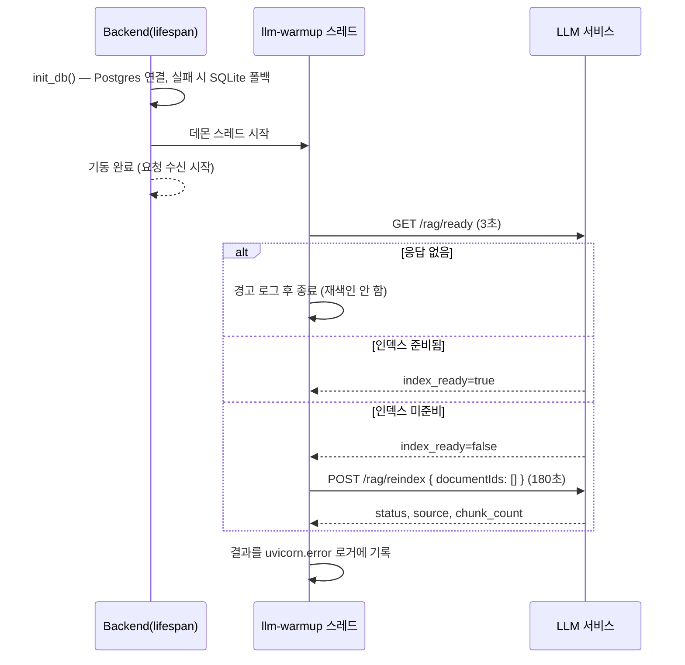
```mermaid
sequenceDiagram
    participant BE as Backend(lifespan)
    participant WU as llm-warmup 스레드
    participant LLM as LLM 서비스

    BE->>BE: init_db() — Postgres 연결, 실패 시 SQLite 폴백
    BE->>WU: 데몬 스레드 시작
    BE-->>BE: 기동 완료 (요청 수신 시작)
    WU->>LLM: GET /rag/ready (3초)
    alt 응답 없음
        WU->>WU: 경고 로그 후 종료 (재색인 안 함)
    else 인덱스 준비됨
        LLM-->>WU: index_ready=true
    else 인덱스 미준비
        LLM-->>WU: index_ready=false
        WU->>LLM: POST /rag/reindex { documentIds: [] } (180초)
        LLM-->>WU: status, source, chunk_count
    end
    WU->>WU: 결과를 uvicorn.error 로거에 기록
```

<details>
<summary>설명</summary>
<br>

인덱스가 준비되지 않은 채로는 모든 질의가 LLM의 `integration_unavailable` 응답으로 끝나므로, 누가 재색인을 부를 때까지 기다리지 않고 기동 시 한 번 확인. 
워밍업이 기동을 막지 않게 하기 위해서 데몬 스레드로 작동. 
`rag_documents`가 이미 임베딩을 갖고 있고 청크 content가 바뀌지 않았으면 캐시로 로드되어 재호출이 없고, 변경된 청크만 그만큼 다시 임베딩.

</details>

---

## 10. 주요 프로시저

### ① 세액감면판정   
처리 흐름: [9.4 시퀀스 다이어그램](#seq-tax-reduction) 참고


### ② AI 챗봇 Q&A 
처리 흐름: [9.4 시퀀스 다이어그램](#seq-chat-qa) 참고

### ③ LLM 질문 라우팅 처리

라우터 LLM이 질문을 **공고 / 정책 / 세금** 세 카테고리로 분류하고, 카테고리별로 다른 방식을 적용해 처리함.  
②번 "LLM 서비스" 단계가 실제로 이 흐름을 실행함.

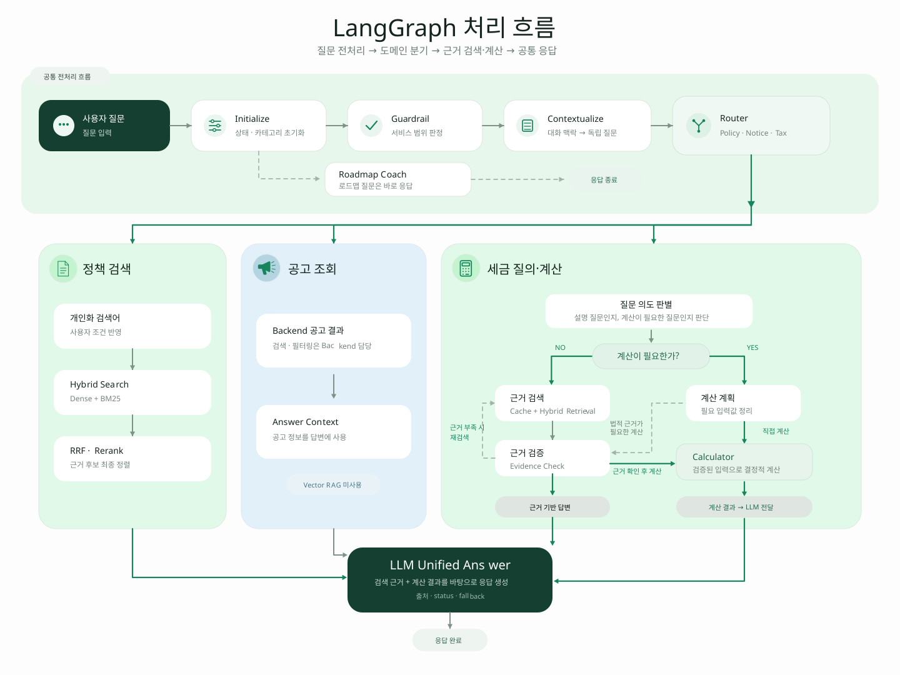

<details>
<summary><b>&nbsp;&nbsp;카테고리별 처리 방식</b></summary>
<br>

- **공고 질문**: LLM까지 가지 않아도 Backend에서 충분히 답변 가능하다고 판단해 Backend에서 바로 처리
- **정책 질문**: Dense 검색과 BM25를 RRF로 결합하고, Cohere Rerank로 한 번 더 정렬해 정답을 찾음
- **세금 질문**: 계산이 필요한 경우 국세청 세금 계산법을 함수화한 계산기를 호출하고, 그 결과값을 근거로 LLM이 답변. 계산이 필요 없고 법령 확인이 필요한 경우엔 정책 질문과 동일한 Dense+BM25+Rerank 흐름에 **multi-hop**(최대 3회)을 더해, 근거가 부족하면 질문을 다시 생성해 재검색

</details>


---

## 11. WBS

| 단계 | 작업 항목 | 상태 |
| --- | --- | :---: |
| **1. 주제 선택** | 아이디어 브레인스토밍 → 주제 후보 조사 → 주제 타당성·목적 구체화 → 주제 확정 | ✅ 완료 |
| **2. 요구사항 분석** | 기능 요구사항 정리 | ✅ 완료 |
| | 비기능 요구사항 정리 / 사용자(페르소나) 정의 / 우선순위 정리 | ✅ 완료 |
| **3. 설계** | 유스케이스·ERD·시퀀스·클래스 다이어그램 작성, API 명세 작성 | ✅ 완료 |
| | 화면 설계(와이어프레임) | ✅ 완료 |
| **4. 아키텍처 확정** | 기술 스택 확정 · 시스템 아키텍처 다이어그램 · 폴더/모듈 구조 · 환경변수 정리 | ✅ 완료 |
| **5. 구현** | DB 스키마 · Backend · LLM · Frontend 구현, 서비스 간 연동 | ✅ 완료 |
| **6. 테스트** | 단위 테스트 | 🔄 진행 중 |
| | 통합 테스트 (실제 OpenAI·Cohere·PostgreSQL 연동 검증) | ✅ 완료 |
| | 버그 수정 | 🔄 통합 결함 53건 중 35건 처리 |
| **7. 배포** | Docker 환경 구성(`docker-compose.yml`, `setup.sh`, `setup.bat`) | ✅ 완료 |
| | CI/CD 구성 / 배포 및 운영 점검 | ⬜ 미착수 |
| **8. 문서화** | DESIGN.md 작성 / 발표·데모 자료 준비 | 🔄 진행 중 |
| | README 작성 | ✅ 완료 |

---

## 12. 수행결과

#### 메인페이지
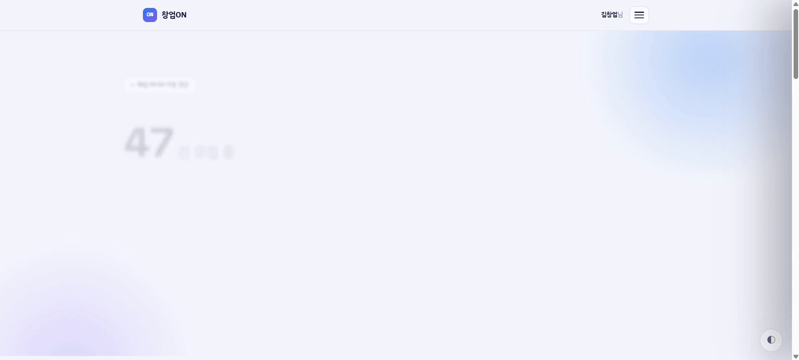

#### 창업 로드맵
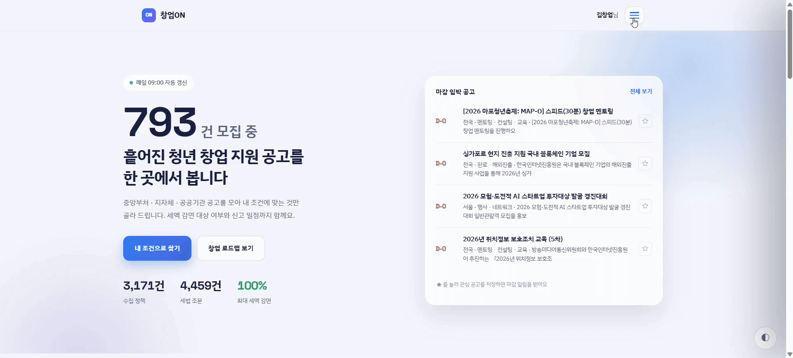

#### 세무 어시스턴트 챗봇
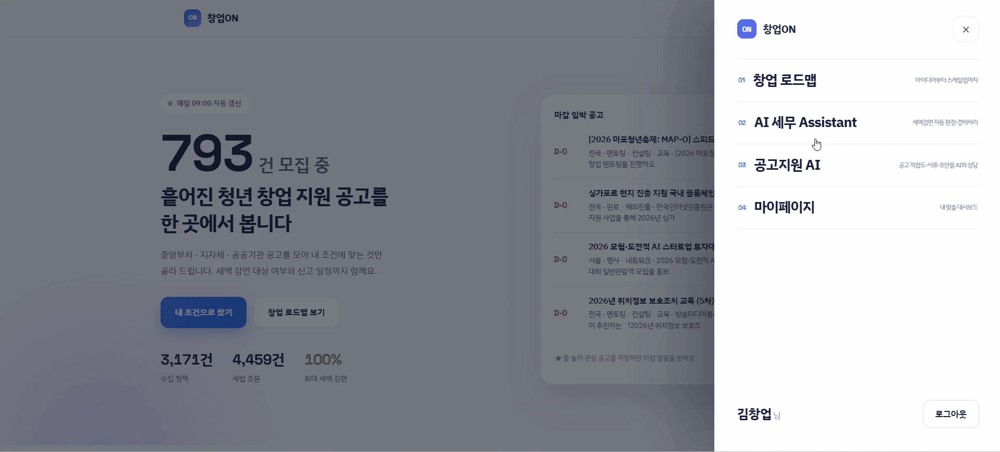

#### 대화방 수정 및 삭제
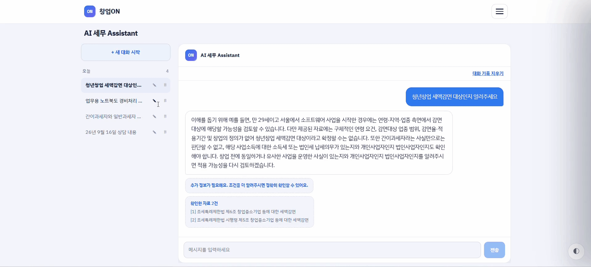

#### 공고 확인
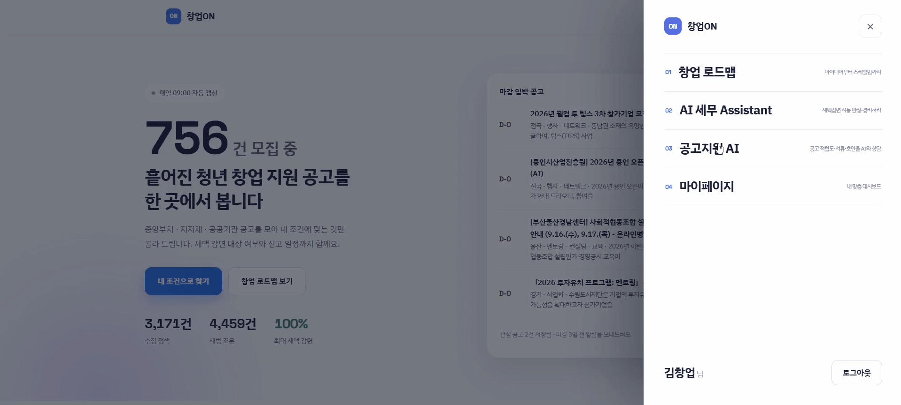
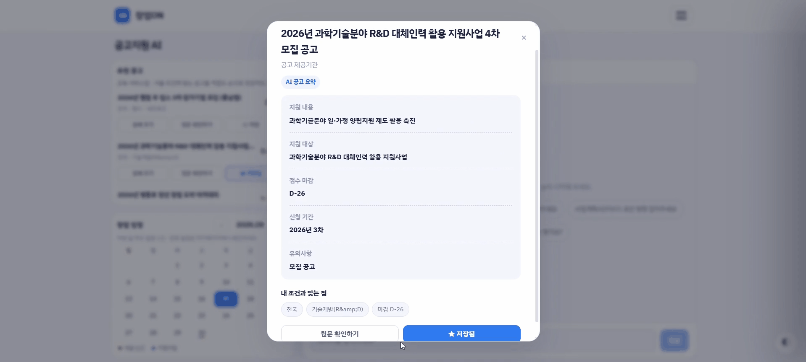

#### 공고 지원 챗봇
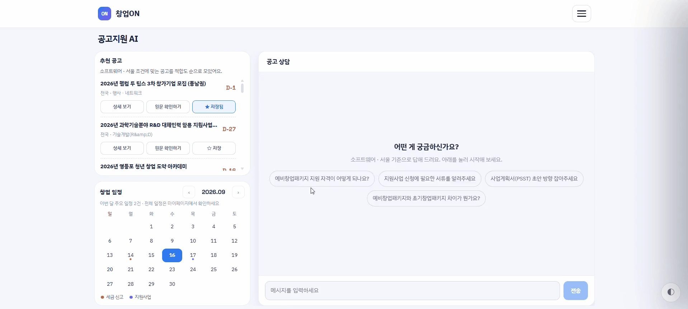

#### 마이페이지 - 대화 이력 확인
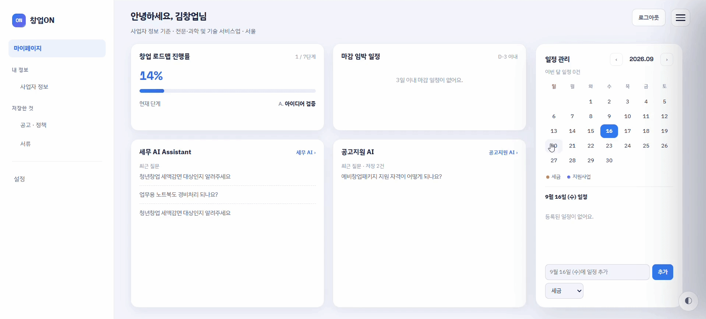

#### 마이페이지 - 캘린더 일정 추가
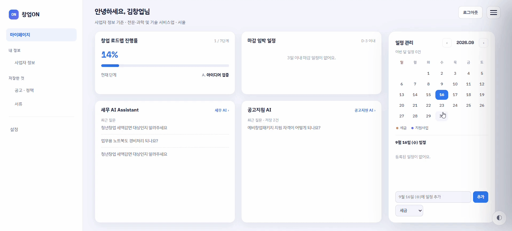

#### 마이페이지 - 사용자 정보 수정
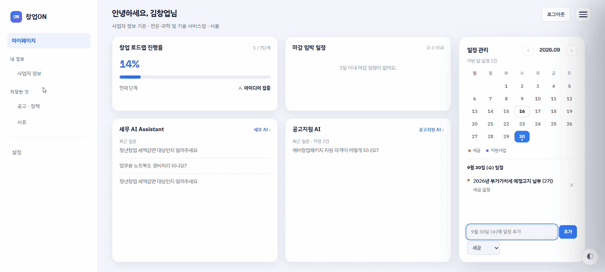

#### 마이페이지 - 저장한 공고 및 추천 공고 확인
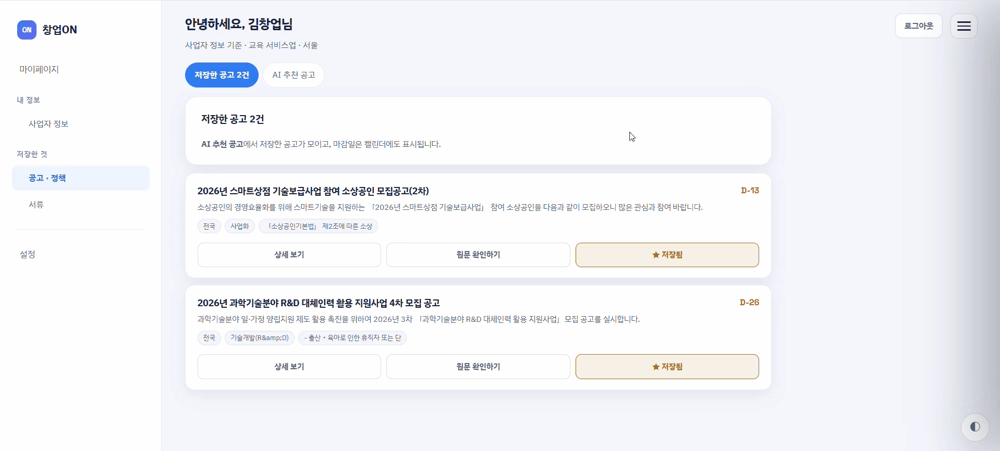
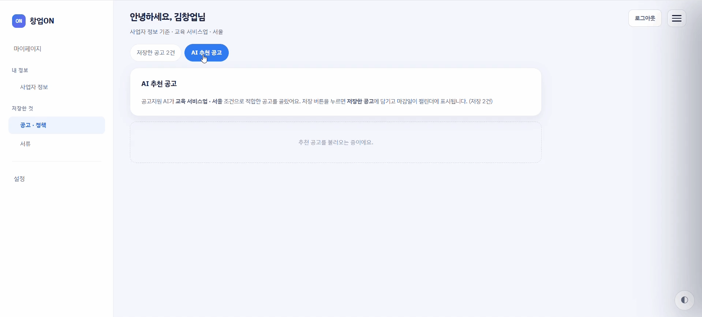

#### 다크모드 지원
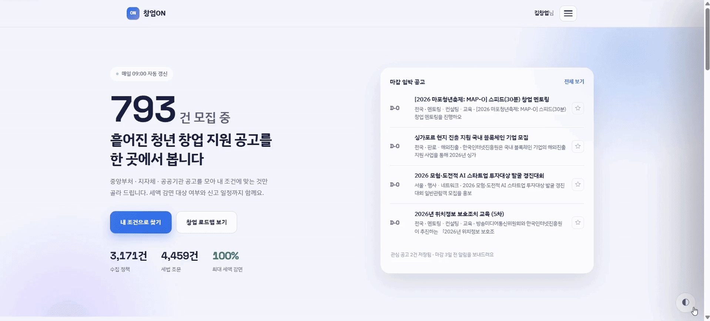


## 13. 트러블슈팅


### 트러블슈팅 기록

<details open>
<summary>&nbsp;&nbsp;LLM 파트</summary>

<br>

<div style="margin-left: 20px;">

  <details>
  <summary>&nbsp;&nbsp;평가 지표</summary>
  
  <br>

  평가 지표는 5가지 항목(route·status·block·grounded·required_phrases)을 종합해 산출.

  | 지표 | 의미 |
  | --- | --- |
  | route | 올바른 경로로 분류됐는지 |
  | status | 예상 응답 상태와 일치하는지 |
  | block | 범위 밖 질문을 제대로 차단했는지 |
  | grounded | 요구된 법령 근거·출처가 존재하는지 |
  | required_phrases | 답변에 필수 핵심 표현이 포함됐는지 |

  </details>

</div>

1. **세금 문서 범위 제한 시도** — 최초 평가셋(250건) 기준 종합 성능 지표가 64.3%로 목표치(70%) 미달. 세금 카테고리 질문은 세금 문서만 탐색하도록 제한해봤으나 개선 효과 없음.
2. **Router 프롬프트 수정** — 개인화 검색과 정책 ID 중복을 제거하고, Router 분기가 잘못 작동하는 것을 확인해 Router 프롬프트를 수정. 종합 성능 지표 74.6%로 기존 대비 **11.1%p 상승**.
3. **LLM 추론 강도 조정** — 질문 확인·라우터·답변 생성 단계의 LLM 추론 강도를 low로 설정. 정책 단일 질문 응답속도 **33.3% 단축**. 세금 질문은 4건 테스트 기준 8.8% 단축에 그쳐 효과 미미.
4. **Multi-hop 하이브리드 구조 시도** — 세금 질문 응답속도 개선을 위해 직렬 구조인 multi-hop을 병렬+직렬 하이브리드로 변경(첫 질문에서 쿼리 3개를 병렬로 생성하고, 근거가 부족하면 직렬 hop으로 이어감). 유의미한 속도 단축 없음.
5. **근거 판정 횟수 축소** — 단계별 소요 시간을 측정해 LLM의 근거 판정 단계가 병목임을 확인. hop마다 하던 근거 판정을 최종 1회로 축소하자 평균 응답속도 **4.85초 단축**됐지만 종합 성능 지표가 **66.1%로 하락**. 애매한 답변에만 추가 판정을 주는 방식도 시도했으나 품질이 더 떨어져 최종적으로 **미채택**.
6. **Hop 중간 질문 캐싱 도입 (최종 채택)** — 세금 질문 속도 개선을 위해 캐시를 도입. 최종 답변이 아니라 **hop 진행 중 생성되는 질문**을 캐시화해, 유사한 질문이 생성될 때 캐시된 데이터를 재사용(중복 데이터 없이 저장, 사용자가 많아질수록 응답속도가 빨라지는 구조). 종합 성능 지표는 유지하면서 평균 응답속도 **29.6% 감소**

</details>


---

## 14. 테스트 보고서

성능 개선·통합 검수 과정의 상세 기록: [Docs/reports/](Docs/reports/)

| 문서 | 내용 |
| --- | --- |
| [01_EVAL_BASELINE.md](Docs/reports/01_EVAL_BASELINE.md) | 최초 250건 평가 — 개선 전 기준점 |
| [02_ACCURACY_IMPROVEMENT.md](Docs/reports/02_ACCURACY_IMPROVEMENT.md) | 정책·세금 125건 재평가 |
| [03_TAX_FINAL_RESULT.md](Docs/reports/03_TAX_FINAL_RESULT.md) | 세금 단독 최종 실평가 (정확도 우선 설정의 기준값) |
| [04_FINAL_REPORT.md](Docs/reports/04_FINAL_REPORT.md) | 성능 개선 종합 보고서 |
| [05_TAX_SEMANTIC_CACHE_IMPROVEMENT.md](Docs/reports/05_TAX_SEMANTIC_CACHE_IMPROVEMENT.md) | Semantic Cache 응답속도 개선 보고서 |
| [LLM_TAX_HALF_20260914_204413.md](Docs/reports/LLM_TAX_HALF_20260914_204413.md) / [LLM_TAX_HALF_20260914_210435.md](Docs/reports/LLM_TAX_HALF_20260914_210435.md) | 캐시 적용 전후 비교용 세금 평가 |
| [06_EVAL_250_COMPARISON.md](Docs/reports/06_EVAL_250_COMPARISON.md) | 최초 대비 최종 250건 개선 비교 |
| [INTEGRATION_ISSUES_0910.md](Docs/reports/INTEGRATION_ISSUES_0910.md) / [INTEGRATION_ISSUES_0914.md](Docs/reports/) | 통합·시연 결함 목록 |
| [LLM_INTEGRATION_AUDIT_0909.md](Docs/reports/LLM_INTEGRATION_AUDIT_0909.md) | Backend↔LLM 연동 검수 보고서 |
| [LLM_IMPROVEMENT_OPTIONS_COMPARISON_0914.md](Docs/reports/LLM_IMPROVEMENT_OPTIONS_COMPARISON_0914.md) | 향후 개선안 비교·우선순위 |


---

## 15. 향후 확장

1. **사업기획서 초안 작성**: 초기에는 세무 관리 + 지원금·정책 탐색을 핵심 기능으로 개발하고, 향후 창업 시 사용될 사업기획서 초안을 작성하는 기능까지 확장. 청년·1인 창업자의 창업 행정 업무 전반을 지원하는 AI 플랫폼을 목표로 함

2. **영수증을 통한 지출 분석**: 영수증 등의 지출 자료를 기반으로 OpenAI Vision 호출을 통해 영수증 정보 추출 → 지출 분류 → 지출 내역 분석 → 경비처리 가능성 안내 기능을 제공

3. **배포 범위 확대**: AWS를 사용한 웹사이트 배포 및 앱 배포

4. **공고문 DB 적재 시 요약본 즉시 생성**: 공고문이 DB에 적재될 때 요약도 기본으로 함께 생성·저장되도록 개선


---

## 16. 실행 방법

`.env`는 비밀키가 들어 있어 git으로 공유되지 않는다. **팀에서 파일로 받아 저장소 루트에 두고** 시작한다. 스크립트는 `.env`를 만들어 주지 않는다.

```bash
./setup.sh                 # 전체 기동 후 Frontend 개발 서버까지 실행
./setup.sh --no-frontend   # 컨테이너만 기동하고 종료
```

Windows cmd.exe에서는 `setup.bat`을 같은 인자로 쓴다.

| 대상 | 주소 |
| --- | --- |
| 화면 | http://localhost:5173 |
| Backend API 문서 | http://localhost:8000/docs |
| LLM API 문서 | http://localhost:8001/docs |

- 로컬 개발에서는 `db`·`backend`·`llm`만 Docker Compose로 뜨고 **Frontend는 호스트에서 돈다.** Vite 프록시 대상이 호스트 주소이기 때문이다. compose의 `frontend` 서비스는 `frontend` 프로필에 묶여 있어 평소에는 빌드도 기동도 되지 않는다
- `Ctrl+C`는 Frontend만 멈춘다. 컨테이너까지 내리려면 `docker compose down`
- `OPENAI_API_KEY`가 없어도 화면·DB·정책 조회는 정상이고 AI 답변만 목업이 된다
- Docker Compose v2.1.1 이상이 필요하다. `setup.bat`의 메시지는 cmd.exe 인코딩 제약 때문에 영문이다
- 단계별 동작과 문제 해결은 `setup.sh` 상단 주석과 `Docs/STATUS.md` 3절 참고. LLM 서비스만 따로 띄우려면 `LLM/RUN_GUIDE.md`

---

## 17. 한 줄 회고


### 김태윤
> 회의와 문서를 기반으로 프로젝트를 진행을 계획했으나 각 인원들 간 소통 방식의 차이와 문서 최신화의 지연이 발생해 통합에 많은 문제가 발생했고 그것들을 해결하기 위한 시간과 토큰이 너무 많이 사용된 점이 아쉽다. 하지만 기존에 사용해보고 싶었던 기술들을 이번 프로젝트에 모두 적용한 것에 만족한다.

### 김현지
> 데이터를 수집하고 DB에 적재하는 과정을 진행해보며 데이터가 흘러가는 과정을 직접 느낄 수 있었다. 실제로 적재된 데이터를 확인했을 때 일부 컬럼이 누락되거나 예상과 다른 값이 들어오는 경우도 있었고, 추가로 정규화 작업이 필요했던 부분도 있었지만, 이런 이슈들을 해결해나가는 과정에서 많은 것을 배울 수 있었다.

### 전진영
> 팀원들 도움으로 backend 완성할 수 있었고, 덕분에 프로젝트 전체흐름과 백앤드만들면서 제가 부족한부분도 파악할 수 있었습니다.

### 채정석
> 화면부터 백엔드·LLM까지 연결하며 서비스의 전체 흐름을 경험했습니다. Docker, 환경변수, git merge 등 개발 외적인 문제를 해결하며, 기능 구현뿐 아니라 정리와 관리의 중요성도 배웠습니다.

### 황호순
> 수업시간에 배운 최적화 기법과 구조 설계를 실제로 적용하고 성능 개선하는 과정에서 어려움도 많았지만 배우는게 많은 프로젝트였습니다.
