# 청년·1인 창업자 AI 행정·재정 지원 플랫폼

> LLM과 RAG(Retrieval-Augmented Generation) 기술을 연동한 내외부 문서 기반 질의응답 시스템으로,    
청년·1인 창업자의 세무 관리와 정부·지자체 지원정책 탐색을 지원하는 AI 업무지원 플랫폼

---

## 📑 목차

- [1. 팀 소개](#1-팀-소개)
- [2. 프로젝트 개요](#2-프로젝트-개요)
- [3. 기술 스택](#3-기술-스택)
- [4. 데이터 및 AI 기술](#4-데이터-및-ai-기술)
- [5. 프로젝트 수행 범위](#5-프로젝트-수행-범위)
- [6. 시스템 아키텍처](#6-시스템-아키텍처)
- [7. 저장소 구조](#7-저장소-구조)
- [8. 요구사항 명세서](#8-요구사항-명세서)
- [9. Diagram](#9-diagram)
  - [9.1 유스케이스 다이어그램](#91-유스케이스-다이어그램)
  - [9.2 ERD](#92-erd)
  - [9.3 클래스 다이어그램](#93-클래스-다이어그램)
  - [9.4 시퀀스 다이어그램](#94-시퀀스-다이어그램)
- [10. 주요 프로시저](#10-주요-프로시저)
- [11. WBS](#11-wbs)
- [12. 수행결과](#12-수행결과)
- [13. 트러블슈팅](#13-트러블슈팅)
- [14. 테스트 보고서](#14-테스트-보고서)
- [15. 향후 확장](#15-향후-확장)
- [16. 실행 방법](#16-실행-방법)
- [17. 한 줄 회고](#17-한-줄-회고)

---

## 1. 팀 소개

### 팀명

**FIFO**


### 팀원

| 이름 | 담당 | 설명 | GitHub |
| :---: | :---: | :---: | :---: |
| 김태윤 | **PM** | - | [](https://github.com/kty2001) |
| 김현지 | **DB** | - | [](https://github.com/HJK013) |
| 채정석 | **Frontend** | - | [](https://github.com/qnfdhk-rgb) |
| 황호순 | **LLM** | - | [](https://github.com/Amber8800) |


---

## 2. 프로젝트 개요

### 프로젝트명

**창업ON : 청년·1인 창업자 AI 지원 플랫폼**

<br>

### 프로젝트 소개

청년·1인 창업자는 세금, 세액감면, 정부·지자체 지원사업 등 다양한 행정 정보를 직접 찾아보고 자신의 조건에 해당하는지 판단해야 합니다.      
그러나 관련 정보가 여러 기관과 공고문에 분산되어 있고, 법령 및 지원 조건이 복잡해 필요한 혜택을 놓치는 경우가 많습니다. 게다가 영수증·경비처리와 사업계획서 작성처럼, 창업 초기에 반복되는 실무까지 혼자 감당해야 합니다.

본 프로젝트는 사용자의 사업자 정보와 개인 조건을 기반으로 세무 정보와 정부·지자체 지원정책을 통합적으로 탐색하고 안내하는 AI 업무지원 플랫폼을 개발합니다. 나아가 영수증 사진을 올리면 OCR로 경비처리 가능성을 판정하는 **지출관리**와, 아이디어를 공고 양식에 맞춘 초안으로 작성·채점하는 **사업계획서 AI 작성**까지 확장하여, 세무·정책 탐색을 넘어 창업 실무 전반을 한곳에서 지원합니다. 

<br>

### 프로젝트 필요성

- 세금·세액감면 조건과 정부·지자체 지원사업이 여러 기관·공고문에 분산·복잡하게 흩어져 있어, 창업자가 혜택을 스스로 찾고 판단하기 어렵습니다. 
- 일반 AI는 존재하지 않는 정책·부정확한 세무 정보를 줄 위험이 있어 근거 기반 안내가 필요합니다.
- **영수증·지출의 경비처리 가능 여부와 근거 법령**을 창업자가 직접 판단하기 어렵습니다.
- **지원사업 제출용 사업계획서**를 공고 양식에 맞춰 작성하는 데 많은 시간과 노하우가 필요합니다.

<br>

### 프로젝트 목표

- 세법·정책 문서를 벡터로 임베딩한 RAG 기반 LLM 질의응답에 조건 기반 판정을 결합해, 환각 없이 근거 있는 맞춤 답변을 제공합니다.
- **영수증 OCR과 세법 RAG를 결합**해 지출의 경비처리 가능성을 근거 법령과 함께 판정하고, 지출 분류·통계까지 자동화합니다.
- **공고 양식을 반영한 사업계획서 초안**을 LLM으로 생성하고 AI 예비진단으로 채점하여, 제출용 문서 작성을 지원합니다.

<br>

### 핵심 기능

#### ① AI 세무 Assistant

<details>
<summary>&nbsp;&nbsp;AI를 통한 세무 업무 지원</summary>
<br>

세법·국세청 자료 기반 RAG로 세금·경비처리·절세 Q&A에 답하고, 맞춤 세금 정보·통합 캘린더·리마인더를 함께 제공한다.

</details>


#### ② 청년창업 세액감면 자동 판정

<details>
<summary>&nbsp;&nbsp;청년창업 세액감면 요건 충족 여부 자동 판정</summary>
<br>

나이·업종·창업 시점 등 조건을 Rule로 판정하고, 단순 LLM 답변이 아니라 관련 법령·공식 자료를 근거로 결과를 제시한다.

</details>

#### ③ 맞춤형 지원금·정책 탐색

<details>
<summary>&nbsp;&nbsp;사용자에게 적합한 조건의 지원 정책을 쉽게 확인할 수 있게 함</summary>
<br>

정부·지자체 지원사업을 수집해 사용자 조건에 맞는 정책을 추천하고, 자격 비교·신청기간 안내·관심 정책 저장을 지원한다.

</details>

#### ④ 지원사업 공고문 AI 분석

<details>
<summary>&nbsp;&nbsp;AI가 공고문을 분석하여 중요 정보를 구조화</summary>
<br>

긴 공고문을 지원대상·내용·기간·서류·유의사항으로 구조화해 요약하고, 공식 출처·근거 문서를 함께 제공한다.

</details>

#### ⑤ 영수증 지출관리 - OCR 경비처리 판정

<details open>
<summary>&nbsp;&nbsp;영수증 사진을 올리면 경비 처리 가능 여부를 근거와 함께 판정</summary>
<br>

- PP-OCRv5 한국어 OCR로 상호·금액·날짜·품목을 인식한다.
- RAG를 통한 세법 검색으로 경비 처리 가능성을 판정한다.
- 증빙 종류·지출 항목(9종) 분류와 판단 근거의 법령을 제시한다.

</details>

#### ⑥ 사업계획서 AI 작성

<details open>
<summary>&nbsp;&nbsp;아이디어를 입력하면 공고 양식에 맞춘 사업계획서 초안을 생성·채점</summary>
<br>

- PSST 흐름(문제인식·실현가능성·성장전략·팀구성) 기반 초안을 생성한다.
- 지원 공고의 목차를 붙여넣거나 제출 양식 파일(HWPX·PDF)을 올리면 그 항목·순서에 맞춰 작성한다.
- AI 예비진단으로 0~100점 채점과 항목별 강점·보완점을 제시한다.
- 생성된 초안을 한글(HWPX)·PDF 형식 파일으로 다운로드하고, 보관함에서 여러 건 저장·관리할 수 있다.

</details>

<br>


---

## 3. 기술 스택

| 구분 | 기술 |
| --- | --- |
| **Backend** |     |
| **LLM / AI** |      |
| **Database** |   -005571?style=flat-square&logo=elasticsearch&logoColor=white) |
| **Frontend** |     |
| **Infra** |     |
| **패키지 관리** |   |
| **협업** |   |


## 4. 데이터 및 AI 기술

<details open>
<summary><b>&nbsp;&nbsp;데이터</b></summary>
<br>

- 관련 세법 자료 — 국가법령정보센터 법령 조문(19개 법령), 국세청 법령해석례, 생활법령정보(창업 분야)
- 정부24 공공서비스(혜택) 정보 — 창업·청년·소상공인 등 키워드 기반 정책 데이터
- K-Startup(창업진흥원) 지원사업 공고 — 만 20~39세 대상, 모집 중인 공고
- 기업마당(중소벤처기업부) 중소기업 지원사업 공고
- 온통청년 청년정책 — 창업·벤처·중소기업·대출·자금·보증 관련만 필터링 수집

세법·시행령·시행규칙 조문 4,459건, 정책 총 2,931건, 그중 공고 2,187건(2026-09-18 집계. 이후 추가된 법령해석례·생활법령은 미포함)

배포 환경에서는 GitHub Actions가 매주 1회 전체 수집을 실행하고, 수집이 끝나면 변경된 청크만 임베딩·Elasticsearch 재색인까지 자동으로 이어감. 
일시 장애로 실패한 수집은 3시간마다 재시도하고, 재시도 대상 없다면 재색인 없이 종료.

데이터 수집·전처리 상세 내용은 [Docs/data_collection_preprocessing.md](Docs/data_collection_preprocessing.md) 참고

</details>
<br>

<details open>
<summary><b>&nbsp;&nbsp;AI 기술</b></summary>
<br>

- **RAG**: 세법·정책 원문 문서를 벡터로 임베딩하여 벡터데이터베이스에 저장하고, 이를 근거로 검색·응답하여 환각을 방지
- **Hybrid 검색**: pgvector Dense 검색과 BM25(키워드)를 RRF로 결합한 뒤 Cohere Rerank. 한국어 형태소 분석을 위해 Elasticsearch Nori BM25를 도입·평가했으나, 근거 데이터 확대 후 재평가에서 기본 BM25가 동률~우세로 나와 운영 키워드 검색은 기본 BM25로 두고 Elasticsearch는 재평가용으로 보존 ([RETRIEVER_FINAL_REPORT.md](Docs/reports/ELASTICSEARCH_REPORT/RETRIEVER_FINAL_REPORT.md))
- **OCR**: PaddleOCR PP-OCRv5 한국어 모델로 영수증 글자를 읽고 LLM이 항목을 정리. PaddleOCR을 쓸 수 없는 환경에서는 Tesseract로 폴백하고, 글자를 거의 못 읽으면 Vision LLM으로 대체. Tesseract 대비 정확도(82%→97%)와 속도(5장 25.9초→12.1초)를 개선 ([OCR_PPOCRV5_BENCHMARK.md](Docs/OCR_PPOCRV5_BENCHMARK.md))
- **Semantic Cache**: 세금 질문의 검색 근거·근거 판정을 PostgreSQL에 저장해 유사 질문에 재사용. 정확도를 유지하며 평균 응답을 29.6% 단축
- **LangChain**: 벡터데이터베이스와 LLM을 연동해 RAG 파이프라인을 구성
- **LLM**: 자연어 상담 및 공고문 분석
- **Rule-based Engine**: 청년창업 세액감면 요건 자동 판정
- **Agent 구조**: 세무·정책 등 업무별 정보 검색 및 처리

</details>


## 5. 프로젝트 수행 범위

- 데이터 수집 및 가공
- 벡터데이터베이스 생성 및 데이터 저장
- One-shot 또는 Few-shot 활용 프롬프트 템플릿 작성
- 사용할 LLM 모델 선택
- LangChain 기반 RAG 기술로 벡터데이터베이스와 LLM 연동하여 질의응답 구현
- 영수증 OCR 기반 경비처리 판정 및 지출 분류·통계
- 공고 양식 기반 사업계획서 초안 생성 및 AI 예비진단
- 하이브리드 검색(Dense + BM25 + RRF + Rerank)과 Semantic Cache로 검색·응답 품질·속도 고도화
- AWS 클라우드 배포 및 CI/CD·데이터 수집 자동화
- 구현 결과 테스트 및 개선

---

## 6. 시스템 아키텍처

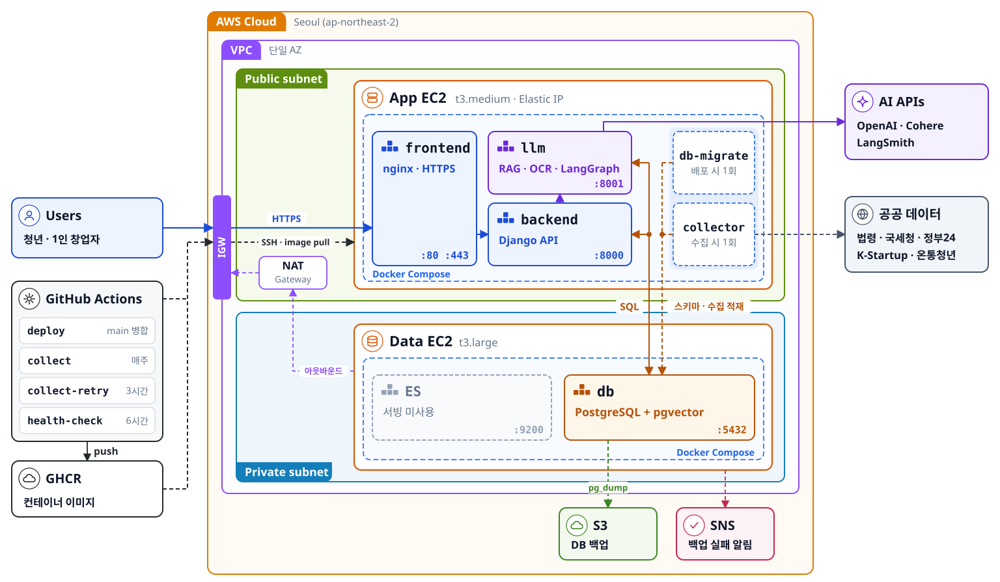

- **사용자 → App EC2 (Public subnet)**: 사용자는 IGW를 거쳐 App EC2의 Frontend(nginx · HTTPS 443)로 접속하는 것이 유일한 외부 진입점. Frontend가 api 요청을 Backend로 프록시
- **Backend → LLM**: LLM 서비스는 외부에 노출되지 않고 Backend가 Docker 내부 네트워크에서 호출. RAG 질의응답(스트리밍)·세액감면 근거 생성·공고문 요약·영수증 OCR·사업계획서 생성/출력을 담당하며, 필요한 외부 AI API(OpenAI · Cohere · LangSmith)를 호출
- **Data EC2 (Private subnet)**: db(PostgreSQL + pgvector)가 관계형·벡터 데이터를 통합 관리하고, App EC2가 SQL·스키마/수집 적재로 접속.
- **Elasticsearch**: Nori BM25 검색기로 도입했으나 재평가에서 기본 BM25 대비 우위가 재현되지 않아 서빙에는 미사용(기본 BM25 운영), 코드·컨테이너로만 보존
- **일회성 작업**: db-migrate(배포 시 1회 스키마 적용)와 collector(수집 시 1회)가 App EC2에서 실행
- **외부 공공데이터**: 법령·국세청·정부24·K-Startup·온통청년의 데이터를 수집 스크립트를 통해 수집해 db에 직접 적재
- **CI/CD (GitHub Actions)**: `deploy`(main 병합)·`collect`(매주)·`collect-retry`(3시간)·`health-check`(6시간). 이미지를 빌드해 GHCR에 push하고, App EC2가 SSH · image pull로 받아 배포
- **백업·알림**: db를 pg_dump로 S3에 백업하고, 실패 시 SNS로 알림. 


---

## 7. 저장소 구조

```
.
├── Backend/         # API 서버 (Django + Django Ninja, :8000)
├── Frontend/        # 사용자 화면 (React + Vite, :5173)
├── LLM/             # RAG 파이프라인, 임베딩, 프롬프트, 모델 서빙 (:8001)
├── DB/              # DB 스키마(01_schema.sql·app_extras.sql), 수집 스크립트(scripts/), 수집 실행기(run_collection.py)
├── elasticsearch/   # Nori 분석기를 설치한 Elasticsearch 이미지
├── Docs/            # 기획·설계·진행 문서
│   ├── Design/      # 현재 유효한 설계 산출물
│   ├── reports/     # 특정 시점의 검수·분석 보고서와 계획서
│   ├── outputs/     # 프로젝트 산출물
│   ├── imporve_plan/  # 검색 개선 계획·Elasticsearch 설정 가이드
│   ├── data/        # README·문서용 이미지·수행결과 GIF
│   └── branch_work/   # 브랜치별 작업 기록
├── Presentation/    # 발표자료(Slidev, /ppt/로 서빙)
├── scripts/         # 운영 스크립트(backup_db.sh: DB 백업 → S3, autoheal.sh, deploy_app.sh, tests/)
├── .github/workflows/  # deploy(테스트·배포), collect(주간 수집), collect-retry(실패 재시도), health-check(상태 점검)
├── docker-compose.yml       # 로컬·단일 호스트
├── docker-compose.dev.yml   # 개발 오버라이드(--reload, frontend-dev)
├── docker-compose.app.yml   # AWS App EC2
├── docker-compose.data.yml  # AWS Data EC2
├── setup.sh         # 로컬 실행 (macOS / Linux / Git Bash)
├── setup.bat        # 로컬 실행 (Windows cmd.exe)
└── .env.example     # 환경변수 키 목록 (값은 비어 있음)
```

## 8. 요구사항 명세서


| 구분 | 기능ID | 기능명 |
| --- | --- | --- |
| 회원/프로필 | FS-01~04 | 회원가입, 로그인, 개인정보 관리, 사업자 정보 관리 |
| AI 상담(챗봇) | FS-05~08 | AI 챗봇 이용, 세금/경비처리/절세 Q&A, 정책 Q&A, 답변 근거 확인 |
| 세무 관리 | FS-09~13 | 사업자 유형 진단, 세금 정보 관리, 통합 일정 캘린더, 맞춤 리마인더, 청년창업 세액감면 자동판정 |
| 지출 분석 | FS-14~17 | 영수증 등록, 영수증 정보 추출(OCR), 지출 분류, 경비처리 가능성 분석 |
| 지원정책 탐색 | FS-18~23 | 지원정책 검색, 맞춤 정책 추천, 지원 자격 확인, 신청기간·방법 확인, 공고문 AI 요약, 관심 정책 저장 |
| 관리자 | FS-24~28 | 관리자 로그인, 사용자 관리, 세법·정책·공고문 데이터 관리, RAG 문서 관리, 시스템 모니터링 |
| 사업계획서 | FS-29~31 | 사업계획서 초안 생성, AI 예비진단, 아이디어 어시스턴트 |

기능별 상세·화면 연결 현황은 [Docs/Design/FUNCTIONAL_SPEC.md](Docs/Design/FUNCTIONAL_SPEC.md) 참고

---

## 9. Diagram

### 9.1 유스케이스 다이어그램


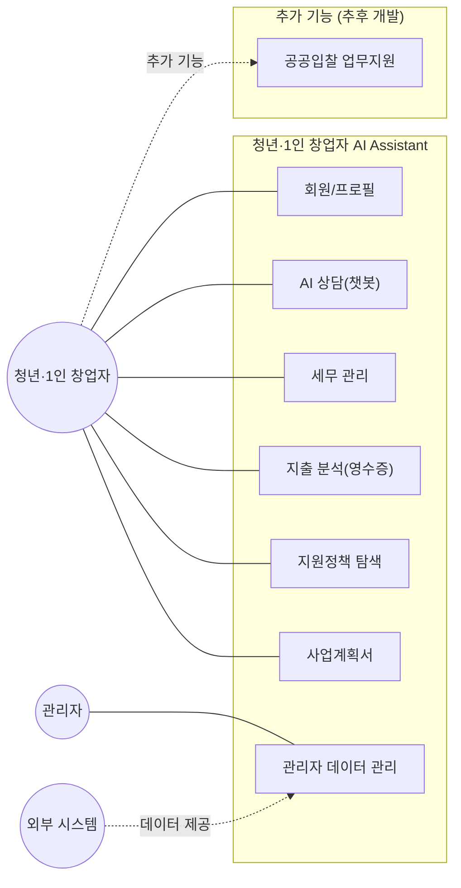
```mermaid
flowchart LR
    User((청년·1인 창업자))
    Admin((관리자))
    Ext((외부 시스템))

    subgraph Platform["청년·1인 창업자 AI Assistant"]
        A["회원/프로필"]
        B["AI 상담(챗봇)"]
        C["세무 관리"]
        D["지출 분석(영수증)"]
        E["지원정책 탐색"]
        H["사업계획서"]
        F["관리자 데이터 관리"]
    end

    subgraph Future["추가 기능 (추후 개발)"]
        G["공공입찰 업무지원"]
    end

    User --- A
    User --- B
    User --- C
    User --- D
    User --- E
    User --- H
    Admin --- F
    Ext -. 데이터 제공 .-> F
    User -. 추가 기능 .-> G
```

<details>
<summary>설명</summary>
<br>

Actor는 청년·1인 창업자(주 사용자) / 관리자 / 외부 시스템(국가법령정보센터·정부24·K-Startup·기업마당·온통청년, 하나로 통합)으로 총 셋으로 구분됨. 
지출 분석(영수증)은 지출관리 화면으로, 사업계획서는 사업계획서 화면으로 구현됨. 공공입찰 업무지원만 추가 기능(추후 개발)으로 범위 밖.

</details>

---

### 9.2 ERD


```mermaid
erDiagram
    users ||--o| business_profiles : has
    users ||--o{ chat_messages : sends
    chat_messages ||--o{ answer_sources : cites
    users ||--o| tax_info : manages
    calendar_events ||--o{ reminders : triggers
    users ||--o{ reminders : sets
    policies ||--o{ calendar_events : "due date of"
    policies ||--o{ rag_documents : "chunked into"
    users ||--o{ tax_reduction_results : requests
    users ||--o{ receipts : uploads
    receipts ||--o| receipt_extractions : "extracted as"
    receipts ||--o{ expenses : yields
    users ||--o{ expenses : owns
    admin_users ||--o{ policies : manages
    policies ||--o{ announcements : posts
    announcements ||--o| announcement_summaries : "summarized as"
    users ||--o{ saved_policies : saves
    policies ||--o{ saved_policies : "saved by"
    admin_users ||--o{ tax_documents : uploads
    users ||--o{ calendar_events : "owns (USER type)"
    users ||--o{ notifications : receives

    users {
        int id PK
        string email
        string password_hash
        string name
        int age
        string region "CHECK: 17개 시·도 중 하나 (NOT VALID)"
        string phone
        string status "DEFAULT 'active'"
        datetime created_at
    }

    business_profiles {
        int id PK
        int user_id FK "UNIQUE"
        string business_type
        string industry
        date business_registered_at
        date founded_at
    }

    chat_messages {
        int id PK
        int user_id FK
        string category
        string question
        string answer
        datetime created_at
    }

    answer_sources {
        int id PK
        int message_id FK
        string title
        string url
        string excerpt
    }

    tax_info {
        int id PK
        int user_id FK
        string tax_type
        string details
        datetime updated_at
    }

    calendar_events {
        int id PK
        string event_type "TAX / POLICY / USER"
        string business_type "TAX 타입일 때만 사용"
        int policy_id FK "POLICY 타입일 때만 사용"
        int user_id FK "USER 타입일 때만 사용"
        string title
        date due_date
        string description
    }

    reminders {
        int id PK
        int user_id FK
        int event_id FK
        datetime notify_at
        boolean dispatched "DEFAULT false"
        datetime created_at
    }

    tax_reduction_results {
        int id PK
        int user_id FK
        boolean eligible
        string reasons
        string legal_basis
        datetime judged_at
    }

    receipts {
        int id PK
        int user_id FK
        string image_url
        string status "DEFAULT 'pending'"
        datetime created_at
        bytea image_data "원본 이미지"
        string mime_type
    }

    receipt_extractions {
        int id PK
        int receipt_id FK "UNIQUE"
        date date
        string vendor
        int amount
        string items
        string proof_type "증빙 종류"
        string read_meta "JSON: 읽음 여부·원문 근거·OCR 신뢰도"
    }

    expenses {
        int id PK
        int receipt_id FK
        int user_id FK
        string category
        int amount
        date date
        boolean deductible
        float deductible_confidence
        string deductible_basis
        string deductible_tier "high/ambiguous/low"
        boolean proof_valid "NULL=판단 불가"
        string missing_fields "JSON 배열"
    }

    policies {
        int id PK
        int admin_id FK
        string title
        string region
        string industry
        string target
        string benefit
        string eligibility_rule
        string source
        datetime created_at
    }

    announcements {
        int id PK
        int policy_id FK
        string raw_content
        string source_url
        date apply_start_date
        date apply_end_date
        string apply_method
        datetime created_at
    }

    announcement_summaries {
        int id PK
        int announcement_id FK "UNIQUE"
        string target
        string benefit
        string period
        string documents
        string notes
        string source
        boolean llm_used "DEFAULT false"
    }

    saved_policies {
        int id PK
        int user_id FK "UNIQUE with policy_id"
        int policy_id FK "UNIQUE with user_id"
        datetime saved_at
    }

    admin_users {
        int id PK
        string email
        string password_hash
        string role
        datetime created_at
    }

    tax_documents {
        int id PK
        int admin_id FK
        string title
        string law_name
        string content
        string source
        datetime created_at
    }

    rag_documents {
        int id PK
        string source_type
        int source_id
        string chunk_id "UNIQUE"
        int policy_id FK
        string content
        string embedding_status
        vector embedding "VECTOR(1536), HNSW + vector_cosine_ops 인덱스"
        datetime updated_at
    }

    tax_rag_cache {
        bigint id PK
        string cache_key "UNIQUE"
        string question
        vector question_embedding "VECTOR(1536), HNSW + vector_cosine_ops 인덱스"
        jsonb cached_result
        datetime created_at
    }

    notifications {
        int id PK
        int user_id FK
        string kind
        string title
        string body
        string channel
        string status
        boolean read_flag "DEFAULT false"
        datetime created_at
    }

    collection_failures {
        bigint id PK
        string script "수집 스크립트명"
        string unit "실패 단위 (예: page=3)"
        string kind "transient / permanent (CHECK)"
        string reason
        int attempt "DEFAULT 0"
        datetime next_retry_at
        datetime resolved_at "NULL=미해결"
        datetime created_at "DEFAULT now()"
    }
```

**유저 개인화·구독 테이블** (대화방·로드맵 체크·사업계획서 임시저장/보관함/서류·구독 플랜)

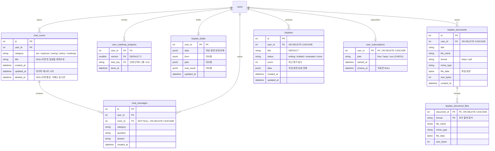
```mermaid
erDiagram
    users ||--o{ chat_rooms : opens
    chat_rooms ||--o{ chat_messages : contains
    users ||--o{ chat_messages : sends
    users ||--o{ user_roadmap_progress : checks
    users ||--o| bizplan_drafts : drafts
    users ||--o{ bizplan_documents : stores
    bizplan_documents ||--o{ bizplan_document_files : formats
    users ||--o{ bizplans : archives
    users ||--o| user_subscriptions : subscribes

    chat_rooms {
        int id PK
        int user_id FK
        string category "tax / expense / saving / policy / roadmap"
        string title "NULL이면 첫 질문을 제목으로"
        datetime created_at
        datetime updated_at "마지막 메시지 시각"
        datetime deleted_at "NULL이면 활성, 삭제는 표시만"
    }

    chat_messages {
        int id PK
        int user_id FK
        int room_id FK "NOT NULL, ON DELETE CASCADE"
        string category
        string question
        string answer
        datetime created_at
    }

    user_roadmap_progress {
        int user_id PK "FK"
        smallint version PK "DEFAULT 2"
        string task_key PK "단계:인덱스 (예: A:0)"
        datetime done_at
    }

    bizplan_drafts {
        int user_id PK "FK"
        jsonb data "작성 화면 상태 전체"
        jsonb form "미사용"
        jsonb plan "미사용"
        jsonb eval_result "미사용"
        datetime updated_at
    }

    bizplans {
        int id PK
        int user_id FK "ON DELETE CASCADE"
        string title "DEFAULT ''"
        string status "writing / drafted / evaluated / done"
        int score "최근 평가 점수"
        jsonb data "작성 화면 상태 전체"
        datetime created_at
        datetime updated_at
    }

    user_subscriptions {
        int user_id PK "FK, ON DELETE CASCADE"
        string plan "free / basic / pro (CHECK)"
        datetime started_at
        datetime renews_at "무료면 NULL"
    }

    bizplan_documents {
        int id PK
        int user_id FK "ON DELETE CASCADE"
        string title
        string file_name
        string format "hwpx / pdf"
        string mime_type
        bytea file_data "파일 원본"
        int size_bytes
        datetime created_at
    }

    bizplan_document_files {
        int document_id PK "FK, ON DELETE CASCADE"
        string format PK "추가 출력 형식"
        string file_name
        string mime_type
        bytea file_data
        int size_bytes
    }
```

<details>
<summary><b>&nbsp;&nbsp;주요 테이블 관계 설명</b></summary>
<br>

- **User – BusinessProfile**: 1:1. 개인정보와 사업자 정보를 분리해 API도 별도 엔드포인트로 관리
- **CalendarEvent**: `event_type`이 `TAX`(세금 일정) / `POLICY`(지원정책 마감일) / `USER`(사용자 직접 등록) 세 값을 가지며, 공용 마스터 데이터와 사용자 소유 행이 한 테이블에 공존
- **RagDocument**: `source_type` + `source_id`로 `tax_documents`/`policies`/`announcements` 여러 테이블을 논리적으로 참조하고, `policy_id`는 `policies(id)`를 가리키는 실제 FK. `ON DELETE` 옵션이 없어 청크가 참조하는 `policies` 행은 청크를 먼저 지워야 삭제됨
- **Notification**: 앱 알림함·메일 대기열·브라우저 푸시를 한 테이블로 관리
- **ChatRoom / UserRoadmapProgress / BizplanDraft / Bizplan / BizplanDocument / UserSubscription**: 브라우저 localStorage에 있던 대화방·로드맵 체크·사업계획서를 유저별로 서버에 두고, 사업계획서 보관함과 구독 플랜을 저장
- **CollectionFailures**: 데이터 수집 스크립트가 실패한 단위를 기록하는 독립 테이블(FK 없음). `kind`(`transient`/`permanent`)로 재시도 대상을 구분하고, `collect-retry.yml`이 `resolved_at IS NULL`인 `transient` 건을 3시간마다 재처리
- 전체 컬럼·인덱스 등 상세 정의는 [Docs/Design/ERD.md](Docs/Design/ERD.md) 참고

</details>

---

### 9.3 클래스 다이어그램

**Model 클래스**


```mermaid
classDiagram
    class User {
        +int id
        +string email
        +string passwordHash
        +string name
        +int age
        +string region
        +string phone
        +string status
        +datetime createdAt
    }

    class BusinessProfile {
        +int id
        +int userId
        +string businessType
        +string industry
        +date businessRegisteredAt
        +date foundedAt
    }

    class ChatRoom {
        +int id
        +int userId
        +string category
        +string title
        +datetime createdAt
        +datetime updatedAt
        +datetime deletedAt
    }

    class ChatMessage {
        +int id
        +int userId
        +int roomId
        +string category
        +string question
        +string answer
        +datetime createdAt
    }

    class AnswerSource {
        +int id
        +int messageId
        +string title
        +string url
        +string excerpt
    }

    class TaxInfo {
        +int id
        +int userId
        +string taxType
        +string details
        +datetime updatedAt
    }

    class CalendarEvent {
        +int id
        +string eventType
        +string businessType
        +int policyId
        +int userId
        +string title
        +date dueDate
        +string description
    }

    class Reminder {
        +int id
        +int userId
        +int eventId
        +datetime notifyAt
        +boolean dispatched
        +datetime createdAt
    }

    class Notification {
        +int id
        +int userId
        +string kind
        +string title
        +string body
        +string channel
        +string status
        +boolean readFlag
        +datetime createdAt
    }

    class TaxReductionResult {
        +int id
        +int userId
        +boolean eligible
        +string reasons
        +string legalBasis
        +datetime judgedAt
    }

    class Receipt {
        +int id
        +int userId
        +string imageUrl
        +string status
        +datetime createdAt
        +bytes imageData
        +string mimeType
    }

    class ReceiptExtraction {
        +int id
        +int receiptId
        +date date
        +string vendor
        +int amount
        +string items
        +string proofType
        +string readMeta
    }

    class Expense {
        +int id
        +int receiptId
        +int userId
        +string category
        +int amount
        +date date
        +boolean deductible
        +float deductibleConfidence
        +string deductibleBasis
        +string deductibleTier
        +boolean proofValid
        +string missingFields
    }

    class Policy {
        +int id
        +int adminId
        +string title
        +string region
        +string industry
        +string target
        +string benefit
        +string eligibilityRule
        +string source
        +datetime createdAt
    }

    class Announcement {
        +int id
        +int policyId
        +string rawContent
        +string sourceUrl
        +date applyStartDate
        +date applyEndDate
        +string applyMethod
        +datetime createdAt
    }

    class AnnouncementSummary {
        +int id
        +int announcementId
        +string target
        +string benefit
        +string period
        +string documents
        +string notes
        +string source
        +boolean llmUsed
    }

    class SavedPolicy {
        +int id
        +int userId
        +int policyId
        +datetime savedAt
    }

    class AdminUser {
        +int id
        +string email
        +string passwordHash
        +string role
        +datetime createdAt
    }

    class TaxDocument {
        +int id
        +int adminId
        +string title
        +string lawName
        +string content
        +string source
        +datetime createdAt
    }

    class UserRoadmapProgress {
        +int userId
        +int version
        +string taskKey
        +datetime doneAt
    }

    class UserSubscription {
        +int userId
        +string plan
        +datetime startedAt
        +datetime renewsAt
    }

    class BizplanDraft {
        +int userId
        +json data
        +datetime updatedAt
    }

    class Bizplan {
        +int id
        +int userId
        +string title
        +string status
        +int score
        +json data
        +datetime createdAt
        +datetime updatedAt
    }

    class BizplanDocument {
        +int id
        +int userId
        +string title
        +string fileName
        +string format
        +string mimeType
        +bytes fileData
        +int sizeBytes
        +datetime createdAt
    }

    class BizplanDocumentFile {
        +int documentId
        +string format
        +string fileName
        +string mimeType
        +bytes fileData
        +int sizeBytes
    }

    class RagDocument {
        +int id
        +string sourceType
        +int sourceId
        +string chunkId
        +int policyId
        +string content
        +string embeddingStatus
        +vector embedding
        +datetime updatedAt
    }

    User "1" --> "0..1" BusinessProfile
    User "1" --> "0..*" ChatRoom
    ChatRoom "1" --> "0..*" ChatMessage
    User "1" --> "0..*" ChatMessage
    ChatMessage "1" --> "0..*" AnswerSource
    User "1" --> "0..1" TaxInfo
    Policy "1" --> "0..*" CalendarEvent
    CalendarEvent "1" --> "0..*" Reminder
    User "1" --> "0..*" Reminder
    User "1" --> "0..*" TaxReductionResult
    User "1" --> "0..*" Receipt
    Receipt "1" --> "0..1" ReceiptExtraction
    Receipt "1" --> "0..*" Expense
    User "1" --> "0..*" Expense
    AdminUser "1" --> "0..*" Policy
    Policy "1" --> "0..*" Announcement
    Announcement "1" --> "0..1" AnnouncementSummary
    User "1" --> "0..*" SavedPolicy
    Policy "1" --> "0..*" SavedPolicy
    Policy "1" --> "0..*" RagDocument
    AdminUser "1" --> "0..*" TaxDocument
    User "1" --> "0..*" CalendarEvent
    User "1" --> "0..*" Notification
    User "1" --> "0..*" UserRoadmapProgress
    User "1" --> "0..1" UserSubscription
    User "1" --> "0..1" BizplanDraft
    User "1" --> "0..*" Bizplan
    User "1" --> "0..*" BizplanDocument
    BizplanDocument "1" --> "0..*" BizplanDocumentFile
```

<details>
<summary>설명</summary>
<br>

- 속성 타입·제약: ERD 참고
- RagDocument: `sourceType`/`sourceId`(논리 참조) + `policyId`(실제 FK) 혼재
- Receipt·ReceiptExtraction·Expense: 지출관리 화면(FS-14~17)용
- `tax_rag_cache`: Backend 미사용 파생 테이블이라 클래스 제외

</details>

**Service 클래스**


```mermaid
classDiagram
    class AuthService {
        +signup(email, password, name) int
        +login(email, password) Token
        +adminLogin(email, password) Token
    }

    class UserService {
        +getMe(userId) User
        +updateMe(userId, payload) User
        +getBusinessProfile(userId) BusinessProfile
        +updateBusinessProfile(userId, payload) BusinessProfile
        +getRoadmapProgress(userId) RoadmapProgress
        +setRoadmapTask(userId, taskKey, done)
        +onboardingComplete(userId) bool
    }

    class SubscriptionService {
        +getSubscription(userId) Subscription
        +changePlan(userId, plan) Subscription
    }

    class ChatService {
        +suggestedQuestions(category) string[]
        +sendMessage(userId, category, question, roadmapStep, roomId) ChatMessage
        +sendMessageAsync(userId, category, question, roadmapStep, roomId) ChatMessage
        +prepareMessageStreamAsync(userId, category, roadmapStep, roomId) Options
        +sendMessageStreamAsync(userId, category, question, roomId, options) Event[]
        +getSources(messageId, userId) AnswerSource[]
        +listMessages(userId, category) ChatMessage[]
        +clearMessages(userId, category) int
        +listRooms(userId, category) ChatRoom[]
        +renameRoom(userId, roomId, title)
        +deleteRoom(userId, roomId)
    }

    class CalendarService {
        +listEvents(year, month, eventType, userId) CalendarEvent[]
        +createPersonalEvent(userId, title, dueDate, description, remind, notifyAt) CalendarEvent
        +deletePersonalEvent(userId, eventId)
        +listReminders(userId) Reminder[]
        +createReminder(userId, eventId, notifyAt) int
        +deleteReminder(userId, reminderId)
    }

    class TaxService {
        +diagnose(conditions) DiagnosisResult
        +getTaxInfo(userId) TaxInfo
        +updateTaxInfo(userId, taxInfo) TaxInfo
        +checkTaxReduction(userId) TaxReductionResult
        +latestTaxReduction(userId) TaxReductionResult
    }

    class ExpenseService {
        +createReceipt(userId, filename, imageBase64, mimeType, imageBytes) Receipt
        +getExtraction(receiptId, userId) ReceiptExtraction
        +listExpenses(userId, category, fromDate, toDate) Expense[]
        +updateCategory(expenseId, userId, category) DeductibilityResult
        +deductibility(expenseId, userId) DeductibilityResult
        +analysis(expenseId, userId) AnalysisResult
        +addItem(expenseId, userId, name, price) AnalysisResult
        +deleteItem(expenseId, userId, itemIndex) AnalysisResult
        +updateVendor(expenseId, userId, vendor) AnalysisResult
        +getReceiptImage(receiptId, userId) bytes
        +deleteExpense(expenseId, userId)
    }

    class BizplanService {
        +generate(body, userId) BusinessPlan
        +evaluate(body) BusinessPlanEvaluation
        +coach(body) CoachAnswer
        +refine(body) RefinedInput
        +inspectTemplate(body) TemplateInfo
        +render(body) RenderedFile
        +getDraft(userId) BizplanDraft
        +saveDraft(userId, data)
        +deleteDraft(userId)
        +saveDocument(userId, body) BizplanDocument
        +listDocuments(userId) BizplanDocument[]
        +getDocumentFile(userId, documentId, format) bytes
        +deleteDocument(userId, documentId)
        +planMeta(data) PlanMeta
        +listPlans(userId) Bizplan[]
        +savePlan(userId, planId, data) int
        +renamePlan(userId, planId, title)
        +deletePlan(userId, planId)
        +openPlan(userId, planId)
        +newPlan(userId)
    }

    class PolicyService {
        +search(keyword, region, industry, userId, offset, limit, onlyAnnouncements) Policy[]
        +recommendations(userId, limit) Policy[]
        +detail(policyId) Policy
        +eligibility(policyId, userId) EligibilityResult
        +listOpenAnnouncements(limit) Announcement[]
        +announcementSummary(announcementId) AnnouncementSummary
        +summarizeText(rawContent, source) AnnouncementSummary
        +savePolicy(userId, policyId)
        +unsavePolicy(userId, policyId)
        +savedList(userId) Policy[]
    }

    class NotifyService {
        +listNotifications(userId) Notification[]
        +unreadCount(userId) int
        +markRead(userId, notificationId)
        +notifyNow(userId, eventId)
        +dispatchDueReminders() int
    }

    class AdminService {
        <<logical>>
        +getUsers(page) User[]
        +getUserDetail(userId) User
        +updateUserStatus(userId, status) User
        +registerTaxDocument(data) TaxDocument
        +registerPolicy(data) Policy
        +registerAnnouncement(data) Announcement
        +reindexRagDocuments()
        +getMonitoringData() Metrics
    }

    class LLMServiceClient {
        <<external>>
        +llmStatus() Status
        +ensureIndexReady() IndexState
        +ragAnswer(question, category, userContext, noticeResults, conversationHistory, roadmapStep) Answer
        +asyncRagAnswer(question, category, userContext, noticeResults, conversationHistory, roadmapStep) Answer
        +asyncRagAnswerStream(question, category, userContext, noticeResults, conversationHistory, roadmapStep) Event[]
        +explainTaxReduction(eligible, reasons, conditions) Explanation
        +extractReceipt(filename, imageBase64, mimeType) ReceiptFields
        +explainExpense(category, vendor, amount, items) DeductibilityResult
        +generateBusinessPlan(fields) BusinessPlan
        +evaluateBusinessPlan(fields) BusinessPlanEvaluation
        +bizplanCoach(fields) CoachAnswer
        +refineBusinessPlan(fields) RefinedInput
        +inspectBusinessPlanTemplate(fields) TemplateInfo
        +renderBusinessPlan(fields) RenderedFile
        +summarizeAnnouncement(rawContent, source) Summary
        +reindex()
    }

    AuthService ..> User
    AuthService ..> AdminUser
    UserService ..> User
    UserService ..> BusinessProfile
    UserService ..> UserRoadmapProgress
    SubscriptionService ..> UserSubscription
    SubscriptionService ..> ChatMessage
    ChatService ..> ChatRoom
    ChatService ..> ChatMessage
    ChatService ..> AnswerSource
    ChatService ..> LLMServiceClient
    CalendarService ..> CalendarEvent
    CalendarService ..> Reminder
    TaxService ..> TaxInfo
    TaxService ..> TaxReductionResult
    TaxService ..> BusinessProfile
    TaxService ..> LLMServiceClient
    ExpenseService ..> Receipt
    ExpenseService ..> ReceiptExtraction
    ExpenseService ..> Expense
    ExpenseService ..> LLMServiceClient
    BizplanService ..> BizplanDraft
    BizplanService ..> Bizplan
    BizplanService ..> BizplanDocument
    BizplanService ..> BizplanDocumentFile
    BizplanService ..> LLMServiceClient
    PolicyService ..> Policy
    PolicyService ..> Announcement
    PolicyService ..> AnnouncementSummary
    PolicyService ..> SavedPolicy
    PolicyService ..> LLMServiceClient
    AdminService ..> AdminUser
    AdminService ..> TaxDocument
    AdminService ..> Policy
    AdminService ..> Announcement
    AdminService ..> RagDocument
    AdminService ..> LLMServiceClient
    NotifyService ..> Notification
    CalendarService ..> Notification
```

<details>
<summary>설명</summary>
<br>

- `API_SPEC.md` 라우트 그룹 중 비즈니스 로직 있는 그룹만 클래스화
- 메서드명·인자: `Backend/services` 함수 선언 그대로 camelCase 변환
- `stats`·`system`·`AdminService`: 대응 Service 모듈 없음(`core.repo` 직접 호출)
- `LLMServiceClient`: `llm_client.py` 함수와 1:1 대응, 재시도 없음
- 실패 시 대부분 `None` → 목업 처리(일부는 503/404/502로 실패 노출)

</details>

---

### 9.4 시퀀스 다이어그램

<a id="seq-tax-reduction"></a>
**① 청년창업 세액감면 자동판정 (FS-13)**

<details>
<summary>&nbsp;&nbsp;다이어그램 보기</summary>
<br>

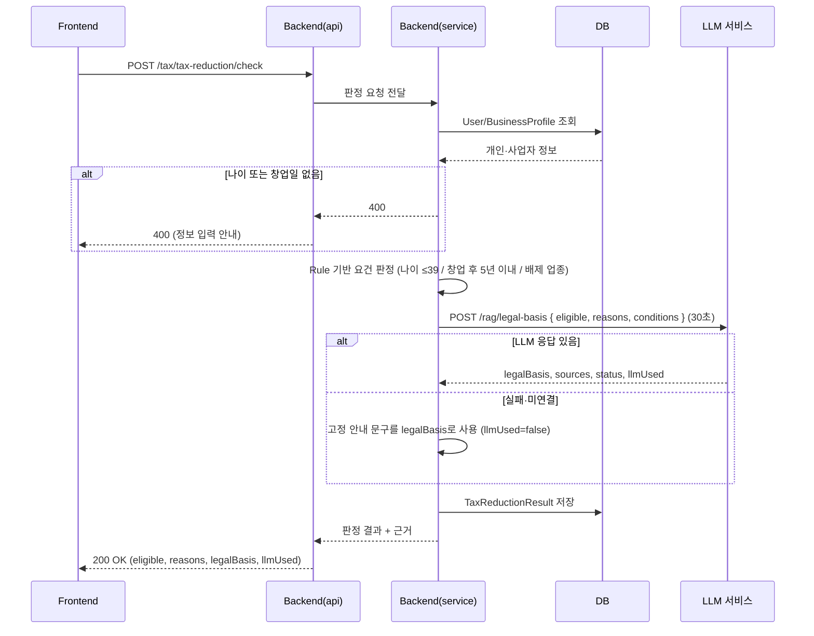
```mermaid
sequenceDiagram
    participant FE as Frontend
    participant API as Backend(api)
    participant SVC as Backend(service)
    participant DB as DB
    participant LLM as LLM 서비스

    FE->>API: POST /tax/tax-reduction/check
    API->>SVC: 판정 요청 전달
    SVC->>DB: User/BusinessProfile 조회
    DB-->>SVC: 개인·사업자 정보
    alt 나이 또는 창업일 없음
        SVC-->>API: 400
        API-->>FE: 400 (정보 입력 안내)
    end
    SVC->>SVC: Rule 기반 요건 판정 (나이 ≤39 / 창업 후 5년 이내 / 배제 업종)
    SVC->>LLM: POST /rag/legal-basis { eligible, reasons, conditions } (30초)
    alt LLM 응답 있음
        LLM-->>SVC: legalBasis, sources, status, llmUsed
    else 실패·미연결
        SVC->>SVC: 고정 안내 문구를 legalBasis로 사용 (llmUsed=false)
    end
    SVC->>DB: TaxReductionResult 저장
    SVC-->>API: 판정 결과 + 근거
    API-->>FE: 200 OK (eligible, reasons, legalBasis, llmUsed)
```

<details>
<summary>설명</summary>
<br>

Rule 기반 판정과 RAG 근거 제시를 결합하는 것이 핵심 차별점(FS-13)이므로, Service가 판정 로직을 직접 수행한 뒤 LLM 서비스에는 근거 설명만 요청. 
지역은 Rule 판정에 쓰지 않고 LLM 설명용 `conditions`로만 전송. 
LLM이 준 `sources`는 판정 결과에 저장하지 않음.

</details>

</details>
<br>

<a id="seq-chat-qa"></a>
**② AI 챗봇 Q&A + 답변 근거 확인 (FS-05, FS-06, FS-08)**

<details>
<summary>&nbsp;&nbsp;다이어그램 보기</summary>
<br>

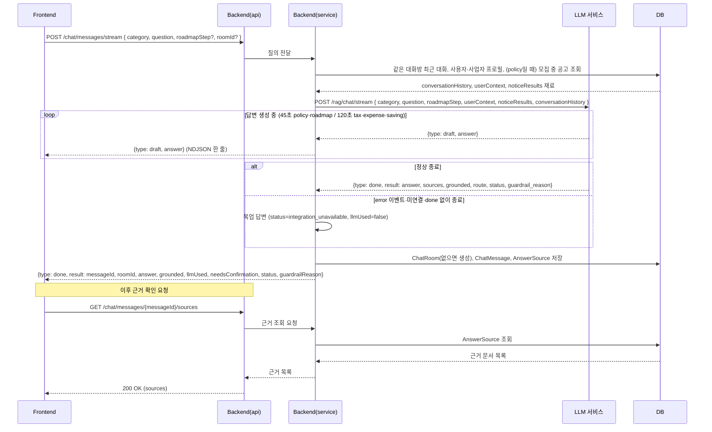
```mermaid
sequenceDiagram
    participant FE as Frontend
    participant API as Backend(api)
    participant SVC as Backend(service)
    participant LLM as LLM 서비스
    participant DB as DB

    FE->>API: POST /chat/messages/stream { category, question, roadmapStep?, roomId? }
    API->>SVC: 질의 전달
    SVC->>DB: 같은 대화방 최근 대화, 사용자·사업자 프로필, (policy일 때) 모집 중 공고 조회
    DB-->>SVC: conversationHistory, userContext, noticeResults 재료
    SVC->>LLM: POST /rag/chat/stream { category, question, roadmapStep, userContext, noticeResults, conversationHistory }
    loop 답변 생성 중 (45초 policy·roadmap / 120초 tax·expense·saving)
        LLM-->>SVC: {type: draft, answer}
        SVC-->>FE: {type: draft, answer} (NDJSON 한 줄)
    end
    alt 정상 종료
        LLM-->>SVC: {type: done, result: answer, sources, grounded, route, status, guardrail_reason}
    else error 이벤트·미연결·done 없이 종료
        SVC->>SVC: 목업 답변 (status=integration_unavailable, llmUsed=false)
    end
    SVC->>DB: ChatRoom(없으면 생성), ChatMessage, AnswerSource 저장
    SVC-->>FE: {type: done, result: messageId, roomId, answer, grounded, llmUsed, needsConfirmation, status, guardrailReason}

    Note over FE,API: 이후 근거 확인 요청
    FE->>API: GET /chat/messages/{messageId}/sources
    API->>SVC: 근거 조회 요청
    SVC->>DB: AnswerSource 조회
    DB-->>SVC: 근거 문서 목록
    SVC-->>API: 근거 목록
    API-->>FE: 200 OK (sources)
```

<details>
<summary>설명</summary>
<br>

답변 생성 시점에 근거 문서를 함께 저장해두므로, 이후 "답변 근거 확인"(FS-08)은 LLM을 다시 호출하지 않고 DB 조회만으로 처리. 
Service는 LLM을 부르기 전에 `userContext`(로그인 사용자 프로필), `noticeResults`(`category=policy`일 때만 모집 중 공고 상위 20건, 본문 800자로 자름), `conversationHistory`(같은 대화방의 최근 완료 대화) 세 가지를 조립함. 채팅 화면은 스트리밍 경로(`/chat/messages/stream` → `/rag/chat/stream`)로 답변을 생성 중에 이어서 보여줌.(`Backend/services/chat_service.py`) 
실제 공고 조회는 Backend가, LLM은 넘겨받은 목록을 근거로 쓸 뿐 DB를 직접 뒤지지 않음. 
근거 문서를 못 찾으면 LLM이 `status`로 알리고, Backend는 `status≠success`면 `needsConfirmation=true`로 표시.

</details>

</details>
<br>

**③ 기동 시 RAG 인덱스 워밍업**

<details>
<summary>&nbsp;&nbsp;다이어그램 보기</summary>
<br>

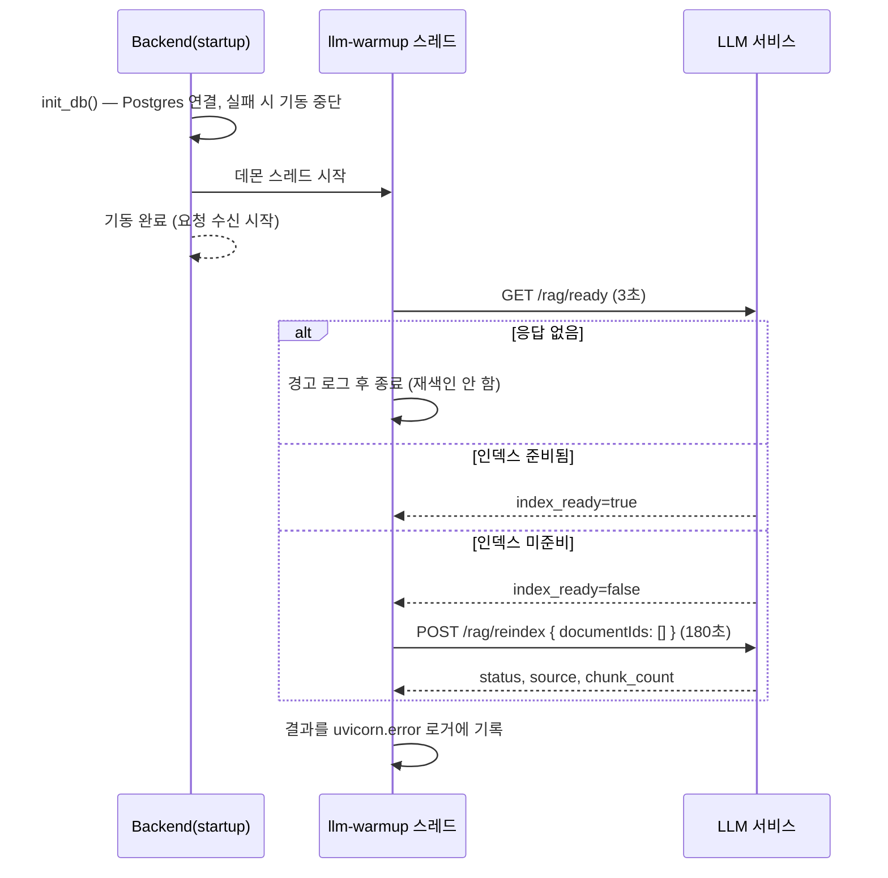
```mermaid
sequenceDiagram
    participant BE as Backend(startup)
    participant WU as llm-warmup 스레드
    participant LLM as LLM 서비스

    BE->>BE: init_db() — Postgres 연결, 실패 시 기동 중단
    BE->>WU: 데몬 스레드 시작
    BE-->>BE: 기동 완료 (요청 수신 시작)
    WU->>LLM: GET /rag/ready (3초)
    alt 응답 없음
        WU->>WU: 경고 로그 후 종료 (재색인 안 함)
    else 인덱스 준비됨
        LLM-->>WU: index_ready=true
    else 인덱스 미준비
        LLM-->>WU: index_ready=false
        WU->>LLM: POST /rag/reindex { documentIds: [] } (180초)
        LLM-->>WU: status, source, chunk_count
    end
    WU->>WU: 결과를 uvicorn.error 로거에 기록
```

<details>
<summary>설명</summary>
<br>

인덱스가 준비되지 않은 채로는 모든 질의가 LLM의 `integration_unavailable` 응답으로 끝나므로, 누가 재색인을 부를 때까지 기다리지 않고 기동 시 한 번 확인. 
워밍업이 기동을 막지 않게 하기 위해서 데몬 스레드로 작동. 
`rag_documents`가 이미 임베딩을 갖고 있고 청크 content가 바뀌지 않았으면 캐시로 로드되어 재호출이 없고, 변경된 청크만 그만큼 다시 임베딩.

</details>

</details>
<br>

<a id="seq-expense-ocr"></a>
**④ 영수증 OCR 경비처리 판정 (FS-14 ~ FS-17)**

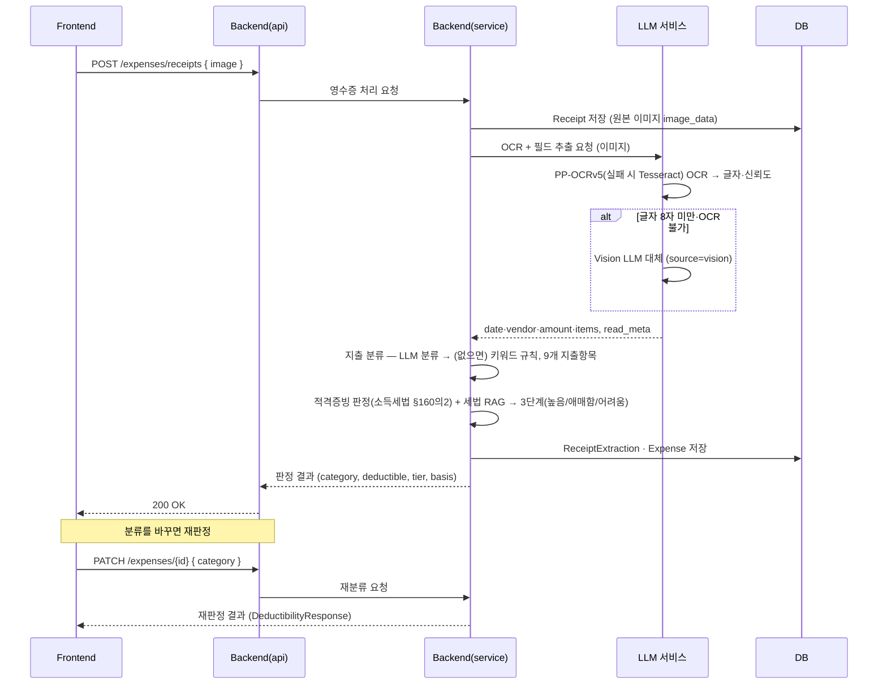
```mermaid
sequenceDiagram
    participant FE as Frontend
    participant API as Backend(api)
    participant SVC as Backend(service)
    participant LLM as LLM 서비스
    participant DB as DB

    FE->>API: POST /expenses/receipts { image }
    API->>SVC: 영수증 처리 요청
    SVC->>DB: Receipt 저장 (원본 이미지 image_data)
    SVC->>LLM: OCR + 필드 추출 요청 (이미지)
    LLM->>LLM: PP-OCRv5(실패 시 Tesseract) OCR → 글자·신뢰도
    alt 글자 8자 미만·OCR 불가
        LLM->>LLM: Vision LLM 대체 (source=vision)
    end
    LLM-->>SVC: date·vendor·amount·items, read_meta
    SVC->>SVC: 지출 분류 — LLM 분류 → (없으면) 키워드 규칙, 9개 지출항목
    SVC->>SVC: 적격증빙 판정(소득세법 §160의2) + 세법 RAG → 3단계(높음/애매함/어려움)
    SVC->>DB: ReceiptExtraction · Expense 저장
    SVC-->>API: 판정 결과 (category, deductible, tier, basis)
    API-->>FE: 200 OK

    Note over FE,API: 분류를 바꾸면 재판정
    FE->>API: PATCH /expenses/{id} { category }
    API->>SVC: 재분류 요청
    SVC-->>FE: 재판정 결과 (DeductibilityResponse)
```

<details>
<summary>설명</summary>
<br>

영수증 등록 한 번(`POST /expenses/receipts`)에 OCR → 필드 추출 → 지출 분류 → 경비처리 가능성 판정까지 서버에서 이어서 수행하고 결과를 저장. 
OCR은 PP-OCRv5를 우선 쓰되 환경 제약 시 Tesseract로 폴백하고, 글자를 거의 못 읽으면 Vision LLM으로 대체(`source=vision`). 못 읽은 값과 기본값을 구분하려고 읽음 여부·원문 근거·신뢰도를 `read_meta`에 저장. 
경비처리 판정은 적격증빙 규칙과 세법 RAG 근거를 결합하며, 세법 자료로 뒷받침된 응답만 규칙 판정을 덮어씀. 화면에서 분류를 바꾸면(`PATCH /expenses/{id}`) 다시 판정.

</details>
<br>

<a id="seq-bizplan"></a>
**⑤ 사업계획서 초안 생성·AI 예비진단 (FS-29, FS-30)**

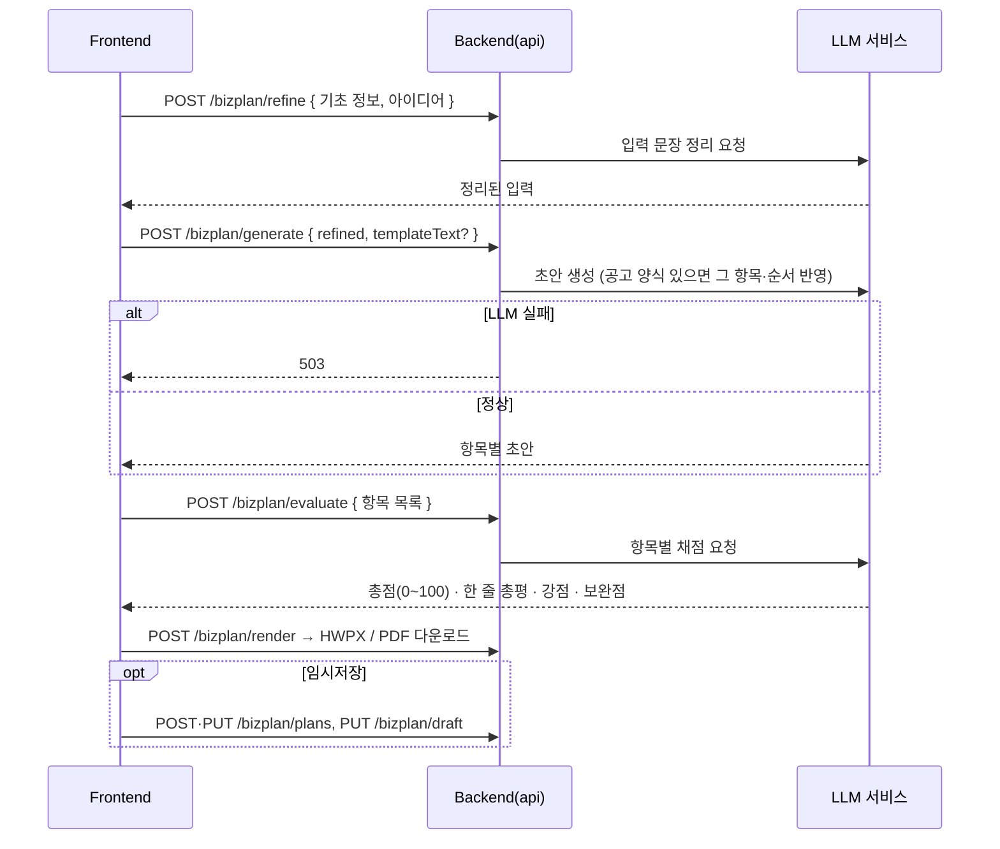
```mermaid
sequenceDiagram
    participant FE as Frontend
    participant API as Backend(api)
    participant LLM as LLM 서비스

    FE->>API: POST /bizplan/refine { 기초 정보, 아이디어 }
    API->>LLM: 입력 문장 정리 요청
    LLM-->>FE: 정리된 입력
    FE->>API: POST /bizplan/generate { refined, templateText? }
    API->>LLM: 초안 생성 (공고 양식 있으면 그 항목·순서 반영)
    alt LLM 실패
        API-->>FE: 503
    else 정상
        LLM-->>FE: 항목별 초안
    end
    FE->>API: POST /bizplan/evaluate { 항목 목록 }
    API->>LLM: 항목별 채점 요청
    LLM-->>FE: 총점(0~100) · 한 줄 총평 · 강점 · 보완점
    FE->>API: POST /bizplan/render → HWPX / PDF 다운로드
    opt 임시저장
        FE->>API: POST·PUT /bizplan/plans, PUT /bizplan/draft
    end
```

<details>
<summary>설명</summary>
<br>

세 단계(입력 정리 → 초안 생성 → 예비진단) 모두 검색(RAG) 없이 LLM을 한 번씩 부르는 방식. 
지원 공고의 목차(`templateText`)나 제출 양식 파일(HWPX·PDF, `/bizplan/template-inspect`)을 주면 그 항목 구성을 따르고, 비우면 기본 양식 13개 입력 칸을 사용. 
AI 예비진단(`/bizplan/evaluate`)은 실제 심사가 아닌 참고용 자체 채점이며, 입력값·초안·예비진단 결과는 "임시저장"으로 보관함(`bizplans`)과 작성 화면 상태(`bizplan_drafts`)에 함께 저장. LLM 실패 시 503.

</details>

---

## 10. 주요 프로시저

### ① 세액감면판정   
처리 흐름: [9.4 시퀀스 다이어그램](#seq-tax-reduction) 참고


### ② AI 챗봇 Q&A 
처리 흐름: [9.4 시퀀스 다이어그램](#seq-chat-qa) 참고

### ③ LLM 질문 라우팅 처리

<details>
<summary>&nbsp;&nbsp;처리 흐름 · 다이어그램 보기</summary>
<br>

라우터 LLM이 질문을 **공고 / 정책 / 세금** 세 카테고리로 분류하고, 카테고리별로 다른 방식을 적용해 처리함.  
②번 "LLM 서비스" 단계가 실제로 이 흐름을 실행함.

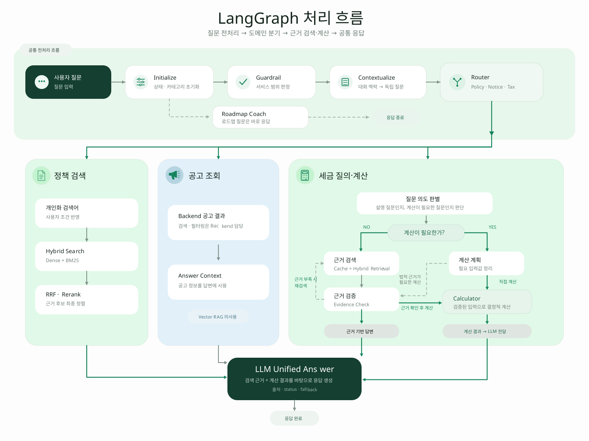

<details>
<summary><b>&nbsp;&nbsp;카테고리별 처리 방식</b></summary>
<br>

- **공고 질문**: LLM까지 가지 않아도 Backend에서 충분히 답변 가능하다고 판단해 Backend에서 바로 처리
- **정책 질문**: Dense 검색과 BM25를 RRF로 결합하고, Cohere Rerank로 한 번 더 정렬해 정답을 찾음
- **세금 질문**: 계산이 필요한 경우 국세청 세금 계산법을 함수화한 계산기를 호출하고, 그 결과값을 근거로 LLM이 답변. 계산이 필요 없고 법령 확인이 필요한 경우엔 정책 질문과 동일한 Dense+BM25+Rerank 흐름에 **multi-hop**(최대 3회)을 더해, 근거가 부족하면 질문을 다시 생성해 재검색

</details>

</details>


### ④ 영수증 OCR 경비처리 판정
처리 흐름: [9.4 시퀀스 다이어그램](#seq-expense-ocr) 참고

<details>
<summary><b>&nbsp;&nbsp;판정 단계</b></summary>
<br>

- **OCR**: PP-OCRv5 한국어로 영수증 글자·위치·신뢰도를 읽고(실패 시 Tesseract 폴백, 글자 부족 시 Vision LLM 대체), LLM이 날짜·상호·금액·품목을 정리
- **지출 분류**: LLM 분류 -> 상호·품목 키워드 규칙으로 9개 지출항목(사무용품·통신비·차량유지비·광고선전비·임차료·복리후생비·접대비·교육·도서·기타) 태깅
- **경비처리 판정**: 소득세법 제160조의2 기준으로 적격증빙을 판정(세금계산서·카드전표·현금영수증은 적격, 간이영수증은 건당 3만 원 이하만 적격)하고, 세법 RAG 근거와 결합해 경비처리 가능성을 3단계(인정 / 확인 필요 / 불인정)로 판정. 세법 자료로 뒷받침된 응답만 규칙 판정을 덮어씀

</details>

### ⑤ 사업계획서 작성
처리 흐름: [9.4 시퀀스 다이어그램](#seq-bizplan) 참고

<details>
<summary><b>&nbsp;&nbsp;작성 단계</b></summary>
<br>

- **입력 정리**: 기초 정보·아이디어 입력 문장을 정리
- **초안 생성**: 공고 목차나 제출 양식 파일을 반영해 항목별 초안 생성(없으면 기본 13개 칸). 검색 없이 LLM 1회 호출
- **AI 예비진단**: 0~100점 채점 + 한 줄 총평 + 항목별 강점·보완점(참고용 자체 채점)
- **출력·보관**: HWPX·PDF 다운로드, 보관함에서 여러 건 저장·관리

</details>


---

## 11. WBS

> 본 프로젝트는 3차 프로젝트를 고도화하며 시작했으므로, WBS도 신규 주제 선정이 아니라 **고도화 기획 → 설계 보강 → 데이터·기능 확장 → 평가 → 배포**를 기준으로 구성하였다.

| 단계 | 작업 항목 | 상태 |
| --- | --- | :---: |
| **1. 고도화 기획** | 3차 결과 분석 → 고도화 범위·요구사항 재정의 | ✅ 완료 |
| **2. 설계 보강** | 유스케이스·ERD·시퀀스·클래스·API 명세를 지출관리·사업계획서까지 반영해 갱신 | ✅ 완료 |
| | 화면 설계(모바일용) | ✅ 완료 |
| **3. 아키텍처 재정비** | 기술 스택 확정 · 시스템 아키텍처(Elasticsearch·AWS 2-EC2) · 모듈 구조 · 환경변수 정리 | ✅ 완료 |
| **4. 데이터 확장** | 세법·정책 수집, 국세청 법령해석례·생활법령 추가, 지역명 정규화, 수집 실패 분류·재시도 스케줄러 | ✅ 완료 |
| **5. 기능 개발(고도화)** | 지출관리(영수증 OCR 경비처리), 사업계획서 AI 작성, 대화방·사용자 개인화, 구독 플랜(목업), PWA·HTTPS | ✅ 완료 |
| | RAG 검색 고도화 — Elasticsearch(Nori) 하이브리드 평가, 정책 개인화·세금 multi-hop 보강 | ✅ 완료 |
| | Semantic Cache — 세금 질문 PostgreSQL 캐시로 평균 응답 29.6% 단축 | ✅ 완료 |
| **6. 테스트·평가** | 단위 테스트(LLM 46·Backend 17·Frontend 3·서버 스크립트 3 파일), holdout250 성능 평가, 데스크탑·모바일 QA | 🔄 진행 중 |
| | 통합 테스트(실제 OpenAI·Cohere·PostgreSQL 연동) | 🔄 진행 중 |
| | 버그 수정 | 🔄 남은 결함은 `Docs/STATUS.md` 2절 |
| **7. 배포** | Docker Compose 구성(`docker-compose.yml`, `setup.sh`, `setup.bat`) | ✅ 완료 |
| | CI/CD(GitHub Actions `deploy.yml`·`collect.yml`·`collect-retry.yml`·`health-check.yml`) | ✅ 완료 |
| | AWS App/Data EC2 배포, 주간 수집→임베딩→재색인 자동화 | ✅ 완료 |
| | 배포 안정화(동시 실행 잠금·백업 cron·메모리 한도·무중단 재색인 등 운영 이슈 대응) | 🔄 진행 중 |
| **8. 문서화** | 설계 문서(DESIGN.md)·README·발표/데모 자료 정리 | 🔄 진행 중 |

---

## 12. 수행결과

#### 메인페이지


#### 창업 로드맵
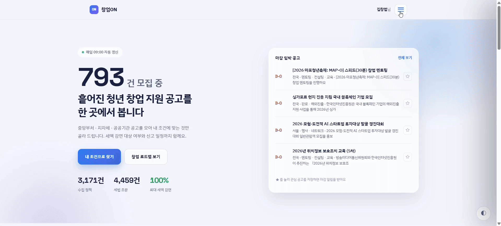

#### 세무 어시스턴트 챗봇
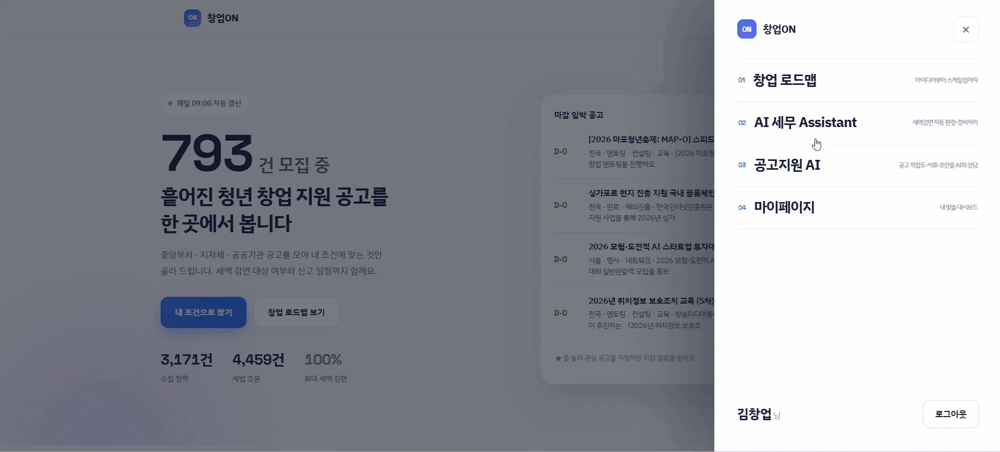

#### 대화방 수정 및 삭제
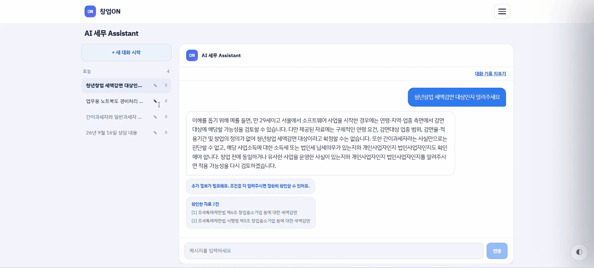

#### 공고 확인
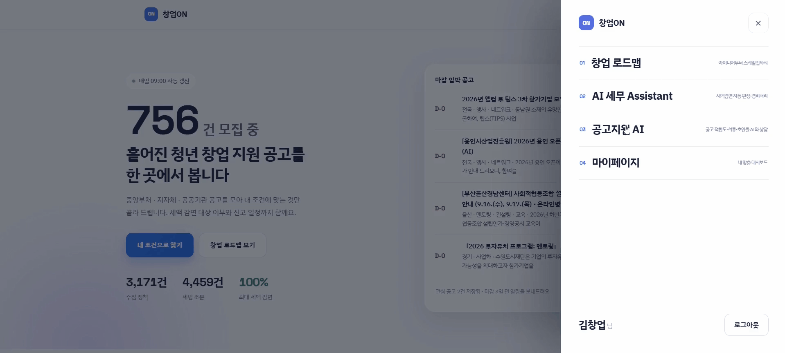
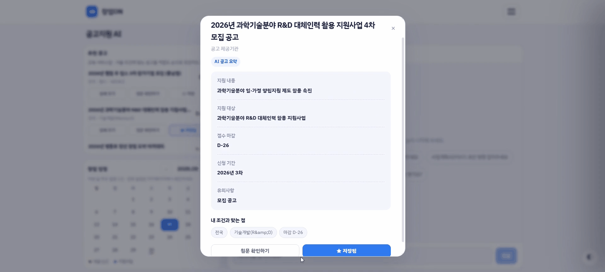

#### 공고 지원 챗봇
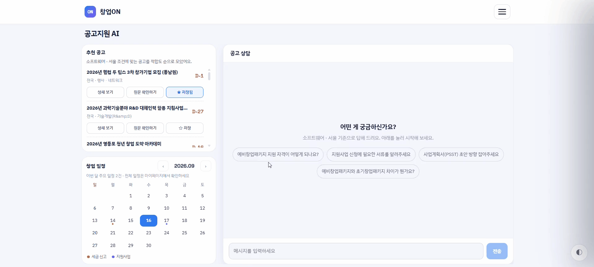

#### 마이페이지 - 대화 이력 확인
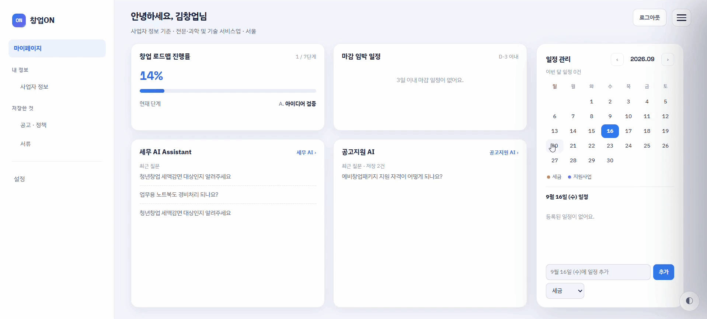

#### 마이페이지 - 캘린더 일정 추가
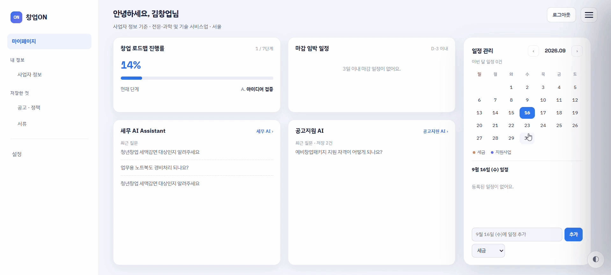

#### 마이페이지 - 사용자 정보 수정
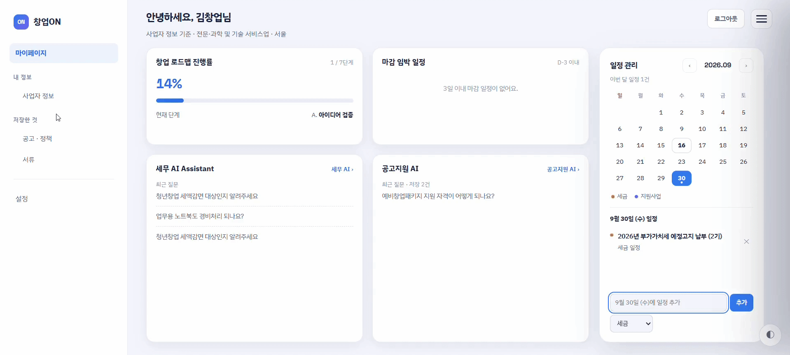

#### 마이페이지 - 저장한 공고 및 추천 공고 확인
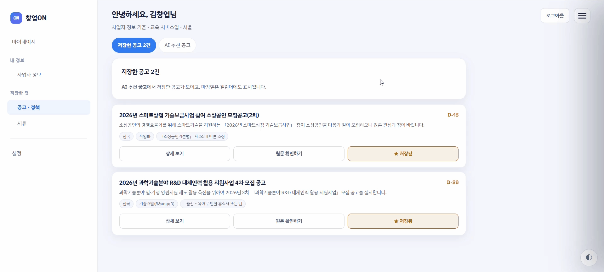
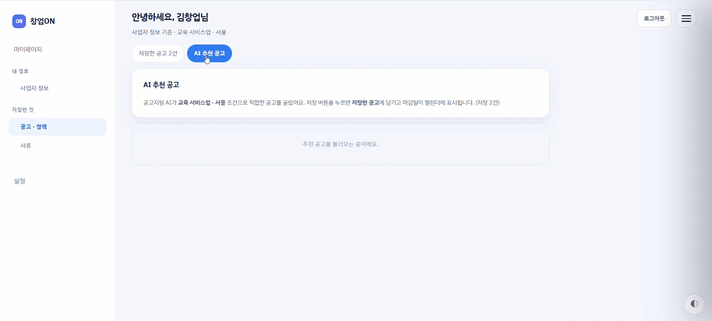

#### 다크모드 지원
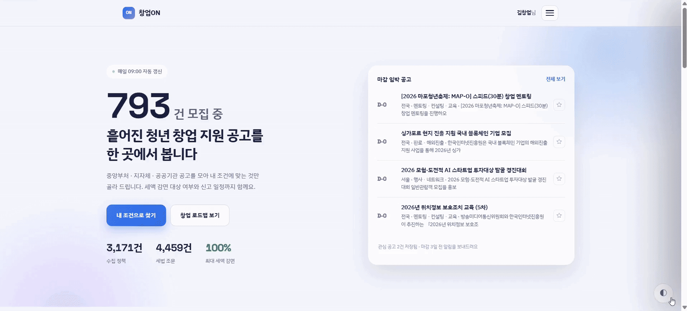


## 13. 트러블슈팅


### 트러블슈팅 기록

<details>
<summary>&nbsp;&nbsp;LLM 파트  <sub>(3차)</sub></summary>

<br>

<div style="margin-left: 20px;">

  <details>
  <summary>&nbsp;&nbsp;평가 지표</summary>
  
  <br>

  평가 지표는 5가지 항목(route·status·block·grounded·required_phrases)을 종합해 산출.

  | 지표 | 의미 |
  | --- | --- |
  | route | 올바른 경로로 분류됐는지 |
  | status | 예상 응답 상태와 일치하는지 |
  | block | 범위 밖 질문을 제대로 차단했는지 |
  | grounded | 요구된 법령 근거·출처가 존재하는지 |
  | required_phrases | 답변에 필수 핵심 표현이 포함됐는지 |

  </details>

</div>

1. **세금 문서 범위 제한 시도** — 최초 평가셋(250건) 기준 종합 성능 지표가 64.3%로 목표치(70%) 미달. 세금 카테고리 질문은 세금 문서만 탐색하도록 제한해봤으나 개선 효과 없음.
2. **Router 프롬프트 수정** — 개인화 검색과 정책 ID 중복을 제거하고, Router 분기가 잘못 작동하는 것을 확인해 Router 프롬프트를 수정. 종합 성능 지표 74.6%로 기존 대비 **11.1%p 상승**.
3. **LLM 추론 강도 조정** — 질문 확인·라우터·답변 생성 단계의 LLM 추론 강도를 low로 설정. 정책 단일 질문 응답속도 **33.3% 단축**. 세금 질문은 4건 테스트 기준 8.8% 단축에 그쳐 효과 미미.
4. **Multi-hop 하이브리드 구조 시도** — 세금 질문 응답속도 개선을 위해 직렬 구조인 multi-hop을 병렬+직렬 하이브리드로 변경(첫 질문에서 쿼리 3개를 병렬로 생성하고, 근거가 부족하면 직렬 hop으로 이어감). 유의미한 속도 단축 없음.
5. **근거 판정 횟수 축소** — 단계별 소요 시간을 측정해 LLM의 근거 판정 단계가 병목임을 확인. hop마다 하던 근거 판정을 최종 1회로 축소하자 평균 응답속도 **4.85초 단축**됐지만 종합 성능 지표가 **66.1%로 하락**. 애매한 답변에만 추가 판정을 주는 방식도 시도했으나 품질이 더 떨어져 최종적으로 **미채택**.
6. **Hop 중간 질문 캐싱 도입 (최종 채택)** — 세금 질문 속도 개선을 위해 캐시를 도입. 최종 답변이 아니라 **hop 진행 중 생성되는 질문**을 캐시화해, 유사한 질문이 생성될 때 캐시된 데이터를 재사용(중복 데이터 없이 저장, 사용자가 많아질수록 응답속도가 빨라지는 구조). 종합 성능 지표는 유지하면서 평균 응답속도 **29.6% 감소**

</details>

<details open>
<summary>&nbsp;&nbsp;검색 고도화 파트</summary>

<br>

1. **Elasticsearch Nori BM25 도입 시도** — 한국어 형태소 분석으로 키워드 검색을 고도화하기 위해 기본 BM25를 Elasticsearch Nori BM25로 교체. 구형 데이터(원본 문서 10,892건)에서는 정책 Hit@5가 84.1% -> 92.1%로 개선을 관측.
2. **데이터 확대 후 재평가에서 우위 미재현 (최종: 기본 BM25 운영)** — 근거 데이터가 추가돼 원본 문서가 14,550건으로 늘어난 뒤 새 평가셋으로 다시 비교하자, 정책 적중률은 동률이고 순위 지표(MRR·MAP)와 세금 자동검사는 오히려 기본 BM25가 우세. 운영 키워드 검색은 **기본 BM25로 전환**하고, Elasticsearch는 향후 데이터 변화 시 재평가를 위해 코드·컨테이너로 **보존**. "검색엔진 교체 자체보다 후보 결합·검색 질의가 결과를 좌우한다"는 점을 확인 ([RETRIEVER_FINAL_REPORT.md](Docs/reports/ELASTICSEARCH_REPORT/RETRIEVER_FINAL_REPORT.md)).

</details>

<details open>
<summary>&nbsp;&nbsp;근거 판정 모델 대체 실험 파트</summary>

<br>

1. **LLM Judge → ML(CatBoost) 대체 시도 (미채택)** — 세금 근거 충분성 판정의 LLM 호출이 응답 지연의 병목이라, 이를 전통 ML 모델(CatBoost 등)로 대체해 속도를 줄이려 함. 정책·세금 500건씩 LLM Teacher 라벨로 학습.
2. **운영 그래프 E2E 비교 후 LLM Judge 유지** — 운영 그래프에서 Judge만 CatBoost로 교체해 세금 법령 18턴을 비교하자, 턴 통과율이 77.8% -> 22.2%로 급락하고 평균 지연도 12.46초 -> 16.49초로 오히려 증가. 정확도·속도 모두 개선하지 못해 기존 LLM Judge를 유지 ([REPALCE_JUDGE_MODEL_RESULT.md](Docs/reports/REPLACE_JUDGE_MODEL/REPALCE_JUDGE_MODEL_RESULT.md)).

</details>

<details open>
<summary>&nbsp;&nbsp;OCR 엔진 교체 파트</summary>

<br>

1. **휴대폰 촬영 영수증 인식률 저하** — 기울어지고 조명이 고르지 않은 사진에서 Tesseract 인식률이 낮아, 경비처리 판정의 출발점인 OCR 품질이 흔들림. 무료로 쓸 수 있는 대체 엔진 4종(Tesseract·PaddleOCR·EasyOCR·docTR)을 비교.
2. **PP-OCRv5 한국어 채택 (최종)** — 초기 PaddleOCR 조합은 느려 보류했으나, 검출 모델·설정을 재탐색해 **PP-OCRv5 한국어**를 채택. 영수증 5장(정답 34개) 실측에서 정확도 82% -> 97%, 5장 처리 25.9초 -> 12.1초로 개선. PaddleOCR을 쓸 수 없는 환경에서는 Tesseract로 자동 폴백하도록 안전장치를 둠 ([OCR_PPOCRV5_BENCHMARK](Docs/OCR_PPOCRV5_BENCHMARK.md)).

</details>

<details open>
<summary>&nbsp;&nbsp;운영 안정화 파트</summary>

<br>

1. **운영 데이터 유실 위험 차단** — 서비스 쓰기 작업이 벡터 색인을 비우거나(`TRUNCATE ... CASCADE`가 `rag_documents`까지 삭제), 잘못된 삭제 요청이 전체 대화 기록을 지우는 문제를 확인. 색인 경로 분리·삭제 요청 사전 차단·병합 검증 절차를 도입해 재발 이후 데이터 유실 0건.
2. **서비스 간 통신 배선·인증 정합** — 통합 초기 compose에 포트·환경변수·헬스체크가 없고, 근거 문서 조회에 소유자 확인이 없는 등 결함을 일괄 정리(상세는 [STATUS.md](Docs/STATUS.md) 3절).

</details>

<details open>
<summary>&nbsp;&nbsp;AWS 배포·운영 파트</summary>

<br>

1. **배포·수집·재시도 동시 실행 충돌** — 세 워크플로가 같은 concurrency 그룹이라 배포 대기 중 작업이 취소됨. deploy job에만 concurrency를 적용하고 `queue: max`와 서버 `flock` 공통 잠금으로 직렬화.
2. **App EC2 메모리 부족(OOM 위험)** — EC2에서 이미지 빌드와 워밍업이 동시에 돌아 메모리 압박. GitHub Actions에서 4개 이미지를 빌드·GHCR 게시하고 EC2는 `--no-build` pull, `LLM_MEM_LIMIT` 필수화, 인덱스→OCR 워밍업 순차화(배포 후 최대 메모리 사용률 상담 ~65%·재색인 ~85%, OOM 0건).
3. **재색인 중 RAG 전체 중단** — 재색인이 기존 인덱스를 먼저 비워 그동안 질의가 모두 실패. 후보 런타임에서 새 검색 상태를 구성한 뒤 교체(`publish_index()`)하고, 실패 시 기존 런타임을 유지하도록 변경(RAG 트러블슈팅 파트와 연계).
4. **백업 cron 무음 실패** — 제한된 PATH에서 `aws` CLI를 못 찾아 백업이 조용히 실패. 스크립트 PATH 보완, 덤프 목차·S3 크기 검사, 성공/실패 시각 분리, 신선도(26시간) 검사, `flock` 중복 방지 추가.

> 위는 AWS 배포 1차 점검 대응 결과이며, 롤백 수단·무중단 배포 등 일부 운영 과제는 진행 중이다 
> (상세·미해결 목록은 [AWS_DEPLOY_RISK_REPORT_20261005.md](Docs/reports/AWS_DEPLOY_RISK_REPORT_20261005.md), [AWS_CHAPTER1_ISSUE_RESOLUTION_REPORT_20261006.md](Docs/reports/AWS_CHAPTER1_ISSUE_RESOLUTION_REPORT_20261006.md)).

</details>


---

## 14. 테스트 보고서

성능 개선 평가 기록: [Docs/reports/](Docs/reports/). 남은 결함은 [Docs/STATUS.md](Docs/STATUS.md) 2절

**4차 프로젝트 테스트·검수 보고서**

| 문서 | 내용 |
| --- | --- |
| [QA_REPORT_20260930.md](Docs/reports/QA_REPORT_20260930.md) | 데스크탑·모바일 기능 QA 결과(화면 연결 기능 대상) |
| [RAG_TROUBLESHOOTING_FIX_REPORT_20261002.md](Docs/reports/RAG_TROUBLESHOOTING_FIX_REPORT_20261002.md) | RAG 검색 트러블슈팅·수정 기록 |
| [AWS_CHAPTER1_ISSUE_RESOLUTION_REPORT_20261006.md](Docs/reports/AWS_CHAPTER1_ISSUE_RESOLUTION_REPORT_20261006.md) / [AWS_CHAPTER1_ISSUE_VERIFICATION_REPORT_20261006.md](Docs/reports/AWS_CHAPTER1_ISSUE_VERIFICATION_REPORT_20261006.md) | AWS 배포 1차 이슈 대응·운영 검증 결과 |
| [ELASTICSEARCH_COMPARISON_REPORT.md](Docs/reports/ELASTICSEARCH_REPORT/ELASTICSEARCH_COMPARISON_REPORT.md) / [ELASTICSEARCH_SERVING_CONSISTENCY_FIX_REPORT_20260922.md](Docs/reports/ELASTICSEARCH_SERVING_CONSISTENCY_FIX_REPORT_20260922.md) | Elasticsearch 검색기 비교, 서빙·재색인 일관성 수정 |
| [REPALCE_JUDGE_MODEL_RESULT.md](Docs/reports/REPLACE_JUDGE_MODEL/REPALCE_JUDGE_MODEL_RESULT.md) / [CATBOOST_JUDGE_COMPARISON.md](Docs/reports/REPLACE_JUDGE_MODEL/CATBOOST_JUDGE_COMPARISON.md) | LLM Judge를 ML 모델로 대체하는 실험 결과(미채택) |

<details>
<summary><b>&nbsp;&nbsp;3차부터 이어진 성능 평가 보고서</b></summary>
<br>

| 문서 | 내용 |
| --- | --- |
| [01_EVAL_BASELINE.md](Docs/reports/01_EVAL_BASELINE.md) | 최초 250건 평가 — 개선 전 기준점 |
| [02_ACCURACY_IMPROVEMENT.md](Docs/reports/02_ACCURACY_IMPROVEMENT.md) | 정책·세금 125건 재평가 |
| [03_TAX_FINAL_RESULT.md](Docs/reports/03_TAX_FINAL_RESULT.md) | 세금 단독 최종 실평가 (정확도 우선 설정의 기준값) |
| [04_FINAL_REPORT.md](Docs/reports/04_FINAL_REPORT.md) | 성능 개선 종합 보고서 |
| [05_TAX_SEMANTIC_CACHE_IMPROVEMENT.md](Docs/reports/05_TAX_SEMANTIC_CACHE_IMPROVEMENT.md) | Semantic Cache 응답속도 개선 보고서 |
| [LLM_TAX_HALF.md](Docs/reports/LLM_TAX_HALF.md) | 캐시 적용 전후 비교용 세금 평가 |
| [06_EVAL_250_COMPARISON.md](Docs/reports/06_EVAL_250_COMPARISON.md) | 최초 대비 최종 250건 개선 비교 |

</details>

**가이드·기능 정리**

| 문서 | 유형 | 내용 |
| --- | --- | --- |
| [AWS_DEPLOY_GUIDE.md](Docs/AWS_DEPLOY_GUIDE.md) | 가이드 | AWS 콘솔 배포 절차, 데이터 수집 자동화 |
| [subscription_cost.md](Docs/reports/subscription_cost.md) | 분석 | LLM 단가·구독 플랜·마진(구독 목업 결제 근거) |
| [Elasticsearch_Nori_setting_guide.md](Docs/imporve_plan/Elasticsearch_Nori_setting_guide.md) | 가이드 | Elasticsearch·Nori 설정 |
| [FEATURE_ROADMAP_EXPENSE.md](Docs/FEATURE_ROADMAP_EXPENSE.md) | 기능 정리 | 창업 로드맵·지출관리·사업계획서 설명과 진행 현황 |
| [Presentation/DESIGN.md](Presentation/DESIGN.md) | 가이드 | 발표자료(Slidev) 디자인 규칙 |


---

## 15. 향후 확장

### 1. 서비스 확장

* **주변 상권분석**
  * 공공 상권 데이터 활용
  * 사업계획서·로드맵과 연계
* **맞춤 공고 알림**
  * 사용자 조건에 맞는 공고 선별
  * PWA 푸시 및 메일 알림 제공

### 2. 운영·인프라

* **비동기 작업 큐 및 ASG & ALB**
  * 장시간 작업 비동기 처리 및 API·Worker 분리
  * 작업 상태 외부 관리 및 서버 무상태(Stateless) 전환
  * ASG와 ALB 기반 동적 수평 확장
* **DevOps 고도화**
  * Terraform 기반 IaC 구축
  * 단계별 지연시간·토큰 비용 모니터링
  * LLM 평가셋 기반 CI 품질 게이트 적용

### 3. 비즈니스 모델 확장

* **B2G·B2B 확장**
  * 기관용 AI 상담 지원 솔루션 제공
  * 기관용 익명 통계 대시보드 제공
* **제휴 채널**
  * 세무사·금융기관 연계


---

## 16. 실행 방법

### 서비스 접속 (배포 환경)

별도 설치 없이 아래 주소로 접속하면 바로 사용할 수 있다.

🔗 **https://changup-on.kr/**

- PWA를 지원하므로 브라우저의 "앱 설치"로 홈 화면에 추가해 앱처럼 쓸 수 있다.
- `OPENAI_API_KEY` 등 서버 설정은 배포 환경에 구성되어 있어, 접속만으로 AI 기능까지 동작한다.

<br>

<details>
<summary><b>&nbsp;&nbsp;로컬 개발 환경 실행 (개발자용)</b></summary>
<br>

`.env`는 비밀키가 들어 있어 git으로 공유되지 않는다. **팀에서 파일로 받아 저장소 루트에 두고** 시작한다. 스크립트는 `.env`를 만들어 주지 않는다.

```bash
./setup.sh                 # 전체 기동 후 Frontend 개발 서버까지 실행
./setup.sh --no-frontend   # 컨테이너만 기동하고 종료
```

Windows cmd.exe에서는 `setup.bat`을 같은 인자로 쓴다.

| 대상 | 주소 |
| --- | --- |
| 화면 | http://localhost:5173 |
| Backend API 문서 | http://localhost:8000/docs |
| LLM API 문서 | http://localhost:8001/docs |

- 로컬 개발에서는 `db`·`db-migrate`(스키마 적용 후 종료)·`elasticsearch`·`llm`·`backend`가 Docker Compose로 뜨고 Frontend는 호스트에서 돈다. Vite 프록시 대상이 호스트 주소이기 때문이다. compose의 `frontend`·`presentation` 서비스는 프로필에 묶여 있어 평소에는 빌드도 기동도 되지 않는다
- 코드 수정을 바로 반영하는 개발 모드: `docker compose -f docker-compose.yml -f docker-compose.dev.yml up -d` (backend·llm `--reload`, Vite 컨테이너 `frontend-dev` :5173)
- AWS 배포는 [Docs/AWS_DEPLOY_GUIDE.md](Docs/AWS_DEPLOY_GUIDE.md), 학원 내부망 단일 서버 배포는 `Docs/README.md` 12절
- `Ctrl+C`는 Frontend만 멈춘다. 컨테이너까지 내리려면 `docker compose down`
- `OPENAI_API_KEY`가 없어도 화면·DB·정책 조회는 정상이고 AI 답변만 목업이 된다
- Docker Compose v2.1.1 이상이 필요하다. `setup.bat`의 메시지는 cmd.exe 인코딩 제약 때문에 영문이다
- 단계별 동작과 문제 해결은 `setup.sh` 상단 주석과 `Docs/STATUS.md` 4절 참고. LLM 서비스만 따로 띄우려면 `LLM/RUN_GUIDE.md`

</details>

---

## 17. 한 줄 회고


### 김태윤
> -

### 김현지
> -

### 채정석
> -

### 황호순
> -